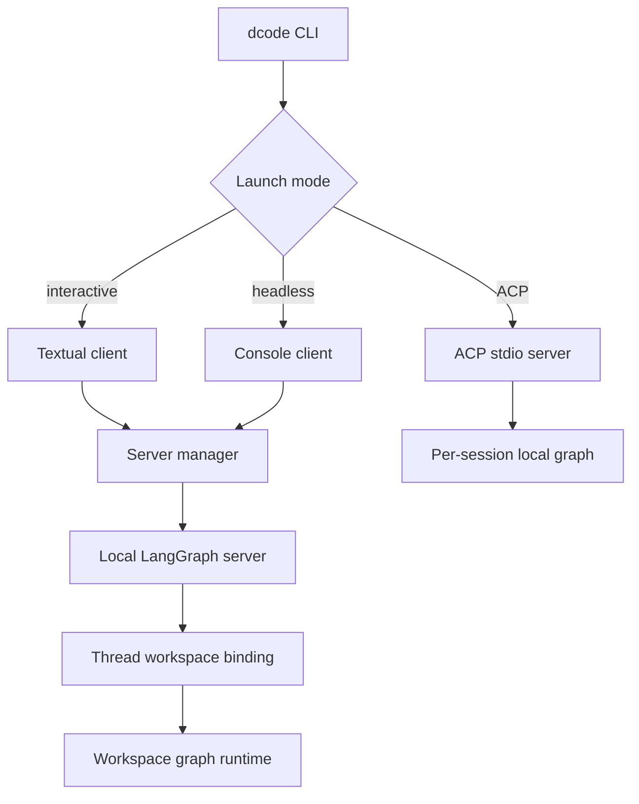

# Deep Agents Code Architecture

`deepagents-code` (`dcode`) is a reference terminal coding-agent product built on the `deepagents` SDK. It packages the SDK harness with terminal presentation, persistence, tools, skills, and optional sandboxed execution.

Its usual architecture separates a terminal client from a local LangGraph server: the client owns input, display, interactive approvals, and process lifecycle; the server owns the graph, model, tools, memory, skills, backend, and durable execution. ACP is the intentional exception: it runs an in-process stdio server and builds a local graph for each ACP session.

*Normal terminal modes use a remote graph hosted by a local server; ACP creates session-local graphs in the launching process.*

## Entrypoints and frontends

`python -m deepagents_code` reaches the package's lazy `cli_main` entrypoint, deferring import of the heavier CLI startup module until the command is used. The CLI dispatches normal interactive and non-interactive runs as well as administrative commands. The default frontend is the Textual app; its startup can run server creation in the background and resolve resume state asynchronously, so rendering need not wait for connection.

`--non-interactive` runs one task through `run_non_interactive` and the normal managed-server path. It streams `messages`, `updates`, and `custom` events and supplies continuation commands for interrupts. Its approval behavior is deliberately different from interactive Auto: absent a shell allow-list, shell is disabled; a restrictive allow-list validates shell commands while other tools proceed; `all` permits unrestricted shell. This is the automation-safe surface for scripts, not a TUI with prompts removed.

`--acp` runs an stdio ACP server in process. For each ACP session its builder takes the session model and cwd, builds a `ProjectContext`, and calls `create_cli_agent`; it does not use the normal server's workspace-runtime cache. ACP Auto uses an adapter that persists trusted Auto state and prompt metadata. Starting ACP in YOLO requires prior acknowledgement, and a classifier model is accepted only when the resolved approval mode is Auto.

## Normal server lifecycle and session ownership

`start_server_and_get_agent` captures project context, validates an explicit MCP configuration before spawning, resolves `ServerConfig`, and exports its server-facing environment representation. It scaffolds a temporary LangGraph project—including a SQLite checkpointer module—starts `langgraph dev` on loopback and an ephemeral port, waits for graph `agent`, then returns a `RemoteAgent`. The client configures that remote object with a cwd, the client-claimable session policy, and its fingerprint. Failed or cancelled startup stops the still-owned server; normal callers use `server_session` for teardown.

The checkpointer supplies durable graph checkpoints. Workspace bindings are separate durable state: they associate a thread with canonical workspace identity and resource policy. Before executing a request, `make_graph` requires a thread ID and workspace context, validates them against the stored binding, and selects the workspace runtime. Thus a client cannot run an arbitrary thread in an arbitrary cwd simply by supplying context.

### Workspace policy, runtime reuse, and diagnostics

A server process can host workspace-specific graph runtimes. The runtime cache key combines workspace identity with a full runtime fingerprint, is LRU-bounded to 32 entries, and a model or prompt change rebuilds a runtime without discarding the thread's binding or checkpoints. In contrast, access-policy drift—tool, trust, sandbox, or approval policy—refuses the request. A sandbox is process-wide: once claimed by one workspace, another workspace cannot acquire it from that server process.

Project policy is not transferred when the client changes projects. For a different project, `ServerConfig.resolve_workspace` drops launch-project MCP configuration, sandbox setup, and extension paths, and re-reads extension trust. Existing bindings are also checked on every request; a disappeared extension-trust grant fails closed rather than silently rebuilding with changed privilege.

Refusals can carry structured `WorkspaceDiagnostics`. Its persisted comparison snapshot is explicitly allowlisted and bounded: it reports suitable policy booleans, identifiers, and allow-lists, but never model specifications or parameters, prompts, credentials, environment values, or paths. The TUI can therefore explain policy/configuration drift without turning diagnostics into a secret-reporting channel.

## Server graph construction

The LangGraph server loads `deepagents_code.server_graph:make_graph`. On graph construction, the server reads the same `ServerConfig` schema that the client serialized, snapshots the workspace environment and credentials, pins compatible tracing settings for the server lifetime, resolves the model, creates built-in and MCP tools, and calls `create_cli_agent`. Blocking filesystem and provider work is moved off the server event loop where needed.

`create_cli_agent` is the composition point: it returns a compiled `Pregel` graph and the `CompositeBackend` shared by normal tool execution and offload. Unless overridden, it renders `system_prompt.md` with model, cwd, skills, filesystem, web-search, and mode information. An explicit `system_prompt` replaces that generated guidance completely. The resulting stack can include filesystem/shell, memory, skills, subagents, extensions, compaction, retries, rubric/goal handling, hooks, interpreter, and approval middleware. Sandbox and interpreter cannot be combined; filesystem restrictions are propagated into synchronous subagents so delegation cannot bypass them.

### Model selection and policy

`create_model` accepts a qualified `provider:model`, a bare name subject to provider detection, or no explicit model, in which case it resolves an environment-based default. It loads configured providers, supports configured custom `BaseChatModel` classes, applies profile and retry policy, and returns both the model and metadata used by runtime state and prompts. A `models.allowed` policy is enforced not only for the primary model but also model strings used for classifier, rubric, and subagent paths in runnable graphs. Missing credentials, unknown providers, unavailable provider packages, and disallowed models are distinct model-configuration failures, allowing the CLI/TUI to offer specific recovery.

## Tools and MCP loading

The graph always starts with built-in URL fetch and thread-ID tools; web search is added when the workspace has a Tavily key. Unless `no_mcp` is set, the server discovers plugin MCP configurations and resolves MCP tools with project context and project-MCP trust. Discovery is stateless and performs only throwaway sessions; the process-wide `MCPSessionManager` binds real sessions lazily on first invocation, on the server event loop. Loading errors for an explicit missing configuration or an MCP runtime failure abort graph construction rather than silently producing a different tool set.

Only explicitly and coherently read-only MCP tools join the context-tool list used for goal criteria and rubric grading. MCP tool annotations also inform approval policy. See [MCP integration](/openwiki/integrations/mcp.md) for configuration and transport details.

## Approval surfaces

Interactive graphs use HITL interrupts for configured side-effecting or external tools. The current approval mode is per-thread store data keyed through a validated hash of the thread ID. Missing, malformed, unavailable, or mismatched data resolves to Manual. The routing marker is process-local rather than checkpointed graph state, preventing checkpoint or user state from forging autonomous execution.

YOLO bypasses gated approvals. Classifier-backed Auto is installed only for eligible local TUI and ACP graphs: deterministic rules can allow selected actions, a classifier reviews others, and uncertain outcomes fall back to ordinary HITL. Auto is disabled for sandbox-backed graphs, while headless uses the separate shell policy described above. These boundaries matter operationally: changing a TUI classifier rule does not change headless shell behavior.

## Configuration and operational boundaries

The client resolves configuration before normal server launch and transfers server inputs through `ServerConfig.to_env()` / `from_env()`. Session claims expose only the session-scoped policy; project-sensitive policy is server-resolved for the target workspace. Model/runtime settings may trigger a rebuild, whereas durable access policy guards whether the existing thread is eligible to run. See [configuration layering](/openwiki/concepts/config-layering.md) for source precedence and reload behavior, [security](/openwiki/operations/security.md) for trust boundaries, and [run a dcode session](/openwiki/workflows/run-dcode-session.md) for operator workflow.

## Focused test seams

High-value tests target ownership and failure behavior rather than widget rendering alone:

- `test_server_manager.py` covers startup, readiness, and cleanup ownership.
- `test_server_graph.py`, `test_workspace.py`, and `test_workspace_diagnostics.py` cover runtime caching, workspace validation/drift, and secret-safe diagnostics.
- `test_model_config.py` and model-switch tests cover provider/model resolution and policy behavior.
- `test_auto_mode.py` uses controllable stores and classifier models for unavailable-store/classifier and policy cases; `test_app.py` covers deferred startup, resume ordering, recovery, approvals, and teardown.

When changing this area, test the relevant frontend and the graph boundary it calls. Normal remote runs, headless automation, and ACP have related but non-identical model, workspace, and approval lifecycles.
