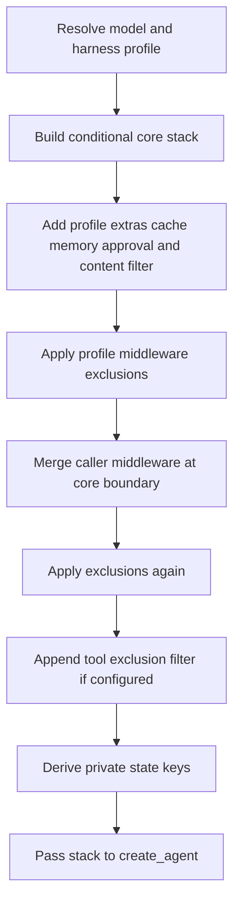

# Middleware Stack and Ordering

`create_deep_agent()` is a harness assembler, not a separate agent runtime. It resolves the model and applicable `HarnessProfile`, constructs ordered `AgentMiddleware`, and passes the final main stack to LangChain's `create_agent()`, which owns the model/tool loop. The passed-through graph options include the system prompt, tools, response format, schemas, checkpointing, store, debugging, name, and cache. See [SDK construction and execution](/openwiki/architecture/sdk-construction-execution.md) for the runtime boundary.

Middleware is the request-time extension boundary. A `wrap_model_call()` hook intercepts every LLM request before it is sent, so it can change the effective system prompt, history, tool list, or typed cross-turn state. In contrast, a callable in `tools=` runs only if the model selects it; it cannot prepare a model request. Caller tools are additive to built-ins. Use middleware for per-request behavior, prompt/tool injection, or state; use an ordinary tool for a self-contained operation. See [middleware catalog](/openwiki/concepts/middleware-catalog.md).

## Main-agent assembly

Membership is conditional on inputs and the resolved profile. `skills`, subagent forms, memory, filesystem permissions, interrupt configuration, profile extras, installed provider integrations, and profile exclusions all affect the result. Optional entries below are absent when their condition is unmet.

Diagram: construction order for the main stack and its profile/caller customization points.

### Stack order

The **core band** is assembled in this order:

1. `SkillsMiddleware`, when `skills` is supplied.
2. `FilesystemMiddleware`.
3. `SubAgentMiddleware`, when synchronous inline subagents exist—normally because the general-purpose subagent is added.
4. Deep Agents summarization middleware.
5. `PatchToolCallsMiddleware`.
6. `AsyncSubAgentMiddleware`, when remote async specs exist.

The **tail band** appends materialized `HarnessProfile.extra_middleware`, provider prompt-caching middleware, `MemoryMiddleware` when configured, `HumanInTheLoopMiddleware` when the resolved interrupt mapping is non-empty, and `UnsupportedContentMiddleware`. Cache middleware is before memory deliberately: profile extras run before caching, and memory's system-prompt mutations occur after the Anthropic cache prefix. Anthropic caching is always installed with unsupported models ignored. Bedrock and Fireworks variants are added only when their integration packages can be imported, and also ignore unsupported models.

The first profile-exclusion pass runs after that tail is assembled. Caller `middleware=` is then merged, exclusions run again, and `_ToolExclusionMiddleware` is appended only when the profile has `excluded_tools`. Being last matters for tool visibility: it sees the near-final request after tool-producing middleware and caller model wrappers, so excluded names cannot be restored by a caller wrapper. The content filter is last in the normal tail; although the optional tool filter is appended after it, the filter remains inside caller model wrappers and therefore observes a `ModelRequest.model` selected by caller middleware before deciding which content that model accepts.

The assembler also combines an explicit `state_schema` with middleware-contributed schemas, derives private state-field names, and assigns them to `SubAgentMiddleware`. This determines what ordinary synchronous delegation may carry across its state boundary.

### Unsupported-content filtering

`UnsupportedContentMiddleware` is public middleware and is automatically installed for the main graph. It filters each model request rather than mutating graph history: in `HumanMessage` and `ToolMessage` content, an unsupported image, audio, video, or qualifying inline file becomes a text notice. The original message remains in the thread, so a later request that switches to a model accepting the content can send the original block again instead of a permanently degraded substitute.

Support normally comes from the effective model's `profile`; a missing profile field is treated as supported, and only an explicit `False` rejects the block. Tool-message image and PDF support have separate profile gates. URL/file-ID references and non-PDF files outside the represented inline case are left to the provider. Non-PDF base64 documents are a Deep Agents-specific exception: they are passed only to an OpenAI Responses model that accepts the MIME type, otherwise they become the notice. This protects a text-only model from a persistent incompatible attachment, including a multimodal `read_file` result on a later turn.

Do not rely on this filter as persisted conversion or authorization: it changes only the outgoing request and omits hook inputs from traces by default. When composing LangChain `create_agent()` directly with `FilesystemMiddleware`, add `UnsupportedContentMiddleware` last yourself.

### Context-management role

The default summarization component is not merely a prompt addition. It can truncate old large tool arguments, compact history when configured thresholds are crossed, and retry through compaction after `ContextOverflowError`. Evicted history is offloaded to the configured backend and a private summarization event records the replacement summary and recovery path; an offload failure warns that older messages are unrecoverable. See [context management](/openwiki/concepts/context-management.md).

## Caller middleware and profile exclusions

Caller middleware is merged by `.name`, rather than blindly appended:

- A caller entry whose name remains in the base stack replaces that slot in place, retaining its position.
- A new name is inserted after the last surviving core member, ahead of profile extras, prompt caching, memory, approval, and content-filter middleware.
- The first exclusion pass occurs before merging; the second removes an attempt to reintroduce an excluded name or exact class.

This gives callers a controlled way to replace a built-in behavior. For example, a caller can supply a `FilesystemMiddleware` with the same name and a narrower `tools=[...]` set to remove a filesystem tool entirely; `tools=` alone cannot do that. Custom middleware that uses a new name is intentionally not copied into the general-purpose subagent merely because it was installed on the main agent.

A `HarnessProfile` can subtract entries with `excluded_middleware`, subject to safety and coverage checks:

- `FilesystemMiddleware` and `SubAgentMiddleware` are protected scaffolding. Excluding either by class or name raises `ValueError`, rather than silently breaking built-in filesystem/permission behavior or the synchronous `task` handler.
- Class entries use exact `type`, not `isinstance`; excluding a base class does not remove a caller subclass. String entries match `AgentMiddleware.name` exactly, permitting a public alias such as `SummarizationMiddleware` to target an implementation class with a different `__name__`.
- A string exclusion that matches multiple distinct classes in one stack is ambiguous and raises `ValueError`. Every permitted entry must match somewhere; unmatched entries raise after assembly, catching typos and stale profiles.

For a main profile, match sets accumulate across the main-agent and auto-added general-purpose stacks, then coverage is checked once both have been filtered. Thus an exclusion may legitimately apply to only one of those stacks. A declarative subagent that resolves another profile performs its own validation, filtering, and coverage check.

### Tool visibility is not authorization

`excluded_tools` adds final `_ToolExclusionMiddleware`, which removes named tools from model requests and returns an error instead of executing an excluded name at the tool-call boundary. This maintains consistency between advertised and executable tools, but is explicitly not a security surface.

Filesystem permissions are enforced by `FilesystemMiddleware` at calls to its built-in tools, not by the backend. Direct backend use therefore bypasses these middleware-level permission rules. Permission rules and approval behavior are covered in [permissions and human-in-the-loop](/openwiki/concepts/permissions-hitl.md).

## Separate subagent paths

Subagent form is determined during assembly: a spec with `graph_id` becomes an `AsyncSubAgent` handled by `AsyncSubAgentMiddleware`; one with `runnable` is a `CompiledSubAgent`; otherwise it is a declarative `SubAgent`. These forms have different construction and inheritance boundaries.

### Declarative subagents

Every declarative spec resolves its own model and harness profile and builds an independent pre-compilation stack: `FilesystemMiddleware`, summarization, and `PatchToolCallsMiddleware`; isolated-spec skills or forked-parent skills; profile extras; prompt caching; two exclusion passes around spec middleware; coverage validation; then the final tool filter. A fork also mirrors top-level memory when configured. `create_sub_agent()` then adds the resolved `HumanInTheLoopMiddleware` and, unless one with the same name is already present, appends `UnsupportedContentMiddleware`; it is therefore installed after the declarative stack's optional tool filter.

A spec inherits top-level tools, permissions, and `interrupt_on` only when it omits each field. Its own permissions replace, rather than extend, parent rules. After those values are resolved, a non-empty interrupt mapping adds `HumanInTheLoopMiddleware` while compiling the declarative graph. The parent `state_schema` is supplied to this compilation; supplied compiled runnables and remote graphs own their own schemas and approval configuration.

The default mode is `isolated`: the child receives a `HumanMessage` containing the delegated task rather than the parent's conversation. `handoff` is accepted as a legacy alias for isolated behavior. Experimental `fork` instead receives the parent's effective compacted history plus a task preamble, and rebuilds the parent prompt with an optional child addendum. A declarative fork cannot specify independent skills; it retains eligible private state channels, while a forked compiled runnable has private keys stripped because its schema is opaque. A forked child is refused if it calls `task`, preventing recursive delegation. See [subagents and skills](/openwiki/concepts/subagents-skills.md).

### General-purpose, compiled, and async agents

Unless the active profile disables it or an inline synchronous spec already uses its name, the harness adds `general-purpose`. Its pre-compilation stack contains filesystem, summarization, patching, optional skills, profile extras, caching, exclusion passes, and a final tool filter; declarative compilation supplies the approval and unsupported-content tail. It inherits only caller middleware that overrides one of its original default slots—not arbitrary main-agent-only middleware.

A `CompiledSubAgent` runnable is used as supplied. It does not inherit the parent state schema or top-level approval rules, and must return a state with `messages`. The parent returns a `ToolMessage` containing a JSON-serialized structured response when present, otherwise the last non-empty AI text, and merges eligible non-private state updates.

An `AsyncSubAgent` runs through Agent Protocol as a background task. `AsyncSubAgentMiddleware` returns and tracks task IDs in middleware state instead of blocking the parent `task` call; graph schema, approval behavior, and content filtering belong to the remote graph.

## Safe changes and focused tests

Ordering changes alter what the model sees and what tools can execute. Test assembled stacks, not only middleware constructors. Focus tests on replacement versus insertion, both exclusion passes, final request/tool-call filtering, protected-scaffolding and ambiguous-name failures, and coverage across main and general-purpose stacks. Also test the separate declarative, compiled, async, isolated, and fork paths—especially private-state treatment, fork prompt/history construction, recursive-delegation refusal, and the structured-response fallback.

For content filtering, test both synchronous and asynchronous model calls; an explicit profile rejection versus an absent profile field; `HumanMessage` and `ToolMessage` blocks; and a custom middleware that replaces `request.model`. The focused integration tests verify that a runtime model switch preserves a supported image but turns an image or a `read_file` image result into a placeholder for a text-only model, and that `create_sub_agent()` also installs the filter.
