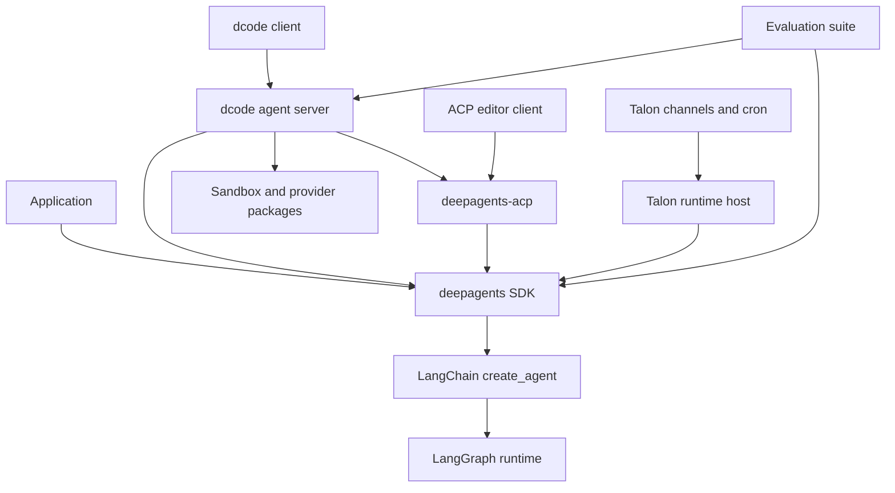
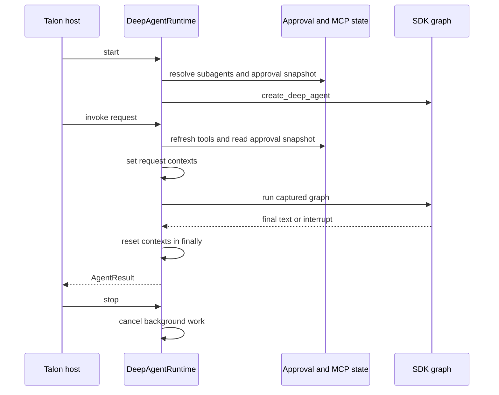
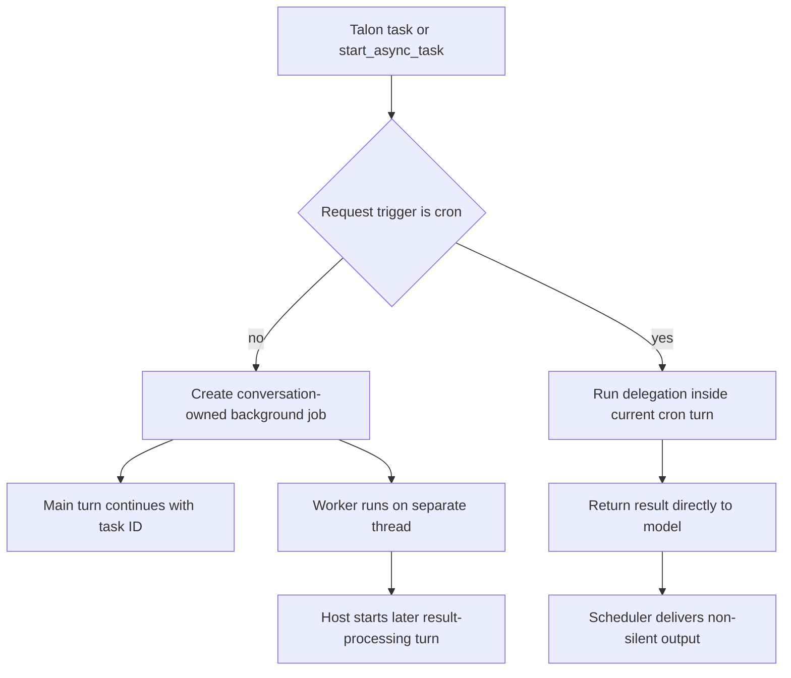

# System Architecture Overview

Deep Agents is the reusable harness in this monorepo; it does not own every agent-facing concern. Locate the owning boundary before changing behavior: reusable graph construction belongs to the SDK; terminal experience, configuration, and product policy belong to dcode; editor-protocol translation belongs to ACP; and long-running channels, approvals, scheduling, and local delegation belong to Talon.

- [Runtime behavior](./runtime-behavior.md)
- [Responsibility-by-file map](./source-map.md)
- [SDK construction and execution](./sdk-construction-execution.md)
- [Deep Agents Code](./code-agent.md)
- [ACP integration](../integrations/acp.md)
- [Talon integration](../integrations/talon.md)
- [Sandbox partners](../integrations/sandbox-partners.md)

## Stack, ownership, and dependency direction

This shows package dependency direction. dcode consumes ACP and optional partner integrations; those packages do not depend on the dcode server.

Deep Agents is a three-layer stack: LangGraph is the runtime for state, checkpoints, streaming, and interrupts; LangChain's `create_agent` builds the model-plus-tools-plus-middleware loop on that runtime; and Deep Agents is an opinionated harness on top of `create_agent`. The SDK owns harness defaults and composition, while LangGraph owns graph execution and checkpoint state.

`libs/` is a monorepo whose packages are independently versioned. `deepagents` is the core SDK, exposing `create_deep_agent`, middleware, and pluggable backends. Consumer packages consume the SDK rather than becoming dependencies of it.

| Package | Owns | Does not own |
| --- | --- | --- |
| `deepagents` | Reusable graph assembly, harness middleware, backend routing, profiles, skills, memory, filesystem tools, and SDK subagent machinery. | Terminal UI, editor-session policy, channel delivery, or provider implementation. |
| `deepagents-code` / `dcode` | Terminal product UI, client/server runtime, product configuration and persistence, approval UX, extensions, MCP integration, and sandbox selection. | The generic agent harness or a provider's sandbox implementation. |
| `deepagents-acp` | Agent Client Protocol translation and ACP session semantics around a graph. | A terminal product's graph policy or UI. |
| `deepagents-talon` | Experimental local host concerns: channel adapters, cron, local persistence, MCP lifecycle, channel-mediated approval, and local/background delegation. | SDK-wide delegation or approval policy. |
| `deepagents-evals` | Behavioral evaluation and benchmark execution outside the request-serving path. | Product runtime behavior. |
| `partners/` | Daytona, Modal, Runloop, Vercel, and QuickJS integrations. | Generic harness behavior or dcode presentation. |

## The reusable SDK assembly seam

`create_deep_agent()` is the SDK assembly point: it resolves the model and harness profile, resolves the backend, assembles main-agent middleware, builds the default general-purpose subagent, composes the final system prompt, and delegates to LangChain's `create_agent(...)` to produce a runnable graph. Put reusable harness behavior here, not channel routing, editor session policy, terminal rendering, or an operator workflow.

`DeepAgentState` extends LangChain's `AgentState` with a `DeltaChannel` reducer. That keeps checkpoint growth linear (O(N)) rather than quadratic (O(N²)) on long message threads. Graph checkpoints remain separate from backend persistence: LangGraph retains graph state, whereas the chosen backend determines where files, memory, and shell execution occur.

`FilesystemMiddleware` is SDK infrastructure, not a terminal-product feature. It supplies `ls`, `read_file`, `write_file`, `edit_file`, `delete`, `glob`, and `grep` through a `BackendProtocol`; `execute` is exposed only when the backend supports sandbox execution. It defaults to state-backed ephemeral storage, can route durable storage through a `CompositeBackend`, and offloads oversized results through that same backend. An explicit filesystem-tool allowlist must include `read_file`; omitted tools are not dispatchable. Consumers choose backends and product allowlists, but reusable filesystem semantics and permission enforcement belong in the SDK.

Tool visibility is not authorization. Middleware and profiles decide what the model sees; backend capabilities and filesystem permissions decide whether an operation can proceed; `interrupt_on` sends selected calls through LangGraph interruption. Preserve that separation when adding consumer-specific policy.

## dcode: a product server, not the SDK

Deep Agents Code separates a terminal client from an agent server in separate processes. The client owns presentation and input; the server owns the coding graph. Interactive and headless operation use the same runtime boundary.

`create_cli_agent()` is dcode's product assembly point. It creates a composite local-or-sandbox backend, CLI context schema, product middleware, approval policy, checkpoint/store integration, subagents, and a sanitized assistant name before calling `create_deep_agent()`. An explicit filesystem-tool allowlist is injected into synchronous subagents so delegation cannot bypass it; a JavaScript interpreter is rejected with a remote sandbox; and Auto approval is disabled for sandbox-backed graphs. Registered extensions replace same-named tools and middleware before final construction.

`deepagents-code` is version `0.1.77`, pins `deepagents==0.7.19`, consumes `deepagents-acp>=0.0.10,<1.0.0`, and exposes optional sandbox extras for AgentCore, Daytona, Modal, Runloop, and Vercel. Provider mechanics remain in the partner package even when dcode selects the backend.

### dcode MCP ownership

MCP configuration, trust, connection lifetime, and TUI status are Code product behavior. Its loader discovers user and project configuration sources while retaining each source's trust scope. Project servers require the product's trust decision because local commands and remote endpoints can execute or use configuration-provided values. dcode owns source merging, `${VAR}` resolution, project admission, and user-facing per-server status.

The loader returns tools, `MCPServerInfo` rows, and a `MCPSessionManager`. The manager owns router connections and adopted connection stacks until coordinated cleanup, so a long-lived dcode runtime can keep stdio subprocesses and authenticated transports alive across calls and close them together. This is separate from SDK filesystem context: MCP source discovery and UI feedback do not belong in `FilesystemMiddleware` or generic graph construction.

### dcode ACP assembly

ACP is both a standalone adapter and a dcode consumer boundary. `AgentServerACP` accepts either a compiled graph or a factory receiving `AgentSessionContext` with the ACP session working directory, mode, and model. The factory form is the seam for session-specific graph construction.

When dcode runs as an ACP server, it opens a checkpointer, builds a graph factory that passes each session's selected model and working directory to `create_cli_agent()`, and enables durable session loading. Its Auto-mode subclass wraps each graph: it writes trusted Auto approval state to the store and attaches trusted prompt metadata and CLI context before streaming. ACP owns protocol/session conversion; dcode owns product graph composition and Auto policy.

With `load_sessions=True`, ACP advertises `session/load`; recovery verifies checkpoint metadata identifies an ACP session and that the recorded working directory matches, restores options, and replays the session. This requires a checkpointer that survives restart; an in-memory saver is appropriate only for ephemeral or test-style use.

## Talon: host lifecycle around an SDK graph

Talon's CLI constructs the host boundary. It loads MCP tools and constructs `DeepAgentRuntime`; with a configured checkpointer it uses that resource, and otherwise the model-backed host creates an SQLite saver and conversation archive wrapper. Talon is experimental: local shell environment filtering is not sandbox isolation.

This shows the host invoking the runtime and the runtime composing, rather than owning, the SDK graph.

At startup `DeepAgentRuntime` resolves subagents and constructs its SDK graph. Each invoke establishes request-scoped authorization, history, cron, graph, and background-result context and resets it in `finally`. It refuses invoke before startup, rebuilds when the approval snapshot changes, and cancels background work before release. If cancellation fails, it deliberately leaves graph and checkpointer resources open so a still-writing worker cannot race a closed persistence resource.

`TalonHost` owns the long-running process lifecycle. It starts the agent runtime before channels and an optional scheduler, unwinds a partial start in reverse order, and during shutdown cancels work before stopping channels, scheduler, and runtime while isolating component stop failures. It serializes work per conversation: a new message may cancel and replace an active turn, but a cancellation timeout blocks the conversation until restart. MCP refresh and subagent reload build replacement graphs under a lock, preserving the prior graph if validation or reload fails; successful replacements apply to later turns.

### Talon delegation and approvals

Talon replaces the SDK subagent middleware with `TaskTools`. A task can add only unique names from the current parent tool catalog to a named local subagent; local subagents use fresh context without inherited parent history, and fork mode is rejected.

For ordinary non-cron turns, `BackgroundSubagents` detaches `task` and `start_async_task` into in-memory jobs owned by the conversation. Workers have separate thread IDs, cannot delegate again, clear inherited authorization handlers, and expose completed results for a later owner turn. A cron request is marked scheduled; its delegation runs inline and returns a result in the same turn instead of creating a background job or later delivery turn, and nested delegation is prevented. Scheduled inline work has a separate semaphore/queue and shorter timeout that becomes an error tool result; the host bounds the overall scheduled run and repairs its job thread after timeout.

This distinguishes interactive work that survives the current turn from cron work that must finish inside it.

`PersistentCronScheduler` claims and advances a due job before invoking it, records successful or failed runs, suppresses delivery for `[SILENT]` output, and records delivery failure as an error.

Talon approval policy is host-owned. Each invocation captures an immutable policy snapshot. An approval-interrupt batch must have unique IDs; the runtime presents protected actions as one decision and resumes with a decision payload for every ID, while cancelling co-batched MCP elicitation. Cron and background-delivery invocations are auto-rejected because they lack an interactive approval path. The host exposes a pending approval to the originating channel and accepts approval/rejection only from the sender who started the run; a validated reaction can resolve the same request.

## Evaluation, releases, and safe changes

The evaluation suite runs agents against real LLMs, captures tool calls, file mutations, and final responses, and scores correctness and efficiency. Its Harbor integration runs sandboxed benchmarks such as Terminal Bench 2.0. Use it for changes that alter agent trajectories, alongside focused tests at the changed ownership boundary.

The release manifest records `deepagents` 0.7.19, `deepagents-acp` 0.0.12, `deepagents-code` 0.1.77, `deepagents-talon` 0.0.8, and partner packages Daytona 0.0.8, Modal 0.0.6, Runloop 0.0.7, Vercel 0.0.2, and QuickJS 0.3.7. dcode's installation compatibility contract is `deepagents==0.7.19`, rather than the manifest's independent release baseline. Release Please creates separate draft pull requests and independent Python package releases with package-specific version files and changelogs, component-bearing tags separated by `==`, and test paths excluded from release analysis.

1. **SDK change:** Trace public `create_deep_agent()` inputs into middleware, profiles, or backends; preserve middleware ordering and the `DeepAgentState` message reducer.
2. **dcode change:** Keep UI, client/server streaming, product approvals, extensions, configuration, MCP handling, and sandbox selection in `libs/code`. Test `create_cli_agent()` and its server caller together where construction inputs cross processes.
3. **ACP change:** Keep protocol conversion, session persistence/replay, and editor-facing options in `libs/acp`. Test both a compiled graph and session-context factory, including durable-load rejection paths.
4. **Talon change:** Preserve host lifecycle ordering, graph replacement safety, per-conversation cancellation, context cleanup, approval identity, and the difference between detached interactive delegation and inline cron delegation.
5. **Provider change:** Put sandbox/provider behavior in its partner package. Test it through the consumer's optional integration without coupling it to the generic harness.
