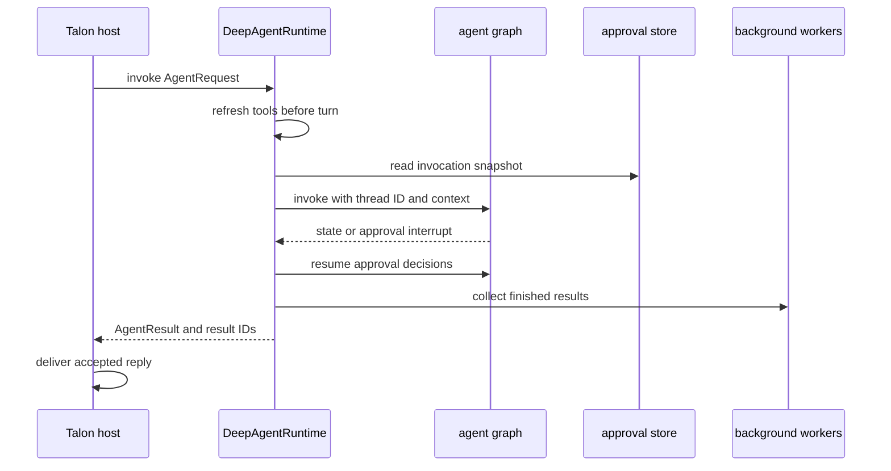

# Long-Running Runtime Behavior

Talon is an experimental Deep Agents runtime hosted behind channels. Its `DeepAgentRuntime` owns the compiled graph and the per-process collaborators that make a conversation durable and safe to resume: a LangGraph checkpointer, optional conversation archive, background-subagent registry, tool-approval store, runtime tools, and cron-job store. The host owns channel delivery, per-conversation ordering, cancellation, and scheduled dispatch. This division means a graph turn can retain its own stable snapshot while later turns refresh configuration. See [Permissions and Human-in-the-Loop](/openwiki/concepts/permissions-hitl.md) for the user-facing approval model, [State Persistence](/openwiki/concepts/state-persistence.md) for stored data, and [Talon integration](/openwiki/integrations/talon.md) for deployment wiring.

## Runtime construction and durable collaborators

`DeepAgentRuntime.start()` resolves local, supplied, and loader-provided subagents; creates the approval-policy snapshot if needed; then compiles the graph. The graph receives the selected model, a composite filesystem/shell backend, checkpoint saver, system prompt, skills, memory, configured subagents, task and background middleware, and a fixed approval interrupt map. Built-in runtime tools include time and messaging; depending on configuration, they also include archive/history tools, subagent reload, cron tools, web tools, and external/MCP tools.

The default checkpointer is `InMemorySaver`, so same-process turns with the same conversation ID share graph history. A `ConversationSaver` instead wraps a checkpoint backend with an independent archive. It serializes archive/checkpoint writes, writes the checkpoint before committed archive revisions, and on cancellation waits for both writes to settle before propagating cancellation. A final reply is archived only after the host confirms delivery, not merely when the model generated it.

The default shell backend is intentionally not a copy of the host environment. It starts with a small allowlist, a fixed safe `PATH`, and removes loader/hijack variables and values whose names indicate credentials. Artifacts are placed under the Talon home with mode `0700`. This protects tool execution from accidentally inheriting provider, MCP, cloud, or tracing credentials; it does not itself make shell tools safe to authorize.

This is the normal turn boundary: the runtime freezes the graph and approval snapshot for the invocation, while the host decides whether its reply actually reached a channel.

## Turn lifecycle, retries, and recovery

Before each invocation, the runtime calls `refresh_tools` when configured. A non-`None` result is compiled into a replacement graph under `_tools_lock`; a refresh error logs a warning and leaves the old graph usable. Explicit MCP reload similarly compiles before swapping, so an invalid replacement preserves the existing tools and graph. Subagent configuration reload follows the same build-then-swap approach. A running turn captures its graph in a context variable before it releases the lock, so it completes—and can resume an approval—against the capability set it started with. Reloaded tools and subagents apply to later turns.

Each graph invocation carries the conversation ID as LangGraph `thread_id`, the recursion limit, optional archive scope metadata, and optional activity callbacks. The runtime retries the *whole graph invocation* up to `max_retries` (default 3), but immediately propagates cancellation. Retryable failures are connection or timeout errors; selected HTTP statuses (`408`, `409`, `413`, `429`, `500`, `502`, `503`, `504`); retry-signalling parse/context failures at HTTP 400; and recognized transient text. Backoff is exponential and capped at 10 seconds. Nonmatching failures and the last failed attempt propagate.

A completed graph state without final text receives up to `max_continuations` continuation nudges (default 3), then a forced-summary prompt. This is a response-completion mechanism, not an error retry. The graph's recursion limit defaults to 500 and can be overridden with `DEEPAGENTS_TALON_RECURSION_LIMIT`; `DEEPAGENTS_TALON_CONTEXT_SIZE` applies a maximum-input-token profile and adds summarization middleware unless one was already supplied.

When the host cancels an active conversation or a scheduled run times out, it asks the runtime to repair the latest checkpoint. `recover_interrupted()` applies `PatchToolCallsMiddleware` and appends a human interruption marker at the latest committed checkpoint. This prevents a later turn from inheriting an assistant tool call without a matching result. If background workers cannot stop within their cancellation wait, runtime shutdown deliberately leaves graph/checkpoint resources open rather than closing them under writers; the host records component failure while continuing shutdown.

## Approval and authorization context

Tool prompting is governed by an exact-name JSON policy in `tools.json`. The store rejects malformed, oversized, duplicate, wildcard-like, control-character, symlink, and non-regular-file policy inputs; updates use a locked byte-revision compare-and-swap. The default policy gates approval-policy updates, conversation deletion, MCP updates, and remote asynchronous subagent creation. An immutable `ApprovalSnapshot` is captured for a graph invocation, so a policy update reports `available: next_invocation` and cannot alter an approval already in progress.

When the graph interrupts for tool approval, the runtime validates unique resumable interrupt IDs, batches the actions for each interrupt, audits only names/counts and stable conversation references, asks the request's approval handler, then resumes the graph with aligned approve or reject decisions. MCP elicitation interrupts are cancelled rather than presented as tool approvals. The runtime rejects after 50 approval rounds rather than loop forever.

The host supplies the approval and authorization handlers only for an eligible interactive request. `tool_approval_operator` is true only when the host marked it true and the request is neither cron nor a background-delivery turn. Cron requests are automatically rejected with a scheduled-run message; channel/background-delivery requests with no approval handler are also automatically rejected. Detached background subagents explicitly clear the authorization handler and operator context because they can outlive the originating interactive turn. These constraints prevent a delayed worker, follow-up delivery, or schedule from consuming a human authority that no longer has a live owner.

## Background subagents and result delivery

For ordinary chat turns, `BackgroundSubagents` intercepts `task` and `start_async_task`, allocates an in-memory task ID owned by the current thread, and runs at most four detached workers with at most 128 retained jobs. Workers use their own graph thread ID, cannot recursively delegate, have no approval operator or authorization handler, time out after one hour, and return bounded (64,000-character) sanitized success/failure text. Results are injected as identified user-message data into a later owner turn; the runtime acknowledges them only after that main turn completes.

The host makes delivery semantics explicit. If a completed turn is superseded or cancelled before its reply can be delivered, it requeues the result IDs so the next turn can process them. If the host deliberately suppresses a reply, it keeps them acknowledged. A failed main turn increments a per-result delivery count; after three failed deliveries, the runtime marks that result dropped instead of retrying forever. On shutdown or conversation cancellation, workers are cancelled and awaited briefly.

## Scheduled execution and cron persistence

Cron jobs are persistent, minute-granularity records with a versioned JSON envelope. A job stores its self-contained prompt, parsed schedule, enablement/repeat state, run outcome, and origin conversation/channel/message. Agent-facing cron tools create, list, edit, and remove only jobs scoped to the current `CronOrigin`; schedules support relative one-shot/recurring forms and timezone-explicit wall-clock one-shot/daily forms.

`PersistentCronScheduler` scans due jobs sequentially. It atomically advances a job's next run before invocation, marks success or error afterward, suppresses delivery when the text begins or ends with `[SILENT]`, and records a delivery failure as an error. Its ticker logs and continues after an unexpected scan failure; due work remains due for a later scan. Because dispatch is sequential and a claimed occurrence is already advanced, the host bounds every scheduled turn and repairs its dedicated `<job-id>:talon-cron` thread after timeout. Two fires of one job share a conversation lock and cannot overlap.

A cron turn has no person who can answer later and no subsequent delivery turn in which to consume detached work. Therefore it auto-denies approval-gated actions and changes delegation semantics: tasks run inline to completion, nested delegation remains disabled, remote `start_async_task` is streamed rather than left as a pollable SDK task, and `list_subagents`/`cancel_subagent` are hidden. Inline calls share a separate semaphore of four slots, queue rather than refuse excess fan-out, use the configured `DEEPAGENTS_TALON_INLINE_SUBAGENT_TIMEOUT` or 600-second default, turn timeout/failure into a tool result rather than letting it retry the entire graph, and clamp output to 64,000 characters. This keeps scheduled execution bounded and ensures its model sees the delegation result in the same turn.

## Operational invariants and regression coverage

When changing long-running behavior, preserve these boundaries:

1. Swap a replacement graph only after it compiles; retain the invocation graph until the invocation exits.
2. Keep approval policy snapshots immutable per turn and do not transfer interactive approval/authorization context into cron, detached worker, or background-delivery work.
3. Repair checkpoints after cancellation or scheduled timeout before reusing a thread.
4. Requeue background results only when a reply was lost, not when intentional suppression consumed the result.
5. Keep cron work origin-scoped, nonoverlapping per job, bounded, and inline for subagent delegation.
6. Treat backend environment scrubbing and artifact permissions as defense in depth alongside approval policy.

Focused runtime tests cover graph/tool refresh atomicity, authorization context binding, backend environment scrubbing, retry classification and limits, interruption repair, approval batching/auto-denial, and graph stability while awaiting approval. Background tests cover detached-worker limits, scheduled inline fan-out, timeouts, result truncation, and context cleanup. Host and scheduler tests cover timeout repair, per-job exclusion, lost-result requeueing, persisted dispatch outcomes, delivery failures, and ticker recovery.
