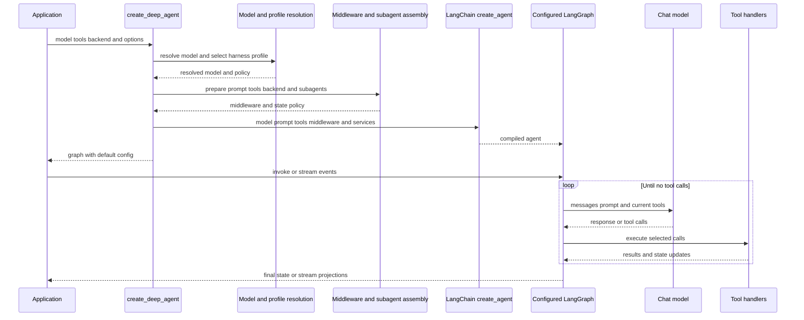

# SDK Construction and Execution

`create_deep_agent` is the public Deep Agents assembly API. It resolves configuration and delegates graph compilation to LangChain `create_agent()`; the result is a configured LangGraph/LangChain agent, not a separate Deep Agents runtime. The package re-exports the constructor alongside the main state, profile, filesystem, and subagent APIs.

## Construction and turn execution

Caption: Construction completes before LangChain compiles the graph; LangGraph then controls the model/tool loop while middleware shapes requests and updates.

## Resolution, policy, and shared services

### Model and harness policy

`resolve_model` returns a supplied `BaseChatModel` unchanged. For a `provider:model` string it calls `init_chat_model` with settings from the registered provider profile. The resolved model and original string specification select a harness profile. Provider profiles therefore affect model construction, while harness profiles shape the constructed agent: prompt text, tool-description overrides and exclusions, extra middleware, default general-purpose-subagent configuration, and middleware exclusions.

`model=None` is deprecated and constructs `ChatAnthropic(model_name="claude-sonnet-4-6")`; applications should pass a model explicitly. A declarative subagent resolves its own model and harness profile, so it can use model-specific policy different from its parent.

Tool-description overrides copy dictionary tools and `BaseTool` instances rather than mutating caller-owned values; plain callable tools remain unchanged. Tool exclusion is deliberately applied after custom middleware: `_ToolExclusionMiddleware` filters the runtime request tool list, preventing middleware-injected tools from restoring an excluded name.

### Backend and prompt ownership

When `backend` is omitted, construction creates one `StateBackend()` and shares it with filesystem, skills, memory, and summarization middleware for the main agent and constructed subagents. The backend supplies storage and execution behavior, but filesystem authorization belongs to `FilesystemMiddleware`.

The authored prompt begins with the harness contribution computed from an empty base. With `system_prompt=None`, that is the complete prompt. A string prompt is followed by a blank line and profile text. For a `SystemMessage`, existing content blocks remain intact and profile text is an additional text block, preserving existing fields such as `cache_control`. Skills and memory middleware can add dynamic material when the request is made.

## Subagent resolution and delegation

The constructor partitions supplied specifications by shape:

- A specification with `graph_id` is an `AsyncSubAgent`, exposed through `AsyncSubAgentMiddleware` for remote/background work.
- A specification with `runnable` is a `CompiledSubAgent`, used as the caller-provided runnable on the synchronous `task` path.
- Other specifications are declarative `SubAgent`s. Construction resolves their model/profile, tools, middleware, permissions, interrupt policy, and prompt. Omitted tools, permissions, and `interrupt_on` inherit parent values; explicit permissions replace the parent list.

Unless the profile disables it or an inline subagent is already named `general-purpose`, construction inserts a default synchronous general-purpose subagent at the front of the inline list. Inline subagents expose `task` through `SubAgentMiddleware`; async subagents use separate middleware. The profile can override the default subagent's description and prompt.

A declarative `mode="fork"` subagent is experimental. It receives parent conversation/state, mirrors prompt-producing parent middleware, and appends its own prompt rather than replacing the inherited prompt. A fork cannot define its own skills, and a `task` call from fork context returns a refusal rather than recursively delegating. Compiled and remote subagents retain the schema and approval behavior configured for their own graphs.

The task middleware compiles declarative specifications with `create_agent`, invokes the selected runnable, and returns a `Command` that appends a `ToolMessage` to parent state. It merges eligible returned fields after excluding private fields, serializes a non-`None` `structured_response`, or otherwise uses the final non-empty AI text. A compiled subagent that does not return `messages` fails validation.

## Middleware ordering, interrupts, and safe requests

The main stack has this core order:

1. optional `SkillsMiddleware`;
2. `FilesystemMiddleware`;
3. `SubAgentMiddleware` when inline subagents exist;
4. summarization middleware;
5. `PatchToolCallsMiddleware`; and
6. optional `AsyncSubAgentMiddleware`.

The tail adds profile extra middleware, prompt-caching middleware, optional `MemoryMiddleware`, optional `HumanInTheLoopMiddleware`, and `UnsupportedContentMiddleware`. Caller middleware replaces an existing matching `.name` in place; new caller middleware is inserted after the core and before the tail. Profile exclusions are applied before and after that insertion. Finally, profile tool exclusion is appended so excluded tools cannot be restored.

`FilesystemMiddleware` and `SubAgentMiddleware` are protected scaffolding. A profile cannot exclude either class or name because they back built-in filesystem tools, permission enforcement, and `task` dispatch. Construction fails rather than silently compiling a degraded agent: protected exclusions, unmatched entries, and a string exclusion matching multiple concrete classes raise `ValueError`.

Filesystem permissions are enforced by filesystem middleware, not the backend. Permission-derived interrupt configuration is merged with caller `interrupt_on`, and a caller entry wins for a duplicate tool name. A nonempty result installs `HumanInTheLoopMiddleware`, so an approval becomes a graph interrupt. Persisting and resuming that interrupt requires a checkpointer.

### Multimodal request safety

`UnsupportedContentMiddleware` makes model requests safe when a thread contains content the active model cannot accept. For each model request it inspects human and tool-message content blocks against `request.model.profile`; explicitly unsupported image, audio, video, or applicable file/PDF blocks are replaced in the outgoing request with a text placeholder. The persisted thread is not changed, so switching later to a capable model can send the original content.

The middleware also treats non-PDF inline base64 documents as a Deep Agents-specific case: only an OpenAI Responses model accepting the MIME type may receive them. File-ID and URL references are left to provider handling. The filter is assembled after caller middleware, so it evaluates a model selected by a preceding request override. Declarative subagents automatically receive it when their graph is compiled; a caller composing `FilesystemMiddleware` directly with LangChain `create_agent` must add it explicitly.

## Compilation, state, and checkpoints

The final `create_agent()` call receives the resolved model, composed prompt, rewritten tools, assembled middleware, response format, context schema, checkpointer, store, debug flag, name, cache, and state schema. Its result receives a default `recursion_limit` of `9999` and LangSmith metadata identifying the `deepagents` integration, Deep Agents version, and agent name.

Absent a custom `state_schema`, the graph uses `DeepAgentState`, an `AgentState` whose `messages` channel is a `DeltaChannel` with `_messages_delta_reducer` and snapshot frequency 50. Delta writes avoid storing the full accumulated list at every checkpoint, changing message checkpoint growth from quadratic to linear while `get_state()` can reconstruct history.

The reducer accepts raw message-like values, replaces or deduplicates by ID, handles individual removal tombstones and `REMOVE_ALL_MESSAGES`, and treats a missing replay base as empty. LangGraph assigns stable IDs before checkpoint serialization; the reducer deliberately does not invent them, preserving identity through replay and resume.

A supplied `state_schema` is forwarded to the main `create_agent` call and `SubAgentMiddleware`, allowing declarative subagents to receive its fields. Precompiled and remote subagents retain their own schemas. Before compilation, the constructor gathers fields marked `PrivateStateAttr` from the supplied graph schema and middleware schemas and gives their names to `SubAgentMiddleware`, preventing their handoff to or merge back from delegated work. If annotations cannot be resolved at runtime, the helper warns and keeps none of that schema's fields private.

## Runtime and streams

On `invoke`, `ainvoke`, or streaming execution, LangGraph calls the model with history, the effective system prompt, and the middleware-produced tools. A direct response ends the turn. Tool calls append results and state updates, then cause another model call. Middleware can intercept model or tool execution, filter tools, inject prompt context, compact/offload history, write typed state, enforce filesystem permissions, and scrub unsupported outgoing content. A callable in `tools=` runs only after model selection and cannot rewrite the preceding request.

## Focused verification

`test_end_to_end.py` drives a fake model through a filesystem `ls` call and then its scripted final response. It also verifies that a runtime model switch preserves images for a capable model but substitutes placeholders for a text-only model, including an image returned by `read_file`; the same behavior is tested for asynchronous invocation and declarative subagents. `test_messages_reducer.py` covers coercion, replay, removals, and stable IDs across resumed threads. The graph and subagent test suites cover assembly ordering, exclusions, prompt construction, state-schema wiring, forks, and delegation failures.

## Related pages

- [Middleware stack](middleware-stack.md) — hook responsibilities and ordering.
- [State persistence](../concepts/state-persistence.md) — checkpointer and resume concepts.
- [Subagents and skills](../concepts/subagents-skills.md) — delegation and skills concepts.
- [Build a Deep Agent](../workflows/build-a-deep-agent.md) — application-level construction workflow.
