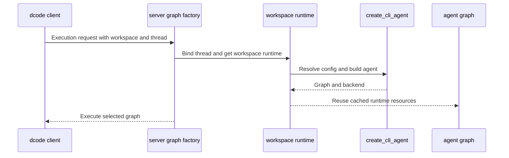
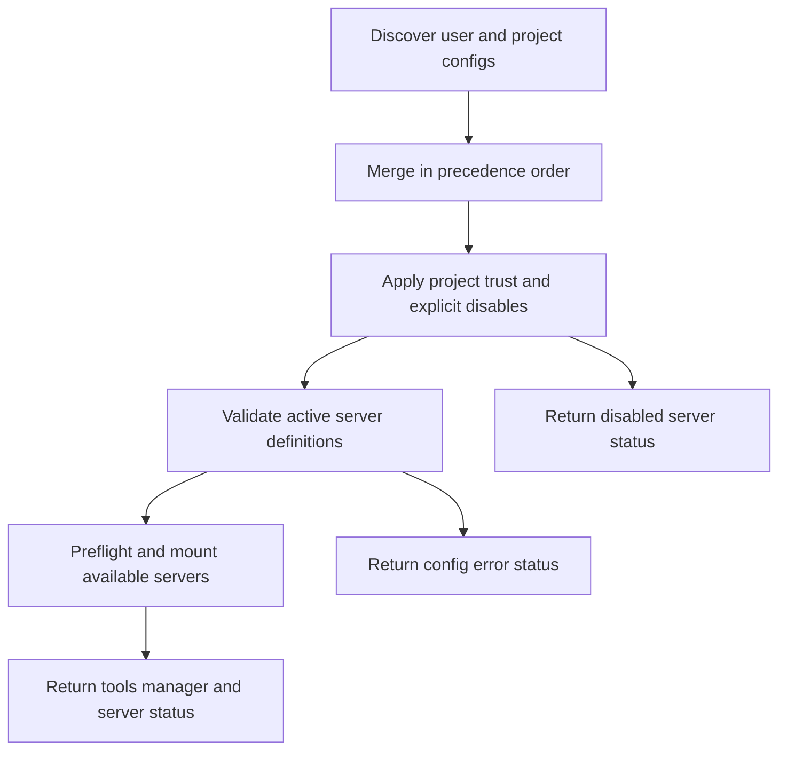

# Source Map and Ownership Boundaries

Use this page to select the owning boundary before changing behavior. This is a monorepo of independently versioned packages: the core SDK owns reusable agent construction and middleware, while Code, ACP, Talon, evaluations, and partner integrations own their product boundaries. See the [architecture overview](./overview.md) for the SDK model and [development operations](../operations/development.md) for repository commands and release workflow.

## Ownership and first seams

| Change surface | Owner and first seam | Focused validation |
| --- | --- | --- |
| Reusable graph composition, middleware ordering, backends, filesystem tools, permissions, profiles, or SDK subagents | **SDK** — `libs/deepagents/deepagents/graph.py`, then the relevant `middleware/`, `backends/`, or `profiles/` module. `create_deep_agent()` is the assembly seam. | `libs/deepagents/tests/` and the feature-specific unit or integration test. |
| Terminal commands, TUI, Code-only policy, client/server execution, MCP configuration, sandbox choice, extensions, skills, or interpreter behavior | **Deep Agents Code** — `libs/code/deepagents_code/`. Follow the CLI into `main.py`, `agent.py`, `server_graph.py`, `mcp_tools.py`, `app.py`, or `tui/`. | `libs/code/tests/unit_tests/`, including `test_mcp_tools.py`, `test_mcp_lifecycle.py`, and `test_debug_console.py` where applicable. |
| Editor protocol conversion, ACP session state, graph streaming, replay, mode, or model selection | **ACP** — `libs/acp/deepagents_acp/server.py`, centered on `AgentServerACP`. | `libs/acp/tests/`, especially session and model-switching coverage. |
| Long-running local channels, schedules, persistence, authorization, MCP lifecycle, or local delegation | **Talon** — `libs/talon/deepagents_talon/`, beginning at `__main__.py`, `host.py`, and `runtime.py`. | `libs/talon/tests/`, selecting host, MCP, authorization, cron, or subagent tests. |
| Benchmark trajectories, reports, catalog/model groups, or Harbor evaluation integration | **Evals** — `libs/evals/`; retain a regression test in the package that owns changed product behavior. | `libs/evals/tests/` plus the affected package test. |
| Provider-specific sandbox or JavaScript REPL mechanics | **Partner package** — `libs/partners/<provider>/`. | The partner package test suite and any required integration workflow. |

`deepagents` is an opinionated harness over LangChain `create_agent()` and LangGraph. `create_deep_agent()` accepts the model, tools, middleware, subagents, backend, permissions, persistence, and response configuration; shell execution needs a sandbox-capable backend. The package root is the supported SDK extension surface, re-exporting graph construction, state, filesystem and subagent middleware types, and profile registration APIs.

Code layers product policy on that SDK through `create_cli_agent()`. It propagates filesystem allowlists into synchronous subagents, rejecting compiled subagents when it cannot preserve the restriction. Its QuickJS interpreter is local-only; host-tool bridge calls bypass ordinary HITL approval, so interpreter configuration is the capability boundary.

`AgentServerACP` is the editor-facing adapter. With an `AgentSessionContext` factory, it builds session graphs from the working directory, mode, and model, resetting the agent when mode or model changes. Durable session loading checks the ACP session marker and original working directory before replay. Its prompt bridge converts ACP multimodal input to LangChain content, streams only top-level graph content, and resumes supported permission interrupts; free-form LangGraph interrupts are rejected because ACP cannot render them as permission requests.

## Code entrypoints and server lifecycle

Both `deepagents-code` and `dcode` console scripts target `deepagents_code:cli_main`; `python -m deepagents_code` reaches the same lazy export. Keeping the export lazy avoids startup imports for ordinary package importers, while an invalid Deep Agents home becomes a dcode error with exit status 2.

`server_graph.make_graph()` is the LangGraph-server factory. Execution-scoped requests require both a workspace context and a thread ID, bind that thread to its workspace before graph selection, and use a cached workspace runtime to avoid repeated MCP discovery, sandbox initialization, and cleanup registration. A startup construction failure emits a machine-readable marker before exit. Criteria and rubric helpers may receive only known read-only built-ins and MCP tools whose annotations are unambiguously non-destructive.

This shows the Code server ownership boundary: workspace binding precedes graph selection, while runtime resources are cached per workspace.

For editable Code checkouts, `_dep_floor_check.py` compares live declared requirements against installed versions only when PEP 610 metadata identifies an editable install. Released installs skip the inspection and inspection errors do not block startup. Interactive terminal launches can refresh, continue, mute, or abort; headless, subcommand, and piped modes only warn. Refresh invokes a fixed `uv` command, keeps only matching editable sibling packages, rechecks, then re-execs to prevent stale imported modules from surviving.

## Code MCP: configuration, trust, and resource ownership

`mcp_tools.py` owns the Code-specific work around FastMCP and `langchain.mcp`: discovering JSON configurations, resolving environment references at activation, enforcing project trust, adapting tools, and reporting per-server state to the TUI. FastMCP owns a transport, auth, and (for stdio) long-lived subprocess per configured server; the Code loader retains the router and connection stack in `MCPSessionManager`.

Discovery checks the user profile configuration, then `<project-root>/.deepagents/.mcp.json`, then `<project-root>/.mcp.json`, in increasing precedence. Project provenance is retained rather than inferred from a path later. Project servers are not activated merely because they appear in a repository file: explicit user disables always win; otherwise whole-config trust or a project-root-and-fingerprint-scoped approval is required. This applies equally to stdio and remote servers, preventing a repository-controlled configuration from spawning a command, making a preflight request, or interpolating headers without approval. Later configuration definitions override earlier ones before that trust decision.

This is the MCP loader's control flow: trust filtering occurs after precedence resolution and before server activation.

A load isolates configuration, authentication, connection, schema, and filter failures to the affected server, returning `MCPServerInfo` instead of hiding healthy siblings. Status invariants prohibit tools on non-`ok` entries and require their error message. `${VAR}`-bearing configurations redact setup and connection details so resolved secrets are not echoed. OAuth-configured remote servers without tokens report `unauthenticated`; a static `Authorization` header takes precedence over stored OAuth credentials.

The session manager owns every adopted router/connection load until cleanup. Cleanup marks it closed, bounds each router/backend close to five seconds, logs ordinary cleanup failures, and still completes cleanup if its caller is cancelled. A caller-managed manager can adopt subsequent loads without invalidating tools from earlier loads; once closed, it rejects adoption. Stateless tools instead create and clean up a fresh connection for each invocation. Start with `test_mcp_lifecycle.py` for these lifetime and cancellation guarantees and `test_mcp_tools.py` for precedence, trust, validation, filtering, and status behavior. Talon imports selected MCP types and `get_mcp_tools` from this module, so preserve those public shapes or migrate Talon in the same change.

## Debug diagnostics are a Code UI seam

The read-only `DebugConsoleScreen` is toggled by `Ctrl+\` or the hidden `/debug` command. `DeepAgentsApp` supplies a fresh, I/O-free session snapshot and opens it as a modal over the current screen. The screen polls its optional snapshot provider and the in-memory `deepagents_code.*` log ring buffer on the same half-second interval; a failed snapshot provider is contained so it cannot crash the application or flood the very buffer being inspected.

The console presents level filtering, an accessible logical-record view, keyboard selection/copy, optional click-to-copy, and a cost-breakdown modal when historical cost data is available. `Ctrl+L` advances a clear cursor rather than deleting the shared buffer, and the app persists that cursor across close/reopen so later records remain visible. The app also persists the click-to-copy preference without blocking the UI. Test this integration through `test_debug_console.py`, including modal key precedence, refresh failure recovery, wrapping and retention, clear/reopen semantics, and snapshot contents.

The separate dcode debug-file logger is opt-in and per-thread. It installs a tagged handler only after securing the destination and replaces stale tagged handlers when rebinding a thread. On POSIX it rejects directories that are not current-user-owned real directories, opens files without following symlinks, tightens access to owner-only, and removes handlers with a warning on hardening failure.

## Backend artifacts and context eviction

`CompositeBackend` routes virtual file paths by longest matching prefix and has an `artifacts_root`, defaulting to `/`. This root is the shared placement policy for middleware-created artifacts, not a generic route rewrite. `FilesystemMiddleware` and summarization middleware normalize its trailing slash and derive sibling prefixes for `large_tool_results` and `conversation_history`; the deprecated summarization `history_path_prefix` argument is rejected in favor of backend configuration.

When a configured filesystem tool-result threshold is exceeded, middleware extracts all textual content, writes the full result beneath `<artifacts_root>/large_tool_results/<sanitized-tool-call-id>`, and replaces text with a line-numbered head-and-tail preview pointing the agent to `read_file`. Non-text message blocks and message identity fields are preserved. Failed writes leave the original message intact. Long tool-call IDs receive a bounded hashed storage name while the model-visible notice abbreviates the ID.

On a context-overflow fallback, summarization clips the trailing `ToolMessage` batch. It treats `read_file` specially: because the original file already exists, it keeps a head slice and points to the original path instead of duplicating it. Other results use the same artifact offload helper. `test_artifacts_root.py` is the focused test for custom-root placement, trailing-slash normalization, default-root behavior, long IDs, and sync/async eviction.

## Release units and compatibility

Release Please manages nine independent Python release units, with package-specific changelogs and version-bearing files. It opens separate draft release PRs, excludes each package's test path from release analysis, and uses component-bearing tags with `==` and no `v` prefix. `libs/evals` is in the monorepo but is not a manifest release unit.

| Path | Distribution / component | Manifest baseline |
| --- | --- | --- |
| `libs/deepagents` | `deepagents` / `deepagents` | `0.7.19` |
| `libs/acp` | `deepagents-acp` / `deepagents-acp` | `0.0.12` |
| `libs/code` | `deepagents-code` / `deepagents-code` | `0.1.77` |
| `libs/talon` | `deepagents-talon` / `deepagents-talon` | `0.0.8` |
| `libs/partners/daytona` | `langchain-daytona` / `langchain-daytona` | `0.0.8` |
| `libs/partners/modal` | `langchain-modal` / `langchain-modal` | `0.0.6` |
| `libs/partners/runloop` | `langchain-runloop` / `langchain-runloop` | `0.0.7` |
| `libs/partners/vercel` | `langchain-vercel-sandbox` / `langchain-vercel-sandbox` | `0.0.2` |
| `libs/partners/quickjs` | `langchain-quickjs` / `langchain-quickjs` | `0.3.7` |

The Code distribution is `0.1.77`, pins `deepagents==0.7.19`, requires `langchain-quickjs>=0.3.4,<0.4.0`, and develops the SDK, ACP, and partner packages as editable siblings. That exact SDK pin means a consumed SDK change requires a paired Code release and validation. Talon is an experimental local runtime host entered via `deepagents_talon.__main__:main`; it accepts `deepagents>=0.7.0` and `deepagents-code>=0.1.71,<1.0.0`. QuickJS is independently released as `langchain-quickjs`, supplies JavaScript REPL middleware, and accepts `deepagents>=0.7.0,<0.8.0`.

Talon's MCP provider independently loads available servers, prefixes and metadata-marks tools, adds management capabilities, rejects name conflicts, and serializes revision-gated refresh. Its middleware wraps only metadata-marked MCP tools, scopes authorization to the individual call ID, normalizes empty optional strings, converts MCP protocol errors to safe `ToolMessage` values, and propagates other exceptions. Talon local subagents build fresh graphs with selected tools, MCP and applicable approval middleware, and no checkpointer; fork mode and malformed async configuration fail closed.

## Safe change sequence

1. Choose the package from the ownership table; do not treat `libs/` as one Python project.
2. Trace to the lifecycle owner. For Code MCP work, inspect discovery provenance, precedence, trust, status reporting, and session cleanup together.
3. For server work, preserve workspace/thread binding and cached runtime resource ownership.
4. For eviction work, test the sync and async paths and verify the artifact root rather than hard-coding `/`.
5. Check `pyproject.toml` and the release table before changing dependency pins or release-facing files, especially Code's exact SDK pin.
6. Add the smallest observable regression test at the owning package, then run the package-local target documented by `make help`.
