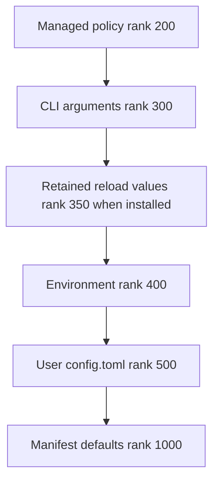
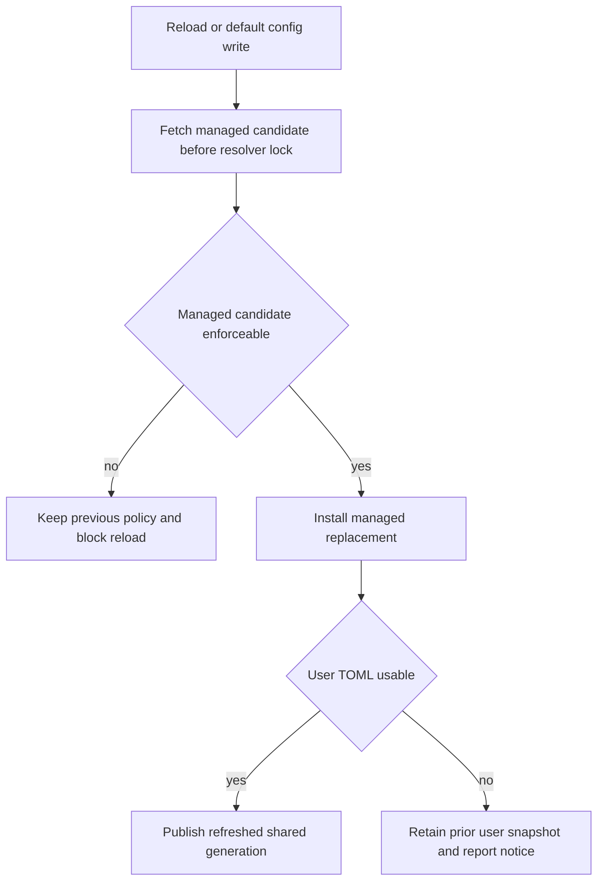
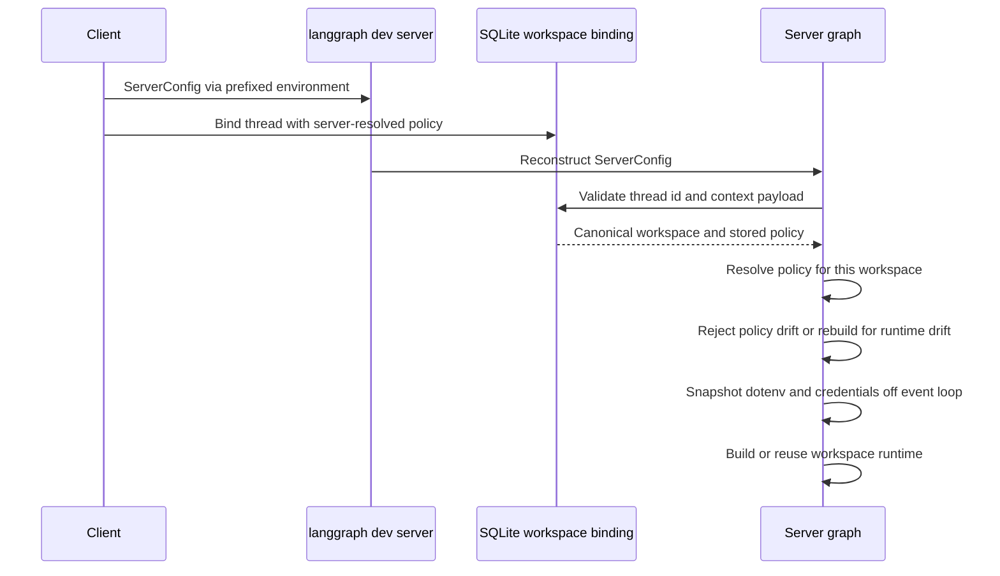

# Configuration Layering and Workspace Binding

Deep Agents Code (`dcode`) resolves typed settings from ranked sources. Its central consistency choice is to serve one coherent file generation—even when stale—rather than mix an edit into only some reads. Managed policy is the trust root and must fail closed: a bad replacement must not remove a restriction and let a weaker source win.

For model-specific settings, see [profiles and models](/openwiki/concepts/profiles-models.md); for an MCP integration overview, see [MCP](/openwiki/integrations/mcp.md).

## Source model and precedence

Configuration is layered across user, project, session, and runtime scopes. Teams can share project defaults while individual users retain credentials, preferences, skills, and local settings. The generic resolver only handles numeric ranks, provider health, and `Found`, `Unset`, or `Invalid` results; providers own domain coercion.

For replacement settings, lower rank wins:

The standard replacement precedence chain, including the conditional in-memory reload-retention tier.

Managed policy outranks CLI, runtime retention, environment, and the writable user file. `resolver_from_snapshots()` requires keyword-only `managed=` and `user=` arguments, so same-typed snapshots cannot be transposed. Provider ranks must be unique. Options select `replace`, `union`, or `deep_merge`; accumulation retains valid tier contributions while treating manifest defaults as fallback rather than ordinary accumulated input.

The parsed command line becomes an immutable `CliProvider` snapshot of the `argparse` namespace. Installing a different CLI provider is rejected: one process has one argv. An ad-hoc snapshot resolver has no CLI tier unless its caller supplies the installed provider.

### Inspecting effective configuration

`dcode config` and `dcode config get <key-or-prefix>` are diagnostic entrypoints, not views of the cached resolver. After dotenv bootstrap, an invocation snapshots managed and user files once, carries over the installed CLI provider, and resolves displayed options against that local generation. It reports source as well as value; `--verbose` / `--all` adds catalog detail and per-leaf provenance. Secrets are redacted in text and JSON, and unreadable stored credentials fall back to other sources with a secret-free warning.

## Shared generations, reload, and safe writes

`get_config_resolver()` owns the normal process-wide cache, keyed by default user and managed-policy paths. On first read it builds providers for managed and user TOML snapshots, environment, manifest defaults, and installed CLI values. Ordinary readers through it observe one generation; files are not watched.

There are three deliberate read models:

- **Shared generation:** managed and user TOML providers retain parsed snapshots; edits become visible only when the generation advances.
- **Direct snapshot:** a caller reads a file itself when it needs exact file health or precedence the common chain cannot express. This is a caller-level exception, not a per-setting cache policy.
- **Active environment:** `EnvProvider` resolves `active_environment()` for every lookup. It is live `os.environ` normally and an immutable context-local mapping inside `use_environment()`.

A default-path in-app write and `/reload` advance the shared generation. `update_user_config()` serializes a read-modify-write under a shared reentrant lock, calls the mutation against the current parsed table, writes a temporary TOML file in the target directory, then atomically replaces the target. It rejects the managed path and refuses unreadable or malformed existing TOML, preventing an edit from overwriting policy or dropping sibling tables. A committed default-path write best-effort refreshes the resolver; a refresh failure logs that the process is still serving old values rather than falsely reporting that the on-disk write failed.

The refresh path preserves a coherent managed and user generation while handling failed candidates.

`TomlFileProvider` retains its last usable snapshot when a reload candidate is missing, unreadable, or malformed. A malformed user file therefore keeps earlier values and produces a `Kept previous config.toml:` notice; a first failed read falls through. Managed policy has an enforceability gate for invalid enforced declarations, malformed known sections, and inconsistent model ceilings. Its candidate is fetched before acquiring the resolver lock and installed as an already-refreshed replacement. This avoids remote I/O under the reader lock and prevents a user-only advance past managed policy; an un-enforceable policy blocks reload with a notice.

For resolver values runtime reload owns, `_ReloadOverrideProvider` retains accepted values that a refreshed resolver cannot reproduce. It is non-durable, atomically replaces its mapping, and ranks 350. Reload preview reads fresh user TOML for the proposed edit but deliberately does not refresh enforced managed policy.

## Project dotenv and MCP controls

The dotenv stack is derived from an explicit environment mapping. Shell values win; enabled nearest-project and global-profile dotenv files fill only absent values. `resolve_read_project_dotenv()` reads configuration locally before project `.env` is layered, because it needs a trusted-global-dotenv tier that the shared resolver cannot express and must not create a shared generation as a bootstrap side effect.

A repository-controlled project `.env` cannot set user-level MCP authorization, Auto review controls, subagent inheritance, graph recursion fallback, or launch terminal tracing. Trusted shell and global dotenv inputs remain eligible. `resolve_env_var()` gives `DEEPAGENTS_CODE_{NAME}` precedence over `{NAME}`; a present but empty prefixed variable suppresses the canonical value.

MCP server fields `command`, `url`, `args`, `env`, and `headers` support only braced `${VAR}` and `${VAR:-default}` expansion against the active environment. The latter uses its default for unset *or empty* input. Malformed braced references and an unset required variable fail validation instead of reaching a command, URL, or header; unsupported fields are copied unchanged and the input mapping is not mutated.

User MCP disablement is persisted as `[mcp].disabled_servers` in user `config.toml`; the legacy `[mcp_disabled].servers` spelling is read for compatibility and removed on a successful write. User and managed disabled-name lists union, and disabled servers are filtered before validation, tool exposure, or connection attempts. The persistent key is server name alone, so the same name is disabled across overlapping configurations. An unreadable or ill-typed managed deny list is treated as a failure to authorize: MCP loading disables every candidate, and `is_server_disabled()` returns true. A corrupt user file is instead preserved and warned about, without erasing managed denials. Re-enabling is refused when managed policy cannot be read, and a managed denial can shadow a successfully saved user preference.

## Server boundary and workspace isolation

The interactive client launches `langgraph dev` in a separate process and cannot share resolver memory. `ServerConfig` is the typed boundary: the launcher derives it from CLI settings, normalizes relative paths against captured project context, serializes it as `DEEPAGENTS_CODE_SERVER_*` variables, and clears variables for `None`. The server reconstructs and validates the payload; malformed or unsafe filesystem-tool allowlists fail closed.

The subprocess handoff, durable binding, and execution-time policy check are separate controls.

A binding is server-authoritative SQLite state for one thread. It canonicalizes an existing absolute directory and project root, persists canonical non-secret workspace policy plus server-side policy and runtime SHA-256 fingerprints, and atomically refuses a different workspace or policy. Schema v4 separates durable access-policy compatibility from full runtime identity: a policy change refuses the request, while a compatible model or runtime change refreshes identity and rebuilds without losing checkpoints. The LRU runtime cache holds 32 workspace-and-runtime-fingerprint entries. A configured sandbox is process-wide: the first workspace claims it and another workspace is refused.

`make_graph()` requires a thread ID and workspace context for execution, validates the context against the binding, then resolves current `ServerConfig` for the bound directory. Project grants—MCP configuration, sandbox setup, extension paths, and their trust decisions—are resolved for that project, never accepted from the client. For a target outside the launch project, `resolve_workspace()` drops launch-project MCP, sandbox, and extension grants, resets MCP trust, and re-reads target extension trust; uncertainty comparing directories follows that fail-closed path. Revoked extension trust and project or durable policy drift refuse execution.

Before assembly, `_make_graphs()` makes the workspace dotenv mapping and `CredentialsSnapshot` in a worker thread, freezes the mapping, and enters `use_environment(workspace_env)`. Construction consequently uses the workspace environment instead of mutable server `os.environ`; changes after a runtime is built do not alter it.

## Drift diagnostics without secret disclosure

Bindings persist a versioned comparison snapshot beside their durable row. It is a deliberately bounded allowlist of reportable booleans, integers, short identifiers, and tool/command lists from workspace policy. Paths, model specifications and parameters, prompts, environment values, credentials, and profile overrides are neither persisted nor logged for reporting. Unsupported, oversized, or snapshot-size-exceeding values are omitted without changing whether a binding is accepted.

On a binding conflict or execution-time policy drift, `WorkspaceConflictError` carries `WorkspaceDiagnostics`: a category, safe reason, snapshot availability, optional schema versions, and field changes. Allowlisted values are shown only when both bound and current snapshots contain them; fingerprint-only or excluded changes identify their field with `values_unavailable`. Older bindings explicitly report unavailable snapshots rather than treating missing historical data as an unset value. The workspace route returns this as additive `diagnostics` in its HTTP 409 body, while clients tolerate absent or malformed diagnostic payloads for compatibility. Logs name changed fields but not values, and the TUI renders restore instructions with markup-safe, dangerous-Unicode-stripped dynamic content.

## Safe change checklist

1. Put source coercion in providers or the manifest domain, not in the generic rank engine.
2. Choose rank and merge strategy deliberately; preserve managed precedence and keyword-only managed/user snapshot construction.
3. Use `get_config_resolver()` for ordinary process reads. Document any direct snapshot as a caller-level exception and decide whether it needs CLI values.
4. Preserve last-usable behavior and test failed managed refreshes so weaker settings never become effective.
5. Treat project `.env` as untrusted for user-level security controls; preserve explicit workspace environment snapshots.
6. For MCP changes, validate interpolation strictly and retain the managed-deny fail-closed path before tools connect.
7. For server-facing settings, extend `ServerConfig` serialization and classify resource-affecting data in workspace policy/fingerprint validation. Add to drift snapshots only after deciding that its value is safe to store and display.

## Focused validation

- Configuration and reload tests cover rank/merge behavior, CLI installation, coherent replacement, preview semantics, notices, and failed user or managed candidates.
- MCP configuration and disabled-server tests cover interpolation syntax, unioned user/managed denials, corrupt policy behavior, safe preference writes, and filtering before connection.
- Workspace and server-graph tests cover canonical SQLite binding, policy/runtime distinction, scoped environment snapshots, policy and extension-trust drift, runtime rebuilding, LRU behavior, and sandbox ownership.
- `test_workspace_diagnostics.py` pins the snapshot allowlist and bounds, durable persistence, refusal categories and wire parsing, value-unavailable behavior for legacy/excluded fields, secret-free logging, and safe TUI rendering.

When adding a setting, test the decision boundary it changes—rank and merge, reload publication, dotenv trust, MCP authorization, server serialization, workspace policy/runtime classification, diagnostic redaction, or introspection—not only its parser.
