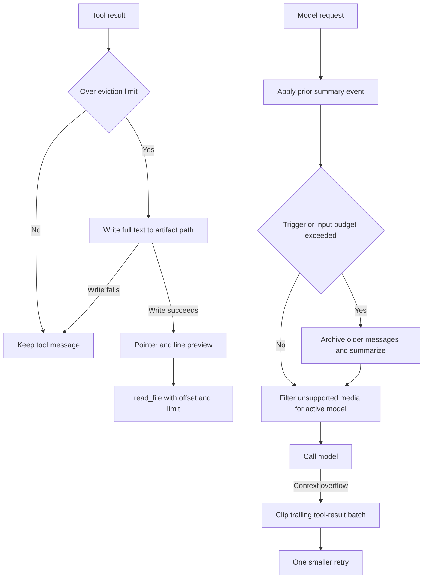

# Context Management

Long-running agents face two distinct context problems: one tool result or human message may be too large to send, and the accumulated conversation may exceed the model input budget. Deep Agents addresses them at different points in the request lifecycle:

- `FilesystemMiddleware` proactively offloads oversized tool-result text and transforms oversized human input at the model boundary.
- `SummarizationMiddleware` keeps raw state but records a summary event that rebuilds the model-visible history as a summary plus a recent suffix.
- If a request is known to be too large, or the provider returns a recognized context-limit error, overflow recovery attempts one strictly smaller request.

Filesystem artifacts are part of the context contract, not merely diagnostics: every advertised path must be readable through the configured backend's `read_file` tool. See [Tools and Filesystem](/openwiki/concepts/tools-filesystem.md) for tool behavior, [Backends](/openwiki/concepts/backends.md) for routing, and [State Persistence](/openwiki/concepts/state-persistence.md) for checkpoint lifecycle.

Caption: individual-result eviction creates a recoverable pointer, while compaction changes only the effective conversation sent to the model and capability filtering is request-local.

## Artifact roots and recoverability

`CompositeBackend` has an `artifacts_root` for middleware-owned artifacts, defaulting to `/`. `FilesystemMiddleware` and `SummarizationMiddleware` strip a trailing slash and derive their paths below that root:

| Artifact | Path below the effective root | Producer |
| --- | --- | --- |
| Large generic tool result | `large_tool_results/{sanitized-tool-call-id}` | proactive eviction and overflow clipping |
| Large human input | `conversation_history/{uuid}.md` | `FilesystemMiddleware` |
| Archived conversation | `conversation_history/session_{uuid}.md` | `SummarizationMiddleware` |
| Offloaded inline media | `conversation_history/media/{sha256-prefix}.{ext}` | `SummarizationMiddleware` |

For example, `artifacts_root="/workspace/"` produces `/workspace/large_tool_results` and `/workspace/conversation_history`; a non-composite backend uses root-level paths. Composite routing then selects a backend by the full artifact path and forwards the stripped path to that backend. Therefore, choose an artifact root that resolves to storage exposed by `read_file`; changing the root without matching routing can leave model-visible pointers unrecoverable.

The same prefix rules apply to sync and async paths. Composite `write`/`awrite` preserve the public path while delegating to the selected backend, and the middleware uses the corresponding synchronous or asynchronous backend method. Tests cover default and custom roots, trailing-slash normalization, tool-result recovery, archived history, media, and human-message eviction in both invocation modes.

## Proactive tool-result eviction

`FilesystemMiddleware` defaults `tool_token_limit_before_evict` to 20,000. The setting is a character-derived threshold using `NUM_CHARS_PER_TOKEN`, and a false value disables the feature. The middleware extracts text blocks only for the size decision. When content exceeds the threshold, the shared eviction helper writes the complete text to the large-result path and emits a pointer-and-preview replacement **only after** the backend reports a successful write. A failed or `None` write leaves the original tool message in place rather than advertising missing content.

The on-path filename is sanitized from `tool_call_id`; a missing id receives a UUID-derived `unknown-...` name, and long ids are bounded by the sanitizer. The model-visible notice abbreviates a long id, but the original `tool_call_id` remains on the replacement message.

### What the replacement preserves

Eviction changes text, not the tool-result identity. The replacement preserves the tool call id, message id, name, artifact, status, and message metadata. For mixed content, text blocks become a single pointer/preview text block while non-text blocks remain present. This applies to direct `ToolMessage` results and tool `Command` message updates; command processing preserves a leading `REMOVE_ALL_MESSAGES` sentinel and non-tool updates. Stable message ids let the state reducer replace the original result rather than append a duplicate.

### Previews guide targeted recovery

The pointer tells the model to use `read_file(file_path, offset, limit)`. Previews are line-numbered head-and-tail views: normally five initial and five final lines. They include an explicit middle-omission marker only when whole lines were omitted, and independently clip each shown line at 1,000 characters. The explanatory note is built from flags recorded during preview construction, so a literal marker in source content is not misreported as middleware truncation.

## Large human messages: full state, reduced request

Human-message eviction deliberately has different ownership semantics. If the newest untagged `HumanMessage` exceeds `human_message_token_limit_before_evict` (50,000 by default, using the same character approximation), the middleware writes its extracted text under `conversation_history`, retains the full original content in checkpointed state, tags it with `additional_kwargs["lc_evicted_to"]`, and sends a preview in the model request. Every previously tagged human message is previewed again on later model calls.

A successful new eviction emits a state update containing only a same-id tagged copy of that human message. This lets the message reducer replace that checkpoint entry without deleting an `AIMessage` written in the same graph super-step. If the write fails, there is no tag and no request truncation. Do not treat this as tool-result eviction: tool text is replaced in state after a successful offload, whereas human text stays in state and is transformed only for model visibility.

## Summary events and archived history

`SummarizationMiddleware` represents compaction with `_summarization_event` and `_summarization_session_id`, not by deleting the raw message log. An event contains `cutoff_index`, `summary_message`, and optional `file_path`. On a later request, the effective conversation is reconstructed as the summary message followed by raw messages from that cutoff. A malformed event falls back to raw messages; an out-of-range cutoff yields the summary alone.

Before compaction, the middleware counts effective messages together with the system message and, when supported by the configured counter, tool schemas. It can first truncate old `write_file` and `edit_file` arguments. Compaction occurs when its configured trigger fires or when the complete request exceeds the calculated input budget; `keep` controls the suffix retained verbatim.

For a positive cutoff, the older partition is prepared for both archival and summary generation. Inline `data:` media is uploaded once per content hash below `conversation_history/media` and rewritten to typed path references. Decode or upload failures become explicit failed-offload placeholders rather than silently disappearing. Older non-summary messages are rendered as XML and appended to a timestamped section in one per-session Markdown history file. The internally generated session id is persisted and reused on later turns; it is separate from a caller's thread id and avoids parent/subagent file collisions.

Archiving is best effort. If history writing fails, the middleware logs and warns that older messages are not recoverable, uses `file_path=None`, and still creates an in-context summary. If the archive succeeds but media blocks failed to offload, the archive path is retained but the warning identifies those media as unrecoverable.

## Capability filtering preserves the graph state

`UnsupportedContentMiddleware` is a separate, request-time safeguard for images, audio, video, and files that the active model cannot accept. `create_deep_agent` installs it automatically; users assembling an agent with `create_agent` should place it last so it evaluates the final `ModelRequest.model`, including any model selected by other middleware.

For each `HumanMessage` and `ToolMessage`, it reads the active model profile. An omitted capability is treated as supported because profiles are incomplete; only an explicit `False` rejects a block. Tool-message images and PDFs additionally observe their tool-message-specific profile flags. Inline non-PDF documents are accepted only for supported OpenAI Responses models. Unsupported blocks become text notices for that request, and a `read_file` media result names its source path in the notice. The original messages and their media remain in graph state, so a later request using a capable model can receive the original blocks again. This is deliberately different from filesystem eviction and summary events, both of which add recoverability state.

## Manual compaction extension

`SummarizationToolMiddleware` exposes `compact_conversation` for model- or user-initiated compaction. It composes with a particular `SummarizationMiddleware`, reuses its model, backend, and summarization machinery, and writes the same `_summarization_event` and session-id state keys as automatic compaction. The tool itself never compacts automatically; it is eligibility-gated to avoid early compaction. This makes it an extension point for human approval flows without introducing a second history representation.

## Overflow recovery: one useful retry

The input budget is derived from the request model profile: 95% of `max_input_tokens`, minus the largest configured output reservation. This count includes system prompt and eligible tool schemas, so irreducible system, tool, or output overhead is rejected before a provider call when the budget is known.

A normal request is attempted when compaction is not required. The middleware recognizes `ContextOverflowError` and selected context-limit language on 400, 413, and 422 errors, but propagates unrelated bad requests. A recognized provider failure falls through to compaction; if there is no compaction cutoff, the budget path still considers tail clipping.

Only a trailing consecutive batch of `ToolMessage` values is eligible for clipping, which preserves tool-call/result ordering. With `keep=("tokens", 1)`, a sufficiently large batch is aggressively reduced:

- For a `read_file` result with a matching original `file_path` argument, recovery retains about 4,000 leading characters and a notice pointing to the original file. It does not create a duplicate artifact.
- For other results, it reuses the shared full-content offload helper and writes under `large_tool_results` before installing a pointer stub.

Replacement messages retain ids and are returned in a `Command` state update, so the checkpoint reflects the recovered representation. A failed generic offload leaves that result unchanged and excludes it from persisted replacements.

The retry is intentionally bounded. A recovery request must be strictly smaller than a provider-rejected request and fit the known budget when one exists. At most one reduced request is sent. If clipping cannot reduce the input, if known overhead remains over budget, or if the smaller request overflows again, the middleware raises terminal `ContextOverflowError`; a second recognized provider overflow is retained as the error cause.

## Sync/async invariants and safe changes

Sync and async entry points provide the same context-management semantics:

- Tool and human eviction use `write` and `awrite` respectively, with no pointer or human tag on write failure.
- History archiving uses `download_files` plus `write`/`edit`, or their async equivalents. In async compaction, archive writing and summary generation run concurrently only after inline-media rewriting has completed.
- Sync tail clipping processes a trailing batch in order; async tail clipping offloads its members concurrently, then rebuilds replacements in the original order.
- Both model wrappers enforce the same budget, recognized-error, strict-reduction, and single-retry rules.

When changing this behavior, preserve the following invariants:

1. Keep `read_file` available. `FilesystemMiddleware` rejects a tool allowlist without it because pointer-based recovery otherwise cannot work.
2. Keep the artifact root, composite route, and `read_file` namespace aligned.
3. Preserve tool-call/result pairing and message ids. Do not broaden clipping beyond the trailing contiguous tool-result batch.
4. Never emit a recoverability pointer before its write succeeds. Conversely, accept that a summary can be valid without an archive path.
5. Tune eviction thresholds, summary `trigger`, `keep`, optional argument truncation, and output reservations together: lower limits reduce request size but increase storage reads and summary work.

## Focused verification

`test_artifacts_root.py` verifies root defaults, custom-root and trailing-slash normalization, sync/async large-result writes, and the summary-history prefix. End-to-end coverage verifies that custom-root tool artifacts can be read back, history and human-message artifacts stay below the custom root, and root-level paths are not used instead.

Middleware and end-to-end recovery tests cover result eviction only after successful writes, mixed-content and metadata preservation, human-message state/request separation, archive/media failure behavior, special `read_file` clipping without duplicate artifacts, and generic tool-result offload. Compaction recovery tests run both sync and async paths and assert no retry for unrelated bad requests, no provider call for known irreducible over-budget requests, a strictly smaller retry, and terminal failure after recovery is exhausted.
