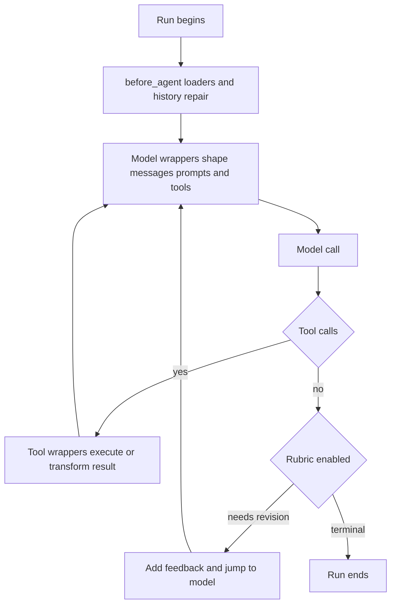

# Middleware Catalog

`deepagents.middleware` is the public import surface for the SDK middleware and its supporting types. Middleware subclasses `AgentMiddleware` and participates in lifecycle hooks: it can initialize state before a run, shape every model request, wrap a tool call, and decide what happens at a natural agent stop. A caller-provided callable in `tools=` instead runs only after the model selects it. Use a plain tool for isolated, consumer-specific work; use middleware when the behavior must alter prompts, the advertised tool set, messages, state, or loop control.

For stack placement, see [Middleware stack](../architecture/middleware-stack.md). The detailed feature contracts live in [Context management](context-management.md), [Subagents and skills](subagents-skills.md), and [Filesystem tools](tools-filesystem.md).

## Public catalog

| Capability | Public entrypoint | Hooks, state, and effect |
| --- | --- | --- |
| Filesystem and optional shell access | `FilesystemMiddleware`, `FilesystemPermission` | Supplies filesystem tools; shapes requests and can evict oversized results after a tool call. |
| Automatic compaction | `SummarizationMiddleware` | Reconstructs effective history, summarizes at its trigger or after a context-overflow response, and stores a private summary event. |
| Model-requested compaction | `SummarizationToolMiddleware`, `create_summarization_tool_middleware` | Adds `compact_conversation`; the tool layer does not itself run automatic compaction. |
| Persistent instructions | `MemoryMiddleware` | Loads `AGENTS.md` sources in `before_agent`; adds formatted memory to each model request. |
| Progressive-disclosure skills | `SkillsMiddleware`, `SkillMetadata`, `SkillsState` | Discovers metadata in `before_agent`; prompts the model to read the complete skill only when needed. |
| Blocking delegation | `SubAgentMiddleware`, `SubAgent`, `CompiledSubAgent` | Adds `task`; the parent waits for the child result. |
| Background delegation | `AsyncSubAgentMiddleware`, `AsyncSubAgent` | Adds launch, monitoring, update, cancellation, and listing tools for remote Agent Protocol work. |
| Definition-of-done review | `RubricMiddleware` and rubric result types | Grades at a natural stop and can jump back to the model with revision feedback. |
| Model-compatible multimodal requests | `UnsupportedContentMiddleware` | Replaces unsupported human or tool content blocks in the request while retaining originals in thread state. |

`PatchToolCallsMiddleware` is installed by graph construction but intentionally is not in `deepagents.middleware.__all__`. The underscore-prefixed modules are assembly and implementation helpers, rather than the normal consumer import API.

## Lifecycle: why middleware is not a plain tool

This depicts the lifecycle boundary: loaders initialize typed state once per run; `wrap_model_call` and `awrap_model_call` affect every request; `wrap_tool_call` can mediate execution or results; and `after_agent` can continue an otherwise finished loop. A plain callable is available only at the tool-execution step, so cannot reliably provide the preceding request-wide effects.

State that must not enter a subagent is annotated with `PrivateStateAttr`. During graph construction, `private_state_field_names` resolves those annotations and configures subagent middleware to strip them. An unresolvable schema is warned about and skipped, so its intended private fields may cross the boundary; annotations must therefore be resolvable at runtime.

## Filesystem, permissions, and large results

`FilesystemMiddleware` builds an allowlisted set from `ls`, `read_file`, `write_file`, `edit_file`, `delete`, `glob`, `grep`, and `execute`. An explicit allowlist must include `read_file`; omitted names do not even reach the dispatchable tool node. `execute` and `delete` are still subject to backend capability checks. The default backend is `StateBackend()`, while backend factories, nonpositive execution timeouts, and invalid `grep_max_count` values are rejected.

Filesystem denial and approval are deliberately separate. The middleware's tool implementations enforce matching `deny` permissions. During graph assembly, `_fs_interrupt` translates `interrupt` rules into `HumanInTheLoopMiddleware` mappings with path-aware predicates; approval does not grant authorization. With an execution-capable backend, unscoped permissions are rejected because execute-level permissions are not implemented.

### Storage and eviction

A `CompositeBackend` owns `artifacts_root`, defaulting to `/`. Filesystem and summarization derive `/large_tool_results` and `/conversation_history` beneath that root. A generic successful offload writes complete text under a sanitized, bounded tool-call identifier and replaces the tool result with a line-numbered head-and-tail preview while retaining non-text blocks. Failed writes leave the original message in place. The storage component replaces dots and path separators; components longer than 128 UTF-8 bytes are replaced with a SHA-256-derived name, while notices abbreviate IDs longer than 32 characters.

Filesystem performs proactive eviction only after a tool returns, and excludes `ls`, `glob`, `grep`, `read_file`, `edit_file`, `write_file`, and `delete`. Summarization uses tail clipping only as input-budget or provider-overflow recovery. For a qualifying `read_file` result whose source call has a nonempty `file_path`, it keeps a head slice and points back to that file; other trailing results are offloaded and stubbed. Recovery allows only one strictly smaller retry before raising `ContextOverflowError` with guidance to reduce request size.

The optional video boundary is also part of filesystem reads. `_video` imports PyAV lazily, so installations without the `[video]` extra remain lightweight. For a video read, `offset` and `limit` mean seconds and the result interleaves timestamp text with sampled image frames.

## Context and instruction middleware

`SummarizationMiddleware` retains raw messages and tracks compaction with a private summary event. It persists older history before creating a summary and request suffix; a persistence failure warns but does not prevent summarization. It also handles recognized context-overflow errors by summarizing and attempting constrained tail recovery. `create_summarization_middleware` creates the automatic layer with model-aware defaults; it is used internally by `create_deep_agent`. `create_summarization_tool_middleware` creates only the manual `compact_conversation` layer, resolving a model string if needed and refusing compaction before approximately half the automatic trigger.

`MemoryMiddleware` loads its configured sources into private `memory_contents` once, ignores missing files, removes HTML comments when rendering, and injects its prompt fragment on every request by default. `system_prompt=None` suppresses prompt injection but not loading. When graph-created memory runs with an Anthropic request model, it can mark the final system block as an ephemeral cache breakpoint.

`SkillsMiddleware` implements progressive disclosure entirely through backend APIs. It loads skill metadata once per thread; a checkpointed list, including an empty list, prevents rediscovery, while `skills_metadata=None` requests reload. Sources are processed in order and the last duplicate skill name wins. The system prompt lists locations and metadata and tells the model to use `read_file` for full instructions; load failures are logged and rendered as explicitly untrusted diagnostics.

Provider caching is assembled before optional memory: `append_prompt_caching_middleware` always adds Anthropic caching and adds Bedrock or Fireworks middleware only when the corresponding package is installed. This ordering lets memory add its Anthropic cache breakpoint.

`UnsupportedContentMiddleware` is a request-only compatibility guard. It consults the active request model's profile and replaces rejected image, audio, video, PDF, or tool-message block types with a text notice; it preserves the original thread message so a later compatible model can receive the original content. Put it last when assembling a middleware list manually, because it must inspect the final selected model. `create_deep_agent` adds it automatically.

## Delegation and quality control

`SubAgentMiddleware` requires at least one named subagent, advertises available agents in its optional prompt fragment, and exposes one synchronous `task` tool. A structured child response is JSON-serialized; otherwise the parent receives its final nonempty AI text. The child call blocks from the parent perspective, although independent task calls can execute concurrently. Private state is removed at this boundary.

`AsyncSubAgentMiddleware` is a distinct remote contract, not a nonblocking form of `task`. It starts Agent Protocol runs without waiting, persists task records in `async_tasks`, and provides tools to start, check, update, cancel, and list work. It rejects an empty or duplicate-named configuration.

`RubricMiddleware` is a no-op until invocation state contains a rubric. At a natural stop it invokes a separate grader agent on a bounded, sanitized transcript. A `needs_revision` result adds a `HumanMessage` and jumps back to the model; grading repeats until `satisfied`, `failed`, a grader error, or the iteration cap. The grader can emit `satisfied`, `needs_revision`, and `failed`; `max_iterations_reached` and `grader_error` are middleware-generated terminal statuses. Consumers that need to react to a non-satisfied result must inspect rubric state, its callback, or its stream event rather than the final AI message.

`PatchToolCallsMiddleware` repairs resumed history in `before_agent`. Any valid or invalid AI tool call with an ID but no matching `ToolMessage` receives an appended error result, differentiating incomplete calls from malformed or truncated arguments, and then the middleware rewrites history.

## Assembly and ordering invariants

`create_deep_agent` builds its core stack from configured skills, filesystem, inline synchronous subagents, automatic summarization, and tool-call repair; it then adds configured asynchronous subagents. Profile middleware, provider caching, optional memory, and optional HITL follow. `UnsupportedContentMiddleware` is added after HITL; profile and caller middleware can then be applied according to their configured placement. Finally, `_ToolExclusionMiddleware` is appended so excluded tool names are removed after every tool-injecting request wrapper and rejected at the execution boundary. This is consistency behavior, not a security boundary.

When changing middleware, preserve sync/async hook parity and test the focused filesystem, summarization, skills, memory, subagent, and rubric middleware tests. Stack order is behavior: moving a prompt wrapper, a model selector, or tool exclusion can change the effective request even when the individual middleware remains correct.
