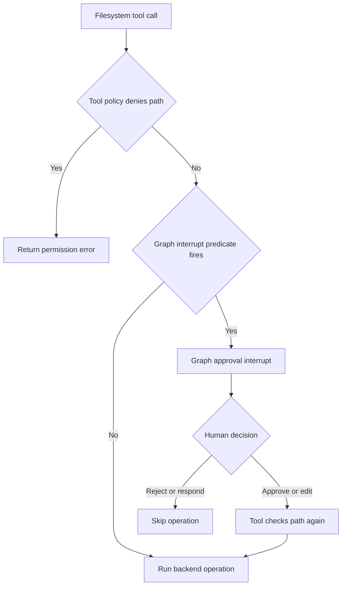
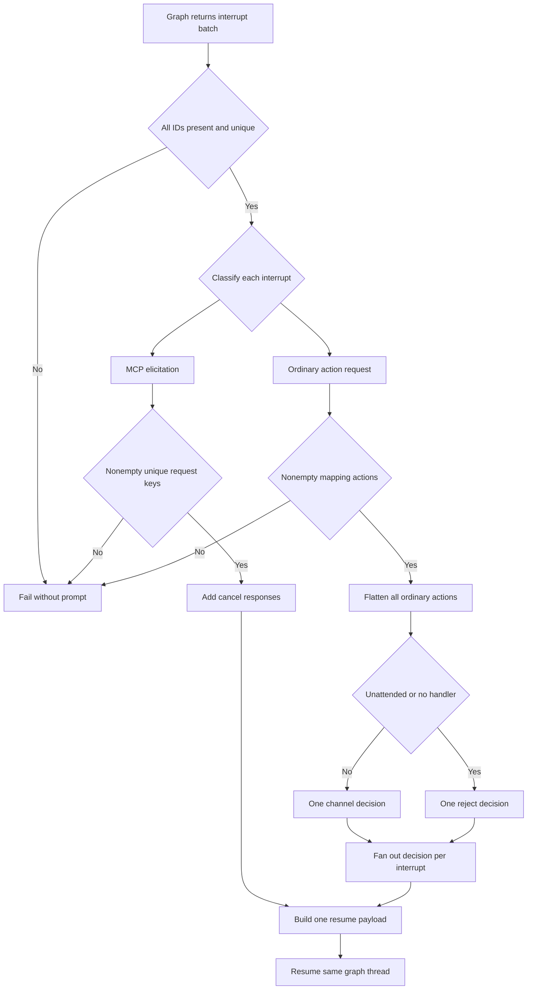

# Permissions and Human Approval

Permissions, approval prompts, and tool availability are separate controls. A model may see a tool but have a particular invocation rejected at execution; a graph interrupt may pause an otherwise permitted invocation; and an approval is not a sandbox boundary. See [filesystem tools](/openwiki/concepts/tools-filesystem.md), [security](/openwiki/operations/security.md), [runtime behavior](/openwiki/architecture/runtime-behavior.md), and [running a dcode session](/openwiki/workflows/run-dcode-session.md).

## Security boundaries

Deep Agents follows a **trust-the-LLM** model: an agent can do what its installed tools allow. Put containment in tool implementations, a backend, or a sandbox—not in model instructions or an approval prompt. HITL is opt-in and only covers calls selected for interruption. `StateBackend` does not execute shell commands; selecting `LocalShellBackend` is an explicit higher-power opt-in.

| Question | Control | Enforcement boundary |
| --- | --- | --- |
| Can the model propose a call? | Installed tool schemas | Agent construction and tool exposure |
| May a filesystem operation affect a path? | `FilesystemPermission` | Filesystem middleware/tool before backend execution |
| Must a person decide before a selected call proceeds? | `HumanInTheLoopMiddleware` / `interrupt_on` | Graph routing and LangGraph interrupt/resume |
| Is an MCP tool asking for structured input? | MCP elicitation interrupt | MCP adapter and Talon's elicitation cancellation path |
| May an MCP OAuth flow communicate with an operator? | Authorization context and callback | Host-mediated authorization outside model context |
| How is a Talon approval decision obtained? | `ToolApprovalHandler` | Origin channel host and runtime |

An approval is not a general permission grant. An approved or edited filesystem call re-enters the tool and is still subject to its denial checks. Conversely, a policy with no graph gate does not make a tool safe; it only means the graph does not pause before that call.

## Filesystem policy and derived HITL

A `FilesystemPermission` has read and/or write `operations`, absolute glob `paths`, and a `mode`. Patterns must be absolute, may not contain `..`, and do not support `~`. Resolution is ordered and first-match-wins, with `allow` as the default; `deny` is enforced before backend execution. Bulk reads filter denied entries. Recursive or potentially recursive deletion uses conservative subtree-overlap handling, so a protected descendant cannot be bypassed by an earlier broad allow.

`interrupt` is intentionally distinct from `deny`. During graph construction, filesystem interrupt rules become `HumanInTheLoopMiddleware` routing. Exact-path tools use normal first-match interrupt resolution. Bulk tools interrupt conservatively when their search subtree intersects an interrupt rule and when scope cannot safely be localized—for example omitted paths, current-directory forms, absolute glob patterns, or parent traversal. The approved or edited call still runs through the filesystem tool and its deny enforcement.

Caption: Filesystem denial is tool enforcement, while filesystem `interrupt` is pre-execution graph routing.

## Talon policy and approval interface

Talon's `ToolApprovalStore` is a persisted exact-tool-name boolean policy, not an authorization credential. It validates a bounded JSON file that must be regular and non-symlinked. An enabled name produces approve/reject graph-interrupt configuration; an absent or disabled name does not. Updates are locked, revision compare-and-swap operations. Each invocation captures a policy snapshot, so a successful save affects a later invocation rather than changing the graph currently running.

`ToolApprovalRequest` is the boundary between runtime and channel host. It carries the conversation ID, the **first** LangGraph interrupt ID in the ordinary-action batch, and the complete sequence of action requests. The handler returns one `approve` or `reject`, not per-action edits. The runtime expands that single outcome into the appropriate number of decisions for every ordinary interrupt before issuing one explicit LangGraph `Command(resume=...)`.

Changing the policy is separately protected. `update_tool_approvals` requires both an active invocation snapshot and operator context. `TalonHost` derives that flag from trusted channel exposure; request or route metadata cannot create it. On an attended channel turn, the sender must be identified and either be configured as an operator or be a self-authored message on `self` exposure. This gate protects the policy-editing tool only: it neither authorizes arbitrary callers nor turns HITL into containment. External MCP authorization remains separate.

The host keeps a pending future per approval conversation, sends one formatted prompt, and resolves it from an accepted reply or reaction. Text replies may only come from the initiating sender when known. Reactions must additionally match provider, conversation, prompt message, and sender. The channel supplies a decision to the runtime; it does not directly execute or authorize the underlying tool.

## Interrupt batching and explicit resume

`DeepAgentRuntime` invokes the graph using the request's conversation ID as LangGraph's thread ID. Whenever the returned state contains `__interrupt__`, it validates the complete batch before prompting anyone:

1. Every interrupt must have a nonempty ID, and IDs must be unique across **both** ordinary tool-approval interrupts and MCP elicitation interrupts. An ID-less or duplicate batch fails; it is never implicitly resumed.
2. An interrupt identified as MCP elicitation is validated and converted to its own cancellation response. It is not an ordinary approval action.
3. Every other interrupt must contain a nonempty sequence of mapping-valued `action_requests`; a malformed member fails the whole batch without calling the approval handler.
4. All ordinary actions across all ordinary interrupts are flattened into one `ToolApprovalRequest`. The first ordinary interrupt ID identifies that request to the handler.
5. The one returned decision is fanned out by action count to each ordinary interrupt. Together with the elicitation cancellation entries, the runtime sends one `Command(resume=payload)` and invokes the same graph thread again.

The runtime repeats this explicit cycle only while interrupts are returned and stops with an error after `DEFAULT_MAX_APPROVAL_ROUNDS` (50). This is a bounded interrupt/resume loop, not a default approval path.

Caption: Talon validates IDs before separating elicitation cancellation from one aggregated ordinary-action decision.

### MCP elicitation is cancelled, not approved

Talon recognizes MCP elicitation before ordinary approval handling. A valid elicitation value has type `mcp_elicitation`, a nonempty `requests` list, and nonempty unique string `key` values. Talon resumes each key with `{ "action": "cancel" }`. It does not call `ToolApprovalHandler` or show an approve/reject prompt; this is the temporary behavior until Talon provides an elicitation UI. A malformed elicitation request list fails rather than being confused with a tool-approval request.

Mixed batches preserve both behaviors: valid elicitation requests are cancelled while all ordinary action requests receive the one aggregated approve or reject outcome. In particular, the result has a resume entry for every validated interrupt ID.

### Unattended work fails closed

Ordinary actions still use the single batch decision path when no person may safely decide. For `trigger: "cron"`, `background_delivery: true`, or a request without an approval handler, `_approval_decision` returns reject without calling the handler. That one rejection is then expanded to every action in every ordinary interrupt. This is an auto-denial of graph-gated work, not a tool authorization system or a sandbox.

The host reinforces this posture. Scheduled invocations do not receive approval or OAuth handlers. A background-result delivery is a new unattended turn: it is marked `background_delivery`, has operator context cleared, and receives neither handler. The runtime independently denies such a protected call even if a caller injects an approval handler or `tool_approval_operator: true` metadata.

Detached background subagents also clear operator and authorization context and report an interrupted protected action as not run. Cron-only inline delegation runs in the caller's already-unattended context, disallows nested delegation, and cannot inherit an interactive approval or authorization path.

## MCP calls and OAuth are not HITL approval

Talon marks loaded MCP tools with `_deepagents_talon_mcp`. `talon_mcp_middleware` wraps only marked calls, omits empty arguments only for optional string-like fields, and binds the exact tool-call ID in task-local authorization context during invocation. An MCP protocol error becomes a redacted model-visible `ToolMessage`; unrelated failures propagate.

That authorization context supports MCP OAuth, not graph approval and not model context. A channel OAuth operation requires a live authorization handler, the current tool-call ID, and an authorization attempt. Its binding includes server name, invocation ID, and expiry. Authorization URLs, device instructions, callback input, and completion or failure notifications use the host callback. Callback processing validates the configured endpoint and required `code` and `state` values. The proactive `authenticate_mcp_server` capability is exposed only for configured OAuth servers, restricts its argument to them, and schedules a tool refresh after successful authorization.

## dcode interaction note

In dcode, approval mode is per thread and fails closed to Manual. Its HITL predicate routes side-effecting tools through that mode, while `AutoModeHITLMiddleware` combines deterministic policy, classifier review, denial errors, and escalation to human review. `ask_user` is a different interaction: it pauses during its own tool execution to collect an answer, validates resumed answers before attaching an authorization receipt, and exception-catching middleware must preserve `GraphBubbleUp` so the graph interrupt is not swallowed.

## Operations and focused tests

- Treat installed-tool visibility, `FilesystemPermission`, `interrupt_on`, Talon channel approval, OAuth, and backend/sandbox isolation as separate layers. Do not describe any one as a substitute for the others.
- Treat `tools.json` and `interrupt_on` as selective graph-pausing policy, not sandboxing or tool-level authorization. Keep meaningful deny checks and backend containment at the tool/backend layer.
- Do not build an approval UI that assumes one prompt per interrupt. A handler sees one flattened ordinary-action batch, identified by its first ordinary interrupt ID, and its decision applies to the whole batch.
- Preserve fail-closed validation when extending interrupt protocols: duplicate or missing interrupt IDs, malformed ordinary actions, and malformed elicitation keys must fail before a handler is called.
- Do not route MCP elicitation to approval UI. Talon currently cancels valid requests. Keep elicitation payloads and resume entries distinct from ordinary action decisions.
- Expect protected cron, background-delivery, and handler-less calls to be rejected. Do not rely on request metadata to grant operator authority or on a later approval prompt for detached work.
- Focus tests on `test_tool_approval_batch.py` for mixed batches, one-decision fan-out, malformed inputs, and unattended rejection; `test_tool_approval_runtime.py` for multiple tool calls, policy snapshots, and injected-handler denial; and `test_host.py` for stripped handlers on background delivery. Keep filesystem permission/interrupt tests separate from Talon's channel and resume contract.
