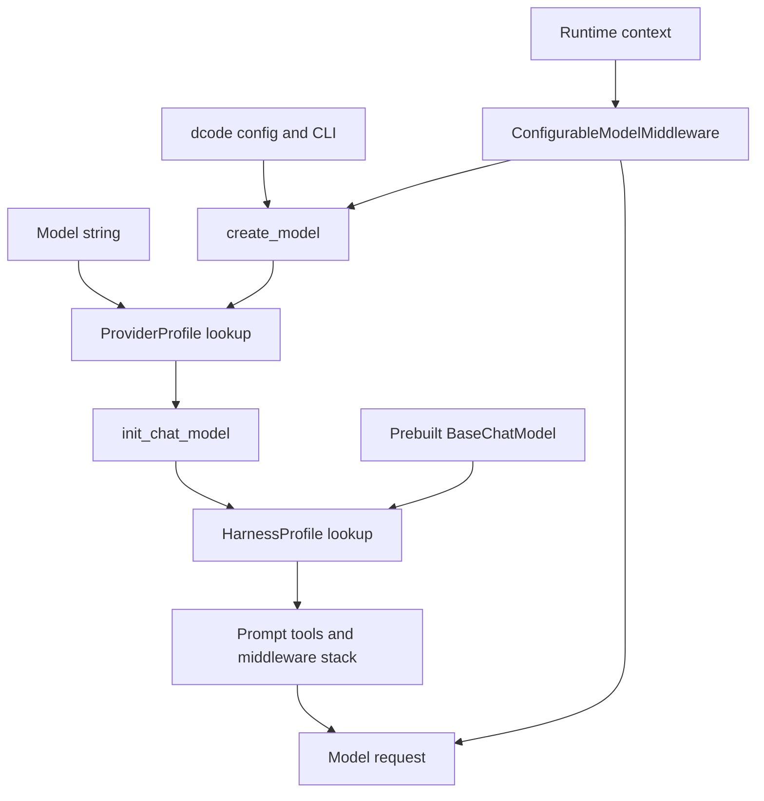

# Models and Harness Profiles

Deep Agents separates two model-specific extension layers:

- A **`ProviderProfile`** changes how a string model specification is constructed: constructor kwargs, pre-construction checks, and dynamic kwargs.
- A **`HarnessProfile`** changes how `create_deep_agent` assembles an already-resolved model into an agent: system-prompt overlays, tool descriptions and visibility, middleware, and the default subagent.

dcode builds on the provider layer for its CLI model configuration. Its per-invocation middleware is a separate operational layer: it can select a model and request settings from runtime context without recompiling the graph.



Caption: Provider profiles participate in construction, harness profiles participate in SDK agent assembly, and dcode can replace the request model at runtime.

## SDK model resolution

`resolve_model` accepts a string or `BaseChatModel`. A model instance is returned unchanged; a string is passed to `init_chat_model` with `apply_provider_profile(model)` kwargs. Consequently, provider-profile construction defaults do not retrofit a prebuilt model. `create_deep_agent` resolves its model first and then selects the harness profile.

Model matching and inspection accommodate integration variation. The identifier is read from `model_name` or `model`; provider information comes from `_get_ls_params()`. A provider-qualified spec normally requires both identifier and normalized provider to match, but an uninspectable custom provider falls back to an identifier match. This avoids needless reconstruction, while making metadata supplied by custom model integrations consequential.

`model=None` currently creates the default `ChatAnthropic(model_name="claude-sonnet-4-6")`, but that default and `model=None` are deprecated for removal in `deepagents==1.0.0`; applications should pass a model explicitly.

## Provider profiles: constructor overlays

A `ProviderProfile` has three independent extension points:

| Field | Role and lifecycle |
|---|---|
| `init_kwargs` | Static `init_chat_model` defaults. The profile defensively copies and exposes them read-only. |
| `pre_init` | Receives the raw model spec before factory execution and construction; an exception aborts construction. |
| `init_kwargs_factory` | Produces fresh kwargs at every resolution, suitable for environment-dependent values. |

`apply_provider_profile` is the construction entrypoint. It returns a new dictionary in this precedence order:

```text
profile init_kwargs < profile factory output < caller kwargs
```

It invokes `pre_init` by default; `run_pre_init=False` supports inspection without side effects. A miss returns a copy of caller kwargs. Hook and factory failures propagate, so callers do not accidentally build a partly configured client.

### Keys, lookup, and additive registration

Both registries accept a provider key such as `openai` or a model key such as `openai:gpt-5.4`. Only the first colon is structural: identifiers may themselves include colons, including Bedrock ARNs. Empty keys, empty provider/model halves, whitespace around the first colon, and leading/trailing whitespace are rejected at registration; lookup treats an empty spec or empty half as a miss.

For a qualified spec, lookup combines provider defaults with an exact-model profile, with the exact layer taking precedence. Re-registering is additive rather than replacement. For provider profiles, static kwargs merge by key, `pre_init` functions chain base then override, and both factories run at resolution with later output winning. This makes registration an overlay: explicitly set a key to replace a built-in or earlier default.

Built-ins load lazily on first lookup or registration, not merely on importing `deepagents.profiles`. Bootstrap registers SDK modules first, then entry points in `deepagents.provider_profiles` and `deepagents.harness_profiles`; third-party registrations therefore layer over built-ins. Concurrent callers wait for bootstrap, while same-thread re-entry lets a plugin call the public registration API. A built-in bootstrap failure restores both registries and raises; plugin enumeration, load, non-callable-target, and registration failures are warned about and skipped. Plugin order is not a stable precedence contract.

Current provider built-ins are deliberately narrow: OpenAI defaults `use_responses_api=True`; NVIDIA creates a fresh NIM billing-origin header map; OpenRouter checks the `langchain-openrouter` version and supplies attribution defaults only when corresponding environment variables are unset. The OpenRouter profile also excludes Azure routing by default; `DEEPAGENTS_OPENROUTER_ALLOW_AZURE` opts back in.

## Harness profiles: runtime-shaping overlays

A `HarnessProfile` is selected after construction, either from the supplied string spec or, for a prebuilt model, from its provider and identifier metadata. For model objects, exact candidates are tried before provider defaults; a bare identifier is not used as a registry key because it could collide with a provider key. No match yields an empty profile and default agent behavior.

The runtime profile can supply:

- `base_system_prompt`, which replaces the authored base, and `system_prompt_suffix`, which appends after it;
- `tool_description_overrides` for supported built-in, `BaseTool`, and dict tools;
- `excluded_tools` and `excluded_middleware`;
- `extra_middleware`, as instances or a factory; and
- `general_purpose_subagent` controls for automatic inclusion, description, and prompt.

The prompt order for the main agent is caller `USER`, profile `BASE`, then profile `SUFFIX`, separated by blank lines. The same profile overlay is applied to SDK-assembled synchronous subagent stacks. A general-purpose-specific prompt overrides its profile base while the suffix still applies. A `task` description override should retain `{available_agents}` or the generated subagent list is lost.

`HarnessProfileConfig` is the YAML/JSON-friendly subset and can be registered directly. It accepts name-form middleware exclusions only; runtime-only `extra_middleware` cannot be exported to config and export raises instead of silently dropping it. Profile registration and provider-plus-model lookup are additive: scalar prompt fields take the explicit model-level value, description maps merge with model keys winning, exclusion sets union, subagent fields merge individually, and middleware of the same concrete type is replaced in place while new types append.

### Middleware and tool exclusions

`extra_middleware` is materialized independently for each main, general-purpose, and declarative synchronous-subagent stack. It is not injected into a precompiled subagent or a remote `AsyncSubAgent`, because those own their completed or remote middleware stacks.

`excluded_middleware` filters the fully assembled stack by exact class or middleware `.name`, including caller-provided middleware. It rejects malformed private/class-path names, protected `FilesystemMiddleware` and `SubAgentMiddleware`, ambiguous matches, and entries that match nothing. Those protected components respectively back filesystem tools and permissions, and the `task` tool; removing them would silently break core behavior. To remove the automatic `task` capability, disable the general-purpose subagent and provide no synchronous subagents.

`excluded_tools` is **request-time tool filtering**, not construction-time tool removal or authorization. `_ToolExclusionMiddleware` is appended after custom and tool-injecting middleware, removes excluded names from each model request, and rejects a subsequent call to such a name with an unavailable-tool error. It therefore keeps the advertised and executable surface aligned for the model, including middleware-added tools, but is not a security boundary.

### Model-profile capability checks

There are two distinct uses of a model's LangChain `profile`; neither is a `HarnessProfile`. dcode's `create_model` reads `max_input_tokens` and explicitly-false modality fields into `ModelResult`, and `validate_model_capabilities(model, model_name)` is an opt-in, best-effort CLI check: no profile prints a warning, `tool_calling=False` prints an error and exits, and a context window below 8,000 tokens warns. A non-dict profile is not rejected.

At request time, `create_deep_agent` installs `UnsupportedContentMiddleware` in its default main stack (unless a harness middleware exclusion removes it). It evaluates the **actual `ModelRequest.model`**, which is why the middleware is intended to run after model-switching middleware. For human and tool messages, content types are accepted unless the relevant profile field is explicitly `False`; missing fields are treated as supported because profile coverage is incomplete. Unsupported blocks are replaced only in the outbound request with a text notice, leaving the thread's original block intact for a later switch to a capable model. Non-PDF inline base64 documents are a special case: they are sent only to `ChatOpenAI` or `AzureChatOpenAI` models with `use_responses_api=True` and an OpenAI Responses-supported MIME type. This is compatibility degradation, not a capability authorization system.

The built-in catalog illustrates why harness profiles can be more than prompts. Anthropic Sonnet 4.6 receives a prompt suffix; selected OpenAI Codex specs receive a suffix and a fresh `TodoListMiddleware`; NVIDIA Nemotron 3 Ultra registrations provide compatibility, tool-call repair, policy, progress, and response-guard middleware for several provider-specific model specs.

## dcode model configuration and switching

`create_model` is dcode's concrete-model entrypoint. It parses an explicit `provider:model`, uses configured providers or provider detection for bare names, and obtains config params and credentials. The allowlist is checked after provider inference but before stored credentials are bridged into environment variables, provider-profile hooks run, or provider imports occur. A blocked model cannot trigger those side effects.

For normal providers, constructor settings compose in this order:

```text
SDK ProviderProfile defaults < config.toml provider and per-model params plus credentials < extra CLI model kwargs
```

Within a provider `params` table, flat values are provider-wide and a model-named table shallow-merges over them. `get_effective_kwargs` additionally places the resolved `base_url` beneath invocation overrides. Provider-profile errors are translated to `ModelConfigError` with package/update and `--model-params` guidance. A configured `class_path` uses its custom model class; the `openai_codex` path deliberately builds its OAuth-aware model directly rather than generic `init_chat_model`.

`profile_overrides` in dcode are different from a `HarnessProfile`: they merge capability metadata into `model.profile` (for example, `max_input_tokens`). dcode reads that metadata into `ModelResult` as context limit and unsupported modalities. It also resolves a retry budget and stamps it on the constructed model; known provider retry loops are disabled so SDK retries do not multiply dcode's model-node retry budget.

`ConfigurableModelMiddleware` is ordinarily outermost, so each model call can read a `CLIContext` from `runtime.context`. dcode installs a state-persisting instance on the main agent with construction-time `ModelResult` metadata; subagent instances disable persistence, and the rubric-grader instance uses strict resolution. A different `model` spec is built with `create_model`; `model_params` shallow-merge into that request's `model_settings`. On a cross-provider move away from Anthropic it removes Anthropic-only settings, and it refreshes the Model Identity prompt section from the new result. Per-thread prompt-cache routing settings are added for Fireworks or OpenAI where eligible without overwriting a user-supplied key.

An invalid runtime replacement normally logs and continues with the current model, but `strict_model_resolution` propagates the configuration error. `ModelNotAllowedError` always propagates rather than silently falling back. Async switching and the configuration/credential reads needed to calculate cache endpoint and effective cache parameters run off the event loop.

After a successful parent call, the middleware returns an `ExtendedModelResponse` carrying a private checkpoint `Command`. It stores the resolved model spec and runtime-only `model_params` for resume; endpoint and effective cache-identity parameters go to separate fields. This separation prevents configured defaults such as headers, temperature, or retry settings from becoming stale session overrides. A failed call produces no update, and subagent middleware instances disable parent-thread persistence.

## Tests and change guidance

Focused unit tests establish the contracts at their owning boundaries:

- `libs/deepagents/tests/unit_tests/test_models.py` covers string versus instance resolution, built-in provider kwargs, provider/identifier matching, malformed and colon-containing profile keys, lookup precedence, caller-wins construction kwargs, and additive profile merges.
- `libs/deepagents/tests/unit_tests/test_nemotron_ultra_profile.py` exercises representative Nemotron profile middleware, including tool-call repair, available-tool gating, progress budgets, and response guards.
- `libs/code/tests/unit_tests/test_configurable_model.py` verifies runtime-context changes, fallback and persistence behavior, cache checkpoint invariants, and the rule that failures do not write a checkpoint.

When extending the system, put reusable client-construction behavior in a `ProviderProfile`, reusable Deep Agents behavior in a `HarnessProfile`, operator policy in dcode configuration/CLI inputs, and invocation-specific changes in runtime context. Test the precedence and failure boundary affected by the change, especially request-time exclusion behavior rather than treating it as an access-control mechanism.

## Related pages

- [Runtime behavior](/openwiki/architecture/runtime-behavior.md)
- [Configuration layering](/openwiki/concepts/config-layering.md)
- [Cost and sessions](/openwiki/operations/cost-and-sessions.md)
- [Run a dcode session](/openwiki/workflows/run-dcode-session.md)
- [Middleware stack](/openwiki/architecture/middleware-stack.md)
- [Tools and filesystem](/openwiki/concepts/tools-filesystem.md)
- [SDK construction and execution](/openwiki/architecture/sdk-construction-execution.md)
