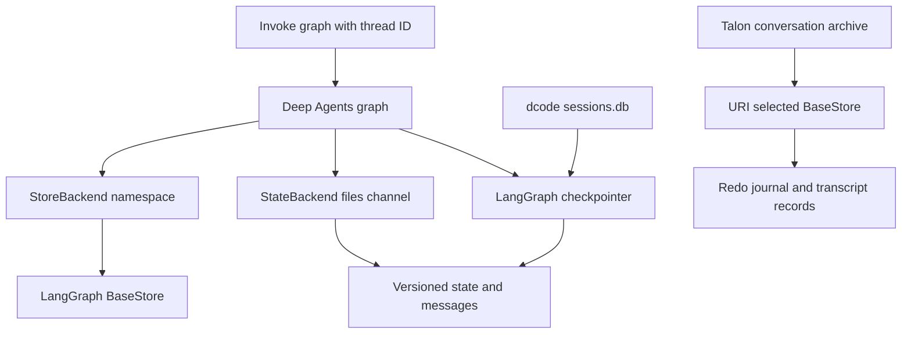
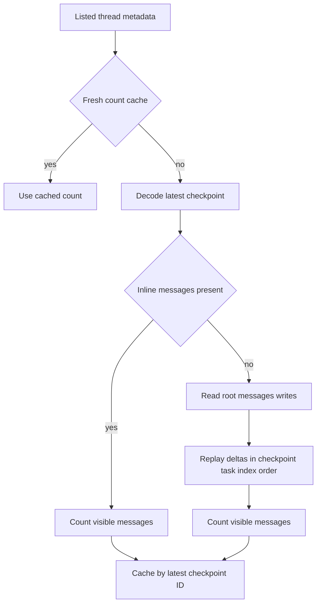

# State and Persistence

Persistence has distinct owners and scopes. A LangGraph **checkpointer** versions graph state for a thread. A Deep Agents **backend** owns filesystem-like files and determines their scope. dcode's `sessions.db` is a local SQLite checkpoint implementation and thread-query surface. Talon additionally maintains a durable conversation archive, which is deliberately separate from checkpoint state. In-process selector caches are not durable authority.

*Checkpoint state and `StateBackend` files are thread-scoped. `StoreBackend` and Talon's archive delegate durability to their selected stores, but serve different data contracts.*

## Checkpoints, state schema, and thread identity

LangGraph checkpoints and backend persistence answer different questions:

- A checkpointer preserves graph state, conversation messages, interrupts, and the data needed to resume a particular `thread_id`.
- A backend implements filesystem-like data and determines whether it remains in state, is shared under a store namespace, or is provided by another backend route.
- `create_deep_agent()` accepts `checkpointer`, `store`, and `cache` independently, forwards them to LangChain's `create_agent`, and selects `DeepAgentState` unless the caller supplies `state_schema`. A cache is an execution optimization, not a checkpoint or durability guarantee.

`DeepAgentState` subclasses LangChain's `AgentState` and overrides its `messages` field with `DeltaChannel(_messages_delta_reducer, snapshot_frequency=50)`. This stores deltas between periodic snapshots, reducing long-thread checkpoint growth from O(N squared) to O(N). Its reducer coerces raw message-like inputs, deduplicates by stable message ID, applies `RemoveMessage` tombstones, and resets at `REMOVE_ALL_MESSAGES`. It intentionally does not assign IDs: LangGraph's checkpoint serialization hook assigns them before reduction, and assigning random IDs during replay would make replay inconsistent.

A checkpoint may therefore omit an inline full `messages` list. Code inspecting checkpoint rows must load state through LangGraph or replay stored deltas using compatible reducer semantics; a missing inline value is not an empty conversation. Custom state that needs standard message behavior should extend `DeepAgentState` rather than replace it with an unrelated schema.

## Files: thread state versus shared store

`StateBackend` stores its `files` map in graph state. It reads with `CONFIG_KEY_READ` and `fresh=True`, applying pending writes through the channel reducer so a write followed by a read in the same superstep sees the change. It queues partial `files` updates with `CONFIG_KEY_SEND`; the dictionary-merge channel preserves unchanged files and commits at the node boundary.

That convenience is deliberately constrained: `StateBackend` requires LangGraph graph execution and is thread-scoped. With a durable checkpointer, its files survive and resume in that conversation thread; they are not a cross-thread filesystem. To seed files, pass `files` in the graph invocation rather than calling the backend outside the graph.

`StoreBackend` instead uses a LangGraph `BaseStore`. It uses an explicitly supplied store or resolves the current graph store at call time, then maps operations through a caller-provided namespace factory. The same namespace can share files across threads, while separate namespaces isolate users or workspaces. Each namespace component must be a nonempty safe string; wildcard and glob-like syntax is rejected before lookup. A runtime-dependent namespace factory requires graph context, whereas a context-independent factory can be used with an explicitly supplied store outside a graph.

The store route preserves a filesystem contract: data are put under the namespace, and deleting a directory enumerates every page then batches deletion of the exact key and nested-key prefix. The chosen `BaseStore`—not `StoreBackend`—determines actual durability, consistency, and transaction behavior.

## dcode SQLite sessions

The local dcode CLI opens a guarded `AsyncSqliteSaver` over its global `sessions.db`, runs `setup()` before constructing its agent graph, and supplies it as the graph checkpointer. The session database is consequently the durable source for local graph-thread state; a thread ID is the stable handle used to list, resume, or delete checkpoint history.

Thread listing reads checkpoint metadata rather than deserializing every state blob. It returns thread ID, agent name, update and creation times, latest checkpoint ID, Git branch, and working directory; optional agent, branch, and exact `cwd` filters apply to metadata. dcode attempts a covering index so listing avoids large checkpoint blobs. A failed index creation, including on a read-only or locked database, changes performance rather than listing correctness.

The recent-thread, initial-prompt, and message-count caches are bounded process-local conveniences. Prompt and count entries are keyed by checkpoint freshness, and recent rows are copied before return. A count can briefly lag while an active superstep has new writes but no new checkpoint ID; the caches must not be treated as authority for resume or deletion.

### Delta message counts

A session listing counts an inline `messages` snapshot when present. Otherwise, dcode reconstructs a visible count from `writes`: it reads only root-namespace message writes for each thread, ordered by checkpoint, task, and write index, excluding subgraph writes that share the thread ID. The fold recognizes overwrite and remove-all resets and uses an exact sequential fallback for specific removals or a failed fast-path reduction. A malformed row or unreducible thread is logged and omitted rather than preventing the selector from loading.

*The reconstruction path derives a display-time count from checkpoint data; it is not a replacement checkpoint format.*

### Connection lifecycle, migration, and deletion

dcode centralizes connection creation, including an `aiosqlite` compatibility patch and timeout. Its opening guard records the raw SQLite handle on the worker and queues an explicit close if cancellation occurs while `aiosqlite` opens it. On exit it drains the worker after close, avoiding leaked handles and workers attempting to schedule against a closed event loop. `get_checkpointer()` owns this guarded connection and drains it in `finally`; callers must keep its async context open for the graph lifetime.

At startup, `migrate_legacy_state()` moves selected internal data from `~/.deepagents/` to `~/.deepagents/.state/`, including `sessions.db` and optional `-wal` and `-shm` sidecars. It is best-effort and idempotent: missing sources and existing destinations are skipped, the destination is hardened before moves, and per-entry failures are logged without blocking startup. Colliding copies are never overwritten and require operator resolution.

Deleting a dcode thread deletes `checkpoints` and `writes` rows, commits them, and evicts applicable listing caches. It then separately attempts deletion of offloaded conversation history. That cleanup is best-effort: failure does not alter the checkpoint-deletion result. Retention and backup procedures should account for SQLite checkpoints and external/offloaded history separately.

## Talon durable conversation history

Talon's history archive is a separate persistence layer, not a checkpointer replacement. `open_history()` selects a store from `DEEPAGENTS_TALON_HISTORY_URI`, defaulting to the assistant's checkpoint SQLite path when unset. Built-in schemes are SQLite/file, MongoDB, and PostgreSQL; another scheme must resolve to exactly one `deepagents_talon.history_backends` entry point, otherwise startup fails rather than silently falling back. Startup errors are exposed as generalized configuration errors to avoid leaking URI credentials. The archive is namespaced as `("talon", assistant_id)`, isolating assistants that use the same store.

The archive requires metadata storage with read-after-write consistency and no automatic TTL. `StoreRecords` hashes its caller namespace into a versioned archive namespace and serializes one active writer with an in-process lock. Before exposing records, it recovers any journal left by an interrupted mutation. A commit first durably writes a bounded redo journal, applies idempotent batch puts, and removes the journal only after success. `finish()` shields these storage mutations from cancellation until they complete, then re-raises cancellation to the caller. This is recoverability for one archive writer, not a distributed lock or cross-system transaction.

`StoreConversationArchive` separates transcript metadata from optional vector indexing and rejects using the same store instance for both. Its setup recovers records before enabling access or background indexing; close waits for indexing work before caller-owned store connections may close. Transcript chunks are deduplicated by session, message identity, revision, and chunk part. A session is bound to its trusted channel/chat scope, so a different scope or a deleting session cannot append under the same session ID. Semantic indexing promotes user messages and delivered final replies; an AI reply is only marked delivered after the host confirms its final text was sent.

## Change and operations guidance

- Choose the owner first: use a checkpointer for resumable graph state, `StateBackend` for thread-local scratch files, `StoreBackend` with a correctly scoped durable `BaseStore` for cross-thread files, and Talon's archive for recoverable transcript/history records.
- Do not bypass `CONFIG_KEY_READ`/`CONFIG_KEY_SEND` for `StateBackend`; its read-your-writes behavior depends on LangGraph channel timing and reduction.
- Keep `DeepAgentState`'s message channel when extending state. If changing dcode display code, preserve root-namespace filtering and write replay ordering.
- Treat metadata and process caches as indexes into checkpoint authority. Neither migration nor deletion establishes a transaction across checkpoints, offloaded history, and archive stores.
- Preserve dcode's guarded connection and worker-drain shutdown lifecycle. For Talon storage changes, preserve redo-journal recovery and ensure cancellation does not close a backend while a shielded mutation is still running.
- Test the relevant boundary: Deep Agents state/store backend tests cover graph context, namespace isolation, pagination, and recursive delete; dcode session tests cover listing, delta counts, and deletion; Talon's history-backend tests cover URI selection, persistence, isolation, cleanup, cancellation, and credential redaction.

See [Backends](/openwiki/concepts/backends.md), [Context management](/openwiki/concepts/context-management.md), [Runtime behavior](/openwiki/architecture/runtime-behavior.md), and [MCP](/openwiki/integrations/mcp.md).
