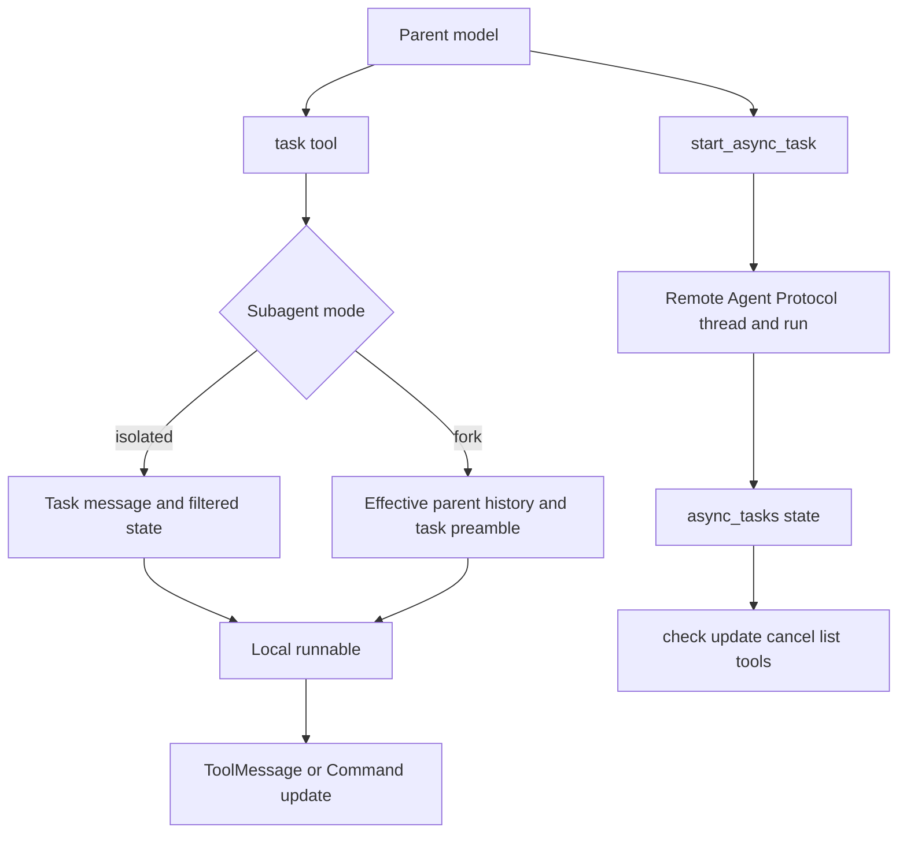

# Subagents and Skills

`create_deep_agent` assembles two distinct extension mechanisms. **Subagents** execute a delegated task and return a result through a tool call; they may be local synchronous agents, caller-provided runnables, or remote asynchronous Agent Protocol tasks. **Skills** are not delegated agents or tools: `SkillsMiddleware` indexes instruction bundles in backend storage and tells an agent where to read a relevant `SKILL.md` when needed.

This distinction is important for capability design. A subagent's context, tools, middleware, permission rules, approval behavior, and state transfer are determined by its spec and compilation path. A skill only contributes metadata and a progressive-disclosure prompt section; it does not itself grant a tool or execute code. See [Middleware catalog](/openwiki/concepts/middleware-catalog.md), [SDK construction and execution](/openwiki/architecture/sdk-construction-execution.md), and [Build a Deep Agent](/openwiki/workflows/build-a-deep-agent.md) for the surrounding construction mechanisms.

## Assembly and delegation paths

The `subagents=` argument accepts three shapes:

- A declarative `SubAgent` is compiled into a local runnable and called through `task`.
- A `CompiledSubAgent` supplies its own runnable; Deep Agents treats its graph, state schema, and embedded controls as caller-owned.
- An `AsyncSubAgent`, identified by `graph_id`, is routed to `AsyncSubAgentMiddleware` instead of the synchronous middleware and talks to an Agent Protocol server.

Unless the selected harness profile disables it or a caller supplies a replacement, the factory adds a synchronous `general-purpose` agent. Thus the normal graph exposes `task`; disable the default and provide no synchronous subagents to remove it. Async definitions are independent and install their own launch and task-management tools.

*The synchronous `task` path waits for a local result, while the asynchronous path records a remote task and returns its identifier immediately.*

The synchronous task schema deliberately accepts only `description` and `subagent_type`; unknown model-supplied arguments are rejected rather than silently losing instructions. Agent names must be unique and unsupported modes fail validation; `handoff` remains a legacy spelling for isolated. The selected agent is invoked with the parent run's ambient callbacks, tags, and configurable values, plus subagent tracing metadata. Independent `task` calls can run as parallel tool calls under the agent runtime.

## Isolated and forked local execution

### Isolated is the default

An isolated declarative subagent receives a new `HumanMessage` containing only the delegated description. It does **not** receive the parent message history, todos, parent `structured_response`, skill metadata, or middleware-private state. Public state fields can be passed in, and returned public updates can be merged back, but the task adapter excludes `messages`, `todos`, `structured_response`, `skills_metadata`, the fork marker, and all discovered private state fields. This lets a child report a useful public update without exposing parent-only implementation state or allowing its skills index to replace the parent’s.

The child is compiled with the spec's model and tools. If `tools` is omitted, declarative specs inherit the parent-supplied tool sequence; supplying it replaces that inherited application-tool sequence. A declarative subagent may choose its own model, middleware, skill sources, permission rules, `interrupt_on`, and response format. Its permissions inherit the parent rules only when its spec omits `permissions`; an explicit list replaces them. Likewise, `interrupt_on` inherits by default but an explicit child value overrides it. A compiled runnable does not receive these factory-level inheritance rules—configure its state schema, permissions, middleware, and approval controls when compiling it.

### Fork continues the parent, but cannot recurse

`mode="fork"` is experimental. A fork receives the parent’s effective conversation history—including application of a prior summarization event—followed by a preamble and the delegated task. For a declarative fork, Deep Agents also carries parent state except stale structured output and summarization session/event state, marks the child as forked, rebuilds the parent system prompt, and appends the spec’s `system_prompt` as an addendum. It mirrors the parent’s prompt-producing middleware so dynamic prompt content can be reconstructed; a compiled fork is opaque, so it gets only non-excluded, non-private public state.

A fork cannot declare `skills`: it inherits the parent’s skill behavior so it cannot silently diverge from the inherited prompt. It is also given a guarded `task` tool rather than having delegation removed; when it calls it, the tool returns a refusal. This retains the familiar tool surface and turns recursive delegation into an explicit model-visible failure instead of launching an unbounded delegation tree.

## Result contract and tracing identity

Synchronous subagents return a `Command` that creates a `ToolMessage` tied to the original tool-call ID. For an ordinary result, the middleware walks backward to the last non-empty `AIMessage` text; it does not expose the child’s intermediate conversation. When the child returns `structured_response`, the value is JSON-serialized instead—using Pydantic's `model_dump_json()` or dataclass conversion where appropriate. This is the supported bridge for a subagent response schema, while the child's `structured_response` key itself remains excluded from parent state.

A `CompiledSubAgent` must return a state containing `messages`; otherwise the task fails with a configuration error because no result can be communicated. It can return public state updates, but excluded and private keys do not cross the boundary. Dynamic response formats are available only for declarative specs via `__deepagents_subagent_response_format`; applying one to a compiled runnable raises rather than pretending the opaque graph supports it.

Each synchronous child call enters a LangSmith tracing context with `ls_agent_type="subagent"`, preserving the enclosing tracing fields while changing that identity. The tool also stamps this as configurable metadata for the child invocation. This makes delegated work identifiable in tracing without manually copying callbacks, tags, or configurable values; the runtime carries those ambient parent values and the child's bound configuration wins collisions.

## Remote asynchronous subagents

An `AsyncSubAgent` names a remote `graph_id`, with optional `url` and `headers`. `start_async_task` creates a remote thread and run with the delegated description as a user message, then stores an `AsyncTask` record keyed by the remote thread ID in `async_tasks`. The record holds the agent name, thread ID, current run ID, status, and creation/check/update timestamps, so it persists with agent state rather than relying only on conversational text. The middleware adds `x-auth-scheme: langsmith` unless headers already supply it. SDK environment credentials support managed deployments; headers are the extension point for self-hosted authentication.

`check_async_task` fetches the current run and, on success, reads the remote thread’s final message. `update_async_task` interrupts the current run and starts a new one on the same remote thread, retaining the task ID while replacing its run ID. `cancel_async_task` cancels the tracked remote run, and `list_async_tasks` filters tracked records then refreshes nonterminal statuses. Unknown types and unknown task IDs are returned as tool errors; failures communicating with the server also become a tool result rather than corrupting the task record. A synchronous parent call requires a URL; URL-less local ASGI transport is available only through async invocation.

Remote tasks do not inherit the parent’s local tool set, filesystem permissions, state schema, or `interrupt_on` policy. They execute the graph deployed at the remote endpoint, which must own its own authorization and approval configuration.

## Skills: discovery, not delegation

A skill source is a backend path or `(path, label)` pair. Each immediate child directory is considered a candidate only when it contains `SKILL.md`; the middleware reads this file through backend `ls` and `download_files` APIs, not direct host filesystem APIs. Frontmatter must provide a name and description to load. The metadata includes the backend path and optional license, compatibility, arbitrary metadata, and `allowed-tools` advisory list. Invalid or unreadable content, invalid metadata, and files larger than 10 MiB are skipped with diagnostics rather than becoming instructions.

At `before_agent`, metadata is loaded in source order and later entries with the same skill name replace earlier entries. The result is cached in `skills_metadata` per state/thread: a present list—including an empty one—prevents a rescan; setting it to `None` in invocation input or with `update_state` requests reload on the next run. Source-level failures are logged and retained as private `skills_load_errors`; the prompt renders a bounded, escaped diagnostic block and treats it as untrusted content.

The model sees source labels, skill names, descriptions, optional annotations, and the `SKILL.md` path. It must choose a relevant skill, explicitly read that file with its available file tool, then use any referenced supporting files or scripts. `allowed-tools` is descriptive metadata in this implementation, not an enforcement mechanism. Passing `system_prompt=None` still loads and caches metadata but suppresses this prompt index; a custom template must retain the three runtime substitution slots.

### Skill propagation boundary

Top-level `skills=` installs `SkillsMiddleware` on the main graph. It is also installed on the automatically generated general-purpose subagent, so that default worker can discover the same sources. A named declarative isolated subagent receives skills only when its own spec sets `skills`; its own list replaces the parent skill sources rather than inheriting them. Forks instead replay the parent skills behavior and are forbidden from supplying a separate list. In all cases, `skills_metadata` does not cross the normal parent/child state boundary, so one agent cannot overwrite another agent's cached discovery index.

## Configuration and focused verification

Use declarative isolated agents for focused work where the parent must provide all necessary task context and wants a narrow, independently configured capability set. Use a fork only when the worker genuinely needs the effective conversation and system-prompt context; it carries more context, is experimental, and cannot delegate again. Use `CompiledSubAgent` when a separately built graph is the required extension boundary. Use `AsyncSubAgent` for long-running remote work where a persistent task record and later status or result checks are preferable to blocking the parent turn.

Focused tests cover synchronous final-message and structured-response forwarding, isolation of todo, private, and skill state, inherited runtime metadata, fork history/prompt reconstruction and recursion refusal, tracing identity, and skills installed on the appropriate child types. Async-subagent tests cover launch, check, update, cancellation, task-state updates, stale-status refresh, and error paths. Skills middleware tests exercise backend discovery, source precedence, invalid files and diagnostics, state caching/reload, and the no-prompt-index mode.

## Related

- [SDK construction and execution](/openwiki/architecture/sdk-construction-execution.md)
- [Middleware catalog](/openwiki/concepts/middleware-catalog.md)
- [Talon](/openwiki/integrations/talon.md)
- [Build a Deep Agent](/openwiki/workflows/build-a-deep-agent.md)
