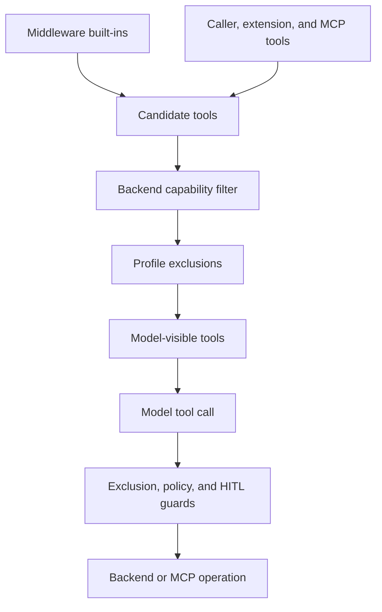

# Filesystem and Tool Surface

A tool name is not an authorization decision. The system separates **assembly and visibility** (the schemas bound for the model), **backend capability** (what the active backend can implement), and **per-call controls** (exclusion checks, filesystem policy, and human approval). Consequently, a tool can be visible yet fail at runtime, be denied, or pause for review.

This shows the distinction between request-time visibility and call-time enforcement.

## Tool surface assembly

`create_deep_agent` builds a layered middleware stack: filesystem tools are built in, subagent/task tools appear when configured, and caller `tools=` join the agent. dcode resolves extension ownership before it calls `create_deep_agent`: extension-owned names replace colliding supplied tools or middleware, extension units are added, and runtime middleware is installed. Treat a configured name as having one intended owner.

Profiles can override descriptions and suppress tools. Description overrides copy and rewrite dict tools and `BaseTool` instances, leaving plain callables unchanged. When `excluded_tools` is non-empty, graph assembly appends `_ToolExclusionMiddleware` after custom middleware. It strips names from both sync and async model requests, then rejects an emitted excluded name with `Error: <name> is not available.` The call-boundary check matters because the executor still has the registered tool and dispatches by emitted name. This keeps the advertised and callable sets aligned; exclusion is not a security boundary.

### dcode catalog and MCP tools

`dcode tools list` and the interactive `/tools` command inspect an agent's actual bound tool node rather than a separate static catalog. They compile with an offline placeholder chat model, so enumeration needs neither credentials nor a model network call. The catalog forwards the filesystem allowlist. Because the filesystem middleware never instantiates omitted factories, a disallowed filesystem tool should not appear; a defensive leak check logs the enforcement failure and returns the unfiltered result rather than hiding it.

MCP is a separate external tool source, not filesystem middleware. For each discovered MCP tool, dcode uses `langchain.mcp.as_langchain_tool` to make an asynchronous `StructuredTool` routed through a FastMCP client, then normalizes arguments against the original MCP input schema. The wrapper retains server and original-tool-name metadata, which lets dcode invoke and filter the correct remote tool after exported names change. Server configuration may use `allowedTools` or `disabledTools`, with literal or `fnmatch` patterns matched against bare and prefixed names; unmatched entries warn rather than aborting startup.

MCP exported names are provider-safe: server and tool components are sanitized, the name is capped at 64 characters, and a changed or overlong name receives a deterministic SHA-256-derived suffix. Loading preflights servers concurrently with a bounded fan-out, preserves configuration order for server status, and sorts the combined usable tools by name. A failed configuration, authentication, connection, mount, or tool-construction step produces server status information instead of preventing other servers from loading. Runtime session ownership is explicit: tools use a caller-managed manager, a returned local manager, or stateless wrappers that open and clean up a session per invocation.

## Filesystem middleware and backend contract

`FilesystemMiddleware` is the model-facing adapter over an initialized `BackendProtocol`; without one it uses ephemeral `StateBackend`. The backend owns storage and filesystem operations, while middleware validates tool inputs, applies the private filesystem policy, formats `ToolMessage` output, and performs eviction. Passing a backend factory is rejected; pass an initialized backend instance instead.

The filesystem vocabulary is fixed: `ls`, `read_file`, `write_file`, `edit_file`, `delete`, `glob`, `grep`, and `execute`.

| Tool | Role |
| --- | --- |
| `ls` | List directory entries. |
| `read_file` | Read a file window, including supported multimodal files. |
| `write_file` | Create or replace a file. |
| `edit_file` | Make exact string replacements in an existing file. |
| `delete` | Recursively delete a file or directory when supported. |
| `glob` | Find regular files matching a glob pattern. |
| `grep` | Search literal text. |
| `execute` | Run a command only through an execution-capable backend. |

Backends return structured results rather than model-formatted text. `ReadResult` validates coherent pagination metadata, while middleware adds line-number gutters and splits very long lines into continuation rows. `GrepResult` and `GlobResult` can be successful but incomplete (`truncated=True`), so truncation is not a hard failure or evidence that no further matches exist.

### Paths and file semantics

`FilesystemBackend` defaults to `virtual_mode=True`. In that mode incoming paths are a virtual tree rooted at `root_dir` (or the current directory), traversal using `..` or `~` is blocked, resolved paths must remain beneath the root, and displayed paths do not disclose the host root. With `virtual_mode=False`, absolute paths are used as-is and relative paths resolve under `root_dir`; it is deliberately unrestricted host filesystem access, not a security boundary. Tests cover both modes, root-relative defaults for `glob`, dotfile matching only when the pattern explicitly starts with `.`, and traversal rejection in virtual mode.

The backend `read` contract tolerates degenerate windows: negative offsets begin at the first line, while non-positive limits return an empty text window. Binary reads are not line-paginated. A backend returns raw content and window metadata; the middleware is responsible for presentation.

### Multimodal `read_file` compatibility

`read_file` decides whether a successful result is text or media from the backend-declared encoding first. Base64 content is never line-numbered; known extensions select `image`, `audio`, `video`, or `file` blocks, while an unknown binary extension becomes a generic `file` block. The resulting `ToolMessage` records the source path and MIME type. Text continues through pagination, line-number formatting, and the read-specific truncation path.

Media can require a second synthetic `HumanMessage`—notably sampled video frames. The filesystem middleware keeps every `ToolMessage` in an assistant tool-call batch ahead of those attachments, because providers require all results for the batch before a non-tool message. `create_deep_agent` puts `UnsupportedContentMiddleware` at the tail of its middleware stack. On each request, that middleware consults the *active request model* profile and replaces blocks it explicitly cannot accept with a text placeholder naming the original `read_file` path. It does not mutate persisted thread content, so changing to a compatible model can send the original media again. Inline non-PDF base64 documents are stricter: they are accepted only for `ChatOpenAI` or `AzureChatOpenAI` using the Responses API and an accepted MIME type.

If a provider nevertheless rejects a request for its file content, `FilesystemMiddleware` retries once after replacing only the latest-turn multimodal `read_file` results with an unsupported-content notice. Other `ModelInvalidRequestError` cases propagate; the retry is a compatibility recovery, not a blanket model-error retry.

### Allowlist, capabilities, and result lifecycle

`FilesystemMiddleware(tools=...)` is a visibility allowlist, not an authorization policy. `None` and `"all"` enable every filesystem name. A list constructs only its named factories, so an omitted name never reaches the dispatchable node; every explicit list must include `read_file`. At model-request time, both sync and async paths additionally remove `execute` or `delete` when the backend cannot serve the capability. They also adjust `grep` and `execute` descriptions to the active tools and append shell path-routing guidance when execution is active.

`execute` requires `SandboxBackendProtocol` support (including a composite backend whose default supports execution). Its implementation still makes a runtime capability check and returns an error if reached without support. It also rejects a timeout above `max_execute_timeout` (default 3600 seconds), and reports when a concrete sandbox does not accept per-command timeout overrides. Successful responses carry the exit code in `ToolMessage.artifact`; sandbox implementations can capture large command output at source only when the output path is guaranteed to resolve to that same sandbox.

`grep` performs literal, not regular-expression, matching. `grep_max_count` defaults to 1000 total matches, may be overridden by the call's positive `max_count`, and can be disabled with `None`. The asynchronous protocol wrapper applies a wait timeout and enforces the cap even if a concrete backend has no `max_count` parameter. Only when execution is active does the model-facing `grep` description recommend `rg` for genuine regex.

Oversized tool results can be written beneath the backend artifacts root and replaced in the request with a preview and a file reference. `ls`, `glob`, `grep`, `read_file`, `edit_file`, `write_file`, and `delete` are excluded from generic tool-result eviction because they already truncate or return compact confirmations. Oversized human messages use a related flow: state retains the original content while the request gets a tagged preview and filesystem reference.

## Shell access and composite routing

`LocalShellBackend` is execution-capable because it combines `FilesystemBackend` with `SandboxBackendProtocol`, but it is not a sandbox. It passes commands to `subprocess.run(..., shell=True)` on the host with the current user's permissions. Its default execution timeout is 120 seconds, output is capped at 100,000 bytes, stdout and stderr are combined, and commands run with `root_dir` as their working directory. Its default environment is empty unless explicit values are supplied or `inherit_env=True` is selected.

`virtual_mode` changes only filesystem-tool mapping; it does not confine commands. Use `LocalShellBackend` only in trusted local development contexts, not with untrusted input, shared production systems, or as a substitute for isolated execution. HITL is strongly recommended.

For a `CompositeBackend`, file-tool paths may be virtual routes but `execute` always runs on the default backend's shell. Middleware does not rewrite commands. When that default is `LocalShellBackend`, it supplies the model with prefix substitutions for routed local `FilesystemBackend` paths. Routes backed by a remote sandbox, a remote default, or a store have no host shell mapping and must be accessed using filesystem tools.

## Filesystem permissions and HITL

`FilesystemPermission` is enforced inside tool implementations rather than by removing their schemas. Each filesystem tool first validates and canonicalizes its path — rejecting traversal and Windows absolute paths, normalizing redundant separators, and giving it a leading `/` — before its permission check. Rules then match operation and canonical path with wcmatch glob semantics and use first-match `allow`, `deny`, or `interrupt` behavior. A denied exact operation returns an error; list and search tooling filters denied results where it can. Permission patterns must begin with `/` and cannot include `..` or `~`.

Exact-path tools (`read_file`, `write_file`, `edit_file`) test their target. Bulk tools (`ls`, `glob`, `grep`, `delete`) interrupt when their search subtree could overlap the anchored prefix of an interrupt rule. A pathless bulk call such as `grep(path=None)` fires for any relevant interrupt rule; `glob` additionally accounts for an absolute pattern that can redirect its search outside `path`. Graph assembly converts interrupt-mode permission rules into `HumanInTheLoopMiddleware` predicates. For exact operations, an earlier deny wins and does not turn into an approval request.

Permissions cannot safely control arbitrary shell commands. Construction therefore rejects filesystem permissions on an execution-capable backend unless all rule paths are scoped to composite routes. This prevents a path policy from being mistaken for shell confinement.

## Tests and operational guidance

State-backend integration tests verify that parallel `write_file` calls merge updates for different files, ordinary edits replace one or all matching occurrences, and invalid paths become `ToolMessage` errors. The same-path parallel-edit regression is deliberately more specific: one call targets `/multi.txt` while the other spells the same target as `/./multi.txt`; the first succeeds, the second returns an error, and only the first replacement is present in state. Keep that test when changing path normalization, tool scheduling, or state updates: equivalent path spellings must not turn concurrent mutations of one logical file into independently successful edits. Filesystem-backend tests additionally exercise virtual and host paths, hidden-path glob semantics, read-window edge cases, binary classification, and large-result eviction.

When a tool misbehaves, diagnose the layer in order:

1. **Absent from model choices:** inspect filesystem `tools=`, middleware, profile exclusions, extension collisions, MCP filters, and MCP server status.
2. **`execute` or `delete` absent:** inspect resolved backend capability; an allowlist cannot create an implementation.
3. **Visible but rejected or paused:** distinguish profile exclusion, backend failure, filesystem denial, and HITL interruption.
4. **Search appears incomplete:** inspect `truncated`, then narrow the path or pattern.
5. **Shell cannot see a file-tool path:** inspect composite routing; use filesystem tools for paths without a host mapping.

## Related pages

- [Backends](backends.md) — implementations, routing, and execution capability.
- [Context management](context-management.md) — eviction and model-context handling.
- [Permissions & HITL](permissions-hitl.md) — approval policy and interrupts.
- [MCP integration](../integrations/mcp.md) — MCP configuration and lifecycle.
- [Sandbox partners](../integrations/sandbox-partners.md) — execution-capable backend integrations.
- [Testing guide](../testing/testing-guide.md) — test conventions and focused regression coverage.
