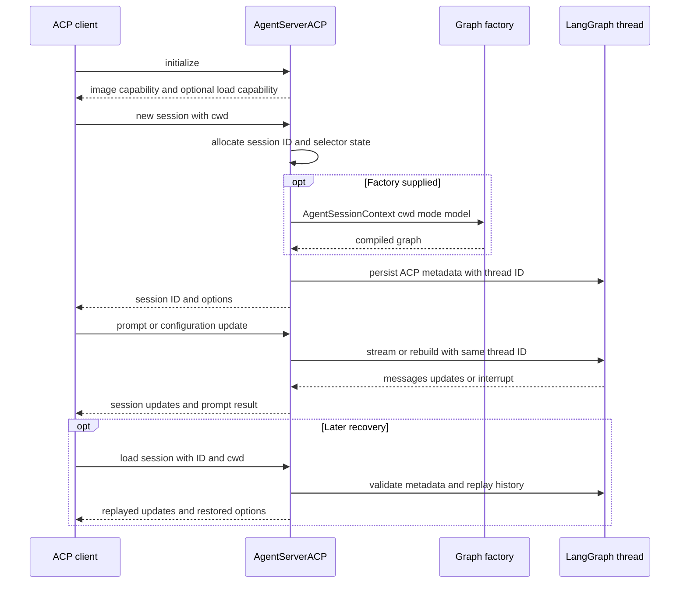

# Agent Client Protocol Integration

[Agent Client Protocol (ACP)](https://agentclientprotocol.com/overview/introduction) lets an editor communicate with an agent process over stdio. `deepagents-acp` supplies `AgentServerACP`, an ACP `Agent` implementation that turns a compiled LangGraph into ACP session operations and `session/update` events. It is an adapter, not a new agent runtime: graph construction, tools, checkpoint storage, and interrupt policy remain application responsibilities.

There are two useful deployment layers:

- A custom server calls `run_agent` with `AgentServerACP` around a Deep Agents or compatible LangGraph graph.
- `dcode --acp` launches dcode's already-assembled coding-agent factory in the current process. Unlike normal dcode, it does not launch the Textual UI or use its remote client `RemoteGraph`; it owns local ACP session graphs instead. See [Deep Agents Code Architecture](/openwiki/architecture/code-agent.md) and [SDK Construction and Agent Execution](/openwiki/architecture/sdk-construction-execution.md).

## Release and package baseline

`deepagents-acp` is currently version `0.0.12`; the package metadata and runtime version are kept in sync by release-please. It requires Python 3.11 or later and declares `agent-client-protocol>=0.10.1`, together with `deepagents` and `python-dotenv>=1.2.2`.

The `0.0.12` release (2026-09-18) scopes `cancel()` requests to their requested ACP session. The immediately preceding releases added visible reasoning as ACP thought chunks (`0.0.11`) and persistent ACP session loading (`0.0.10`). Those release changes explain two important current boundaries: cancellation must not leak across sessions, and `session/load` depends on application-provided durable checkpoint storage rather than on the protocol adapter alone.

## Graph boundary and session model

`AgentServerACP` accepts either a compiled `CompiledStateGraph` or a factory taking `AgentSessionContext(cwd, mode, model)`. A compiled graph is reused; a factory is the appropriate boundary when the editor's cwd or selected configuration changes how an agent must be built. `modes` and `models` are factory-only and cause `ValueError` when supplied with a compiled graph.

The adapter retains only one active graph instance at a time. It resets/rebuilds a factory graph when a prompt belongs to another session or a selected setting changes, passing that session's cwd, mode, and model. The graph's LangGraph `thread_id` is exactly the ACP `session_id`; this is the identity that scopes checkpoint state.

At `initialize`, the server advertises image input and advertises `session/load` only when `load_sessions=True`. `new_session` allocates a UUID-derived ID, records the supplied cwd and ACP MCP descriptors, initializes configured mode/model defaults, and returns the configuration options. With loading enabled it also writes ACP metadata into the graph thread before returning.



*ACP session identity becomes the LangGraph thread identity; the bridge projects graph state and events rather than owning an independent transcript.*

### Per-session configuration

The adapter exposes mode and model selectors as ACP session configuration options (`mode` and `model`), with compatibility handling for ACP releases that either wrap or directly use select options. `set_config_option` accepts strings only, rejects unknown option IDs and unavailable mode/model values with invalid-parameter errors, resets the session graph, and persists the changed selection when durable loading is enabled. The older `set_session_mode` operation also resets and persists a configured session mode, but does not itself validate that its `mode_id` is in the available choices.

The demo is a concrete factory pattern: it uses `context.cwd` as the local-shell backend root, maps `context.mode` to an `interrupt_on` policy, forwards `context.model` to `create_deep_agent`, and shares its `MemorySaver` between factory-built graphs.

## Prompt and stream projection

For a prompt, the bridge converts ACP text and images to LangChain content; resource links become textual resource context with a `file://` path made relative to the session cwd, and embedded text/blob resources become text (a blob is represented as a data URI). Audio input raises `NotImplementedError`. In the reverse direction, normalized assistant text, image, and audio blocks can be emitted; only plaintext `reasoning` blocks are exposed as ACP thought chunks, while encrypted/redacted/nonstandard reasoning is omitted.

The graph is streamed with `messages` and `updates` modes and `subgraphs=True`. Only top-level assistant content and reasoning are shown, so subagent content stays internal. `write_todos` becomes ACP plan updates. A message chunk's content is sent before its tool activity; fragmented tool arguments are accumulated by call index and a tool-start update is sent only once the accumulated arguments parse as JSON. Later tool messages complete the corresponding call (except edit calls, whose start includes a diff). This ordering is also used during replay.

If a supplied graph has no checkpointer, `prompt` attaches `MemorySaver` so the turn can run. That is an ephemeral fallback, not a way to make a restarted server recover sessions.

### Cancellation and interrupts

`cancel(session_id)` adds that ID to an in-memory cancellation set. `prompt` clears a previous cancellation at the beginning of a new turn, checks the set before streaming and on every streamed chunk, and returns `PromptResponse(stop_reason="cancelled")` when it observes a cancellation. The flag is session-specific, so one session's cancel does not cancel another session's prompt; a normal completion returns `end_turn`.

ACP permission UI has fixed choices, so the adapter rejects a free-form LangGraph `interrupt()` value. Compatible graphs must instead emit the `action_requests` form used by `HumanInTheLoopMiddleware`. After an interrupt update, the bridge leaves the stream iterator before reading graph state—important for persistent checkpointers whose interrupt checkpoint is not visible until iteration closes—asks the ACP client for decisions, and resumes with `Command(resume={"decisions": ...})`.

For each action, ACP offers Approve, Reject, and Always allow. A client cancellation response is treated as rejection. Rejected or cancelled `write_todos` clears the plan; rejection additionally tells the graph to ask for feedback and make an improved plan. Once a plan is approved and remains incomplete, later updates to it are auto-approved.

“Always allow” is adapter-memory state scoped to the ACP session, not a durable authorization grant. Non-shell tools are allowlisted by name. For `execute`, the bridge allowlists extracted command signatures, and auto-approves a future compound command only if **all** signatures were allowed and the command has none of the dangerous substitutions, variable expansions, redirects, control characters, process substitutions, or standalone backgrounding patterns.

## Durable-session option versus durable storage

`load_sessions=True` is a protocol capability switch: it advertises and implements `session/load`; it does **not** supply persistent storage. Both creating/loading a durable session require the session graph to have a checkpointer, and recovery across process restart requires that checkpointer's data to survive and remain available after restart. `MemorySaver` supports tests and an in-process turn but not restart recovery. See [State, Checkpoints, and Durable Records](/openwiki/concepts/state-persistence.md).

The bridge persists metadata containing an ACP-session marker, cwd, and current mode/model selection. On `load_session`, it requires a checkpointed thread with that marker; missing or unrelated threads return `resource_not_found`. The requested cwd must equal the persisted cwd or loading returns invalid parameters and clears validation-time local state. It restores only persisted selector values still supported by the current server, rebuilds the factory graph if that restoration changes its context, and replays deduplicated historical human messages, visible assistant blocks/thoughts, tool starts, plans, and tool results through `session/update` before returning. A session cannot be relocated merely by loading it from another editor cwd.

## MCP ownership boundary

ACP's `new_session` and `load_session` accept MCP descriptors, and the generic bridge retains them per session (including compatibility with an old positional `new_session` form). They do not appear in `AgentSessionContext`, are not passed to the graph factory, and are not converted to graph tools. A custom application that intends to honor editor-provided MCP configuration must build that explicit bridge itself.

Dcode has a different, configuration-owned MCP path. Before serving ACP it resolves MCP tools from its explicit/normal configuration, project-trust context, and discovered plugin configurations; these tools and server information are captured by its per-session graph factory. Missing configuration files or MCP tool-loading failures go to stderr and return exit code 1, and the MCP session manager is cleaned up when the ACP server exits.

## Run and operate the integrations

For the repository example, work in `libs/acp`, run `uv sync --group examples`, add `ANTHROPIC_API_KEY` to `.env`, and configure an editor to execute `run_demo_agent.sh` (make it executable if needed). LangSmith tracing variables in the example `.env` are optional. The README's Zed example is one ACP client configuration; the adapter is not Zed-specific.

For dcode, install the ACP dependency with the CLI and point an ACP-capable editor at it:

```sh
uv tool install -U deepagents-code --with deepagents-acp
```

```json
{
  "agent_servers": {
    "Deep Agents Code": {
      "type": "custom",
      "command": "dcode",
      "args": ["--acp", "--model", "anthropic:claude-sonnet-5"]
    }
  }
}
```

Dcode detects raw `--acp` before argument parsing to skip Textual dependency checks and imports ACP components lazily. If `acp` or `deepagents-acp` is absent, it prints the reinstall command and exits nonzero. The ACP launcher resolves the initial model and selector list, builds web/MCP/subagent tools, opens dcode's checkpointer, and passes a session-cwd/model-sensitive factory to `AgentServerACP(load_sessions=True)`.

`--no-mcp` and `--mcp-config` are mutually exclusive (exit 2). YOLO mode requires an acknowledgement previously made in the interactive TUI, and `--auto-classifier-model` requires resolved Auto mode. Dcode passes its resolved `yolo` and `auto` policy into `create_cli_agent`; therefore ACP's permission rendering occurs only for human-gated interrupts left by that policy. In Auto mode, dcode substitutes a specialized bridge that writes trusted Auto approval state, adds text-prompt metadata, and streams using `CLIContextSchema` with Auto settings. It does not expand ACP to support free-form interrupts.

## Focused verification

`libs/acp/tests/test_agent.py` exercises capability advertisement, configuration compatibility and validation, multimodal conversion, top-level streaming order, tool transitions, cancellation isolation, fixed-decision permissions, command allowlisting, delayed checkpoint visibility, recovery replay, selector restoration, and cwd rejection. `libs/code/tests/integration_tests/test_acp_mode.py` is a stdio smoke test: it launches `deepagents --acp --no-mcp`, initializes an ACP pipe connection, creates a session, and asserts a session ID is returned.
