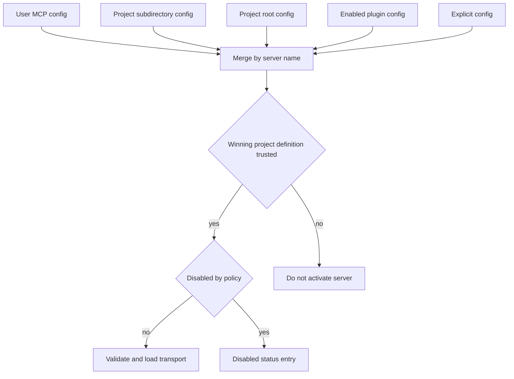
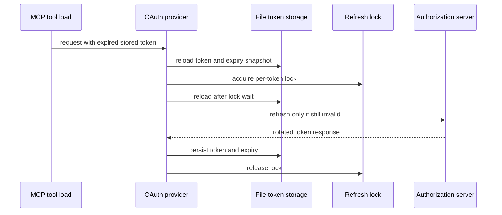

# MCP Servers, Trust, and OAuth

MCP configuration is executable integration input: a stdio definition can start a local command, and a remote definition can make network requests or interpolate values into headers. dcode consequently keeps **discovery provenance**, **project trust**, **user disable policy**, and **connection/loading** as separate stages. An explicit config is an operator-selected exception to discovery, not a way for a repository file to self-authorize.

## Configuration discovery and trust

`resolve_and_load_mcp_tools()` is the runtime entry point. Unless `no_mcp` is set, it searches existing files in ascending precedence:

1. the selected profile's user `.mcp.json`;
2. `<project-root>/.deepagents/.mcp.json`;
3. `<project-root>/.mcp.json`.

Later definitions replace earlier definitions with the same server name. Discovery attaches immutable `USER` or `PROJECT` provenance and a project root; aliases or collisions with a project config are deliberately treated as project scope rather than accidentally inheriting user trust. An `explicit_config_path` is appended as the highest-precedence layer and its errors are fatal. In contrast, auto-discovered bad files become synthetic configuration-error status entries where loading can continue.

This is the ordering boundary: precedence chooses the winning project definition before trust evaluates it.

Project definitions load when the session grants whole-project trust, an explicitly dangerous environment-name allowlist matches, or a persisted approval matches the project identity, server name, and definition fingerprint. A rejection always wins. Persisted approvals for fixed remote servers can use the validated Git common directory and therefore cover linked worktrees; local-command and environment-dependent remote definitions remain exact-worktree scoped. If the user trust policy cannot be read, whole-project trust and persisted scoped approvals fail closed, though explicit environment approvals that remain readable can still apply. Plugin installation is itself a trust decision for bundled MCP layers, but plugins still obey user denials and fail closed when that policy is unreadable.

The project policy must not be confused with the general disabled-server store. `~/.deepagents/config.toml` records `[mcp].disabled_servers` by server name, so one disabled name applies to every same-named definition. User and managed deny sets are unioned. A corrupt user config is warned about, but an unreadable or invalid managed deny policy is treated as disabling every server; writes refuse to overwrite an unreadable or malformed user config. Disabled entries are removed before activation—no connection is attempted—while status metadata keeps them visible to the TUI.

## Loading transports and tools

After filtering, dcode validates names and server shapes, derives `stdio`, `http`, or `sse` transport (a bare URL is remote), and hands transport construction to FastMCP. `${VAR}` and `${VAR:-default}` interpolation is performed only while activating an individual server, for `command`, `url`, `args`, `env`, and `headers`; malformed references and required missing variables are errors. This deferred resolution prevents one server's unavailable environment value from invalidating healthy siblings. `:-` follows POSIX behavior: it uses its default when a variable is unset or empty.

Preflight checks a stdio command on `PATH` or probes a remote endpoint. Transport building, connection, discovery, schema adaptation, and tool filtering are isolated per server and bounded in concurrency. Failures become `MCPServerInfo` records rather than suppressing other servers. When a raw configuration contained environment interpolation, later setup or connection failure details are redacted so a resolved secret is not exposed in UI/log messages.

FastMCP backends are connected and listed independently, then mounted behind encoded namespaces on one router client. dcode adapts discovered tools for LangChain, makes exported names safe and collision-free, retains original server/tool identity for dispatch, applies allow/disable glob filters, and sorts the resulting tools. A static `Authorization` header wins over stored OAuth credentials; otherwise an explicit `auth: "oauth"`, or existing stored credentials for a remote server, causes an OAuth provider to be attached.

`MCPSessionManager` owns router/backend lifetime, not the FastMCP protocol implementation. It retains every adopted load rather than closing the previous one during reload, because already-issued tools may still be in flight. Cleanup closes retained router/backend pairs in reverse adoption order, bounds each close to five seconds, logs ordinary failures, and continues. Stateless mode instead disposes discovery sessions and wraps each invocation in a fresh single-server load.

## Status and reconnect contract

`MCPServerInfo` is the status boundary between loader, tool catalog, and MCP viewer. `ok` can contain tools and no error; any non-`ok` status requires an error and cannot contain tools. The statuses distinguish successful, `unauthenticated`, ordinary error, user `disabled`, and UI-only `awaiting_reconnect`; `pending_reconnect` is allowed only for a disabled entry. This lets `/tools` and `/mcp` report unavailable servers rather than silently dropping them, offer authentication only for relevant OAuth cases, and retain guidance after a user enables a server until reconnection occurs.

## OAuth credential lifecycle

`FileTokenStorage` stores OAuth token state, client registration, public authorization metadata, and an absolute `expires_at` sidecar under the selected profile's state directory. Server names must be path-safe; the effective endpoint contributes to the filename so same-named servers at different URLs do not share credentials. It creates a private token directory and atomically replaces private token files. Blocking reads and writes run off the event loop, and same-file read-modify-write operations use a per-file lock. Token-plus-client-registration writes are one operation so a partial update cannot orphan either half.

The expiry sidecar turns `expires_in` into an absolute timestamp at receipt time and is cleared if a subsequent token omits expiry. On cold start, `_ExpiryAwareOAuthClientProvider` restores a token and its expiry from one storage snapshot and applies a safety margin. A legacy token with a refresh token is treated as expired to attempt refresh first; a legacy token without one can only fall through to a later 401 and interactive reauthentication. Public OAuth metadata is cached with the credentials so the refresh path can use the advertised endpoint.

This shows the refresh critical section. Reloading after lock acquisition avoids replaying a refresh token another process may have rotated; if the lock cannot be acquired, dcode avoids an unlocked refresh that could revoke a token family.

Persistence and lock acquisition/release are joined even if their caller is cancelled: once a refresh-token write starts, cancellation does not detach it. Write failure is surfaced rather than silently losing the update. The cross-process `.lock` file is separate from the credential file and has no token material. A corrupt or unsupported token file produces remediation that directs the operator to delete it and log in again.

Runtime loading is non-interactive. An OAuth-configured remote server with no tokens is reported as `unauthenticated`; an expired/failed refresh or RFC 9728 challenge is also classified as needing login. The non-interactive provider raises `MCPReauthRequiredError` instead of blocking on terminal input.

## Login interaction boundaries

`dcode mcp login [server]` and `dcode mcp login` use the UI-agnostic login service to resolve the same auto-discovered, precedence-merged, trust-gated configuration as runtime loading. An explicit `--mcp-config` is isolated and explicitly trusted. The no-server form lists OAuth servers without stored tokens; it does not declare an expiring token invalid. Structured resolution errors and notices preserve distinctions among no config, unusable config, unknown or malformed server, skipped untrusted paths, policy read failure, and partial file-load errors.

`login()` accepts only remote HTTP/SSE transports, resolves environment references, selects a provider policy, and persists credentials through `FileTokenStorage`. An explicit re-login uses a storage view that hides existing tokens but does not delete them: the authorization flow must actually run, while an aborted attempt preserves the old credential. Existing client registration and reusable loopback port remain available; a stale registration with an unusable loopback redirect can be discarded only when no tokens exist so dynamic registration can be performed again.

`OAuthInteraction` keeps OAuth mechanics independent of presentation. Its methods expose authorization URLs, pasted callback URLs, device-code instructions, notices, and success/error messages—not access or refresh tokens. `CliOAuthInteraction` implements these through stdout/stderr and stdin. Browser-capable providers use a local loopback callback when possible, fall back to paste-back after unavailable callback/browser or timeout, and permit terminal abort. Device-flow providers render RFC 8628 instructions through the same interface.

The Textual `MCPLoginScreen` structurally implements `OAuthInteraction`: it renders a clickable URL, inline callback input, and device code inside a modal on the same event loop as its worker. Escape completes the outstanding input future with cancellation so the worker, rather than the modal, owns handshake teardown. After successful login, the TUI marks the server for reconnect and restarts/reloads the server path that will construct tools from the new credential.

## Focused verification and safe changes

The focused tests cover interpolation syntax and input immutability; discovery precedence and provenance; merge-before-trust behavior; scoped approvals, denial precedence, fail-closed policy errors, plugin policy, and disabled-server persistence; per-server load isolation and status invariants; and retained versus stateless session lifetime.

OAuth tests cover private atomic storage, server/URL credential isolation, snapshot-consistent expiry restoration, off-event-loop I/O, cancellation-safe persistence, cross-process refresh serialization, 401/challenge reauthentication classification, and full/paste-back/device login flows. UI tests use a recording `OAuthInteraction` to prove login does not need stdin/stdout and check that user-facing messages omit token material. Changes should preserve the separation of trust selection from activation, never downgrade an unreadable managed denial to permission, never close sessions merely because a new load succeeds, and never route an interactive login request through server-mode OAuth.

## Related pages

- [Code agent architecture](/openwiki/architecture/code-agent.md)
- [Configuration layering](/openwiki/concepts/config-layering.md)
- [Security operations](/openwiki/operations/security.md)
- [Run a dcode session](/openwiki/workflows/run-dcode-session.md)
