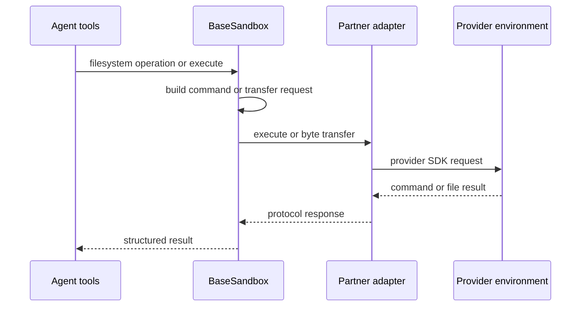
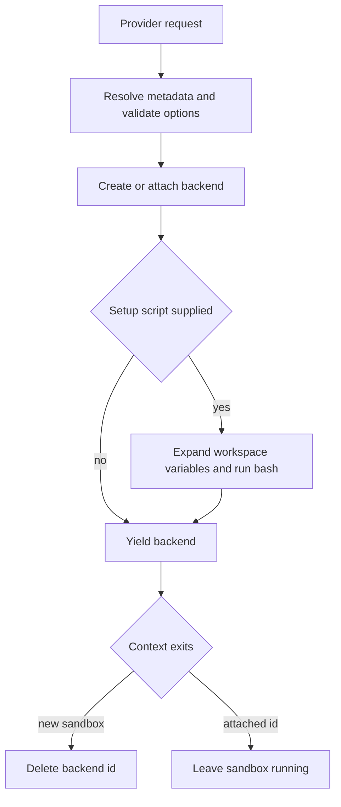

# Sandbox and Partner Backends

A remote sandbox has two deliberately separate layers:

- A **backend adapter** turns a provider environment into the Deep Agents filesystem-and-shell contract.
- A dcode **provider** creates or attaches that environment and owns its lifecycle.

`BaseSandbox` supplies the agent-facing filesystem behavior, while a partner adapter translates its provider SDK. dcode then selects and owns the adapter through a `SandboxProvider`. See [Backends](../concepts/backends.md), [Filesystem tools](../concepts/tools-filesystem.md), and [Security](../operations/security.md).

> `SandboxBackendProtocol` is a capability contract, not an isolation certification. It is intended for containers, VMs, and remote hosts, but `LocalShellBackend` also conforms while running arbitrary commands on the host. Network reachability, accessible files, identity, quotas, retention, and teardown are properties of the chosen provider environment and deployment.

## Contract and shared filesystem layer

`SandboxBackendProtocol` extends `BackendProtocol` with a stable `id`, synchronous `execute()`, and asynchronous `aexecute()`. Command responses hold combined output, an exit code that may be unknown, and a provider-truncation flag. The default async method moves synchronous work to a thread and forwards a timeout only when the concrete method accepts it. Portable callers should use a non-negative integer; `None` selects the backend default and several adapters use `0` for no timeout.

A `BaseSandbox` subclass implements only four provider-facing primitives:

1. `execute()` for a complete shell command;
2. `upload_files()` for byte transfer to the environment;
3. `download_files()` for byte transfer from it; and
4. `id`.

Transfers are a compatibility boundary: each batch must return one response in input order and record errors per file, so an agent operation can report partial success rather than lose the entire batch to one failure.



*The shared layer derives filesystem tools from the adapter's execution and transfer primitives.*

### Derived operations and bounds

`BaseSandbox` executes helper commands and parses their structured output for `ls()`, `read()`, `grep()`, and `glob()`. `read()` uses server-side `python3` to paginate text (with an approximately 500 KiB response cap) and returns non-UTF-8 files as base64. `write()` creates/checks parents and uploads UTF-8 bytes; the two calls imply a TOCTOU window. Small `edit()` payloads use a server-side replacement script, while large values are uploaded as randomized temporary old/new files and replaced in the environment, keeping the source file there. An empty old string and ambiguous single replacements are errors; replacement accommodates LF and CRLF but a replace-all on mixed endings changes only the first matching style.

`delete()` probes for an existing path—including a broken symlink—then uses `rm -rf`. Shell quoting keeps the supplied path one argument; it does not confine traversal or deletion to a root. A recursive deletion can partly complete before reporting a nonzero failure. The helper methods do not reduce `execute()` authority and require an image with the shell and helper programs they generate, including `python3` in several paths.

Search results are intentionally bounded rather than assumed complete. `grep()` is literal search; basename-only filters use `grep --include`, while filters containing `/` use a Python path glob relative to the search root. The glob walker rejects `..` traversal and bounds expansion, matching, and walk time. Since a remote script's walk budget cannot bound startup, transport, or response transfer, async grep and glob apply outer timeouts and return a narrowing error on expiry.

`execute_with_offload()` is opt-in through `enable_capture_offload`, defaulting to `False` because its POSIX-shell/coreutils wrapper is not universally available. When enabled, the wrapper captures combined output in the sandbox: output over `max_inline_bytes` stays at `capture_path` and returns a head/tail preview; capture stops at `max_capture_bytes` without killing the command, preserving the exit status. Disabled adapters execute unwrapped and return `offloaded=False` for generic result handling.

## dcode provider discovery and ownership

`SandboxProviderMetadata` describes working directory, attach-by-ID and snapshot support, installation guidance, and an optional importable backend module without constructing a credential-dependent provider. `SandboxProvider` defines synchronous `get_or_create()`/`delete()` and `asyncio.to_thread` wrappers.

`SandboxRegistry` merges built-ins, third-party providers advertised through `deepagents_code.sandbox_providers`, and local `[sandboxes.providers]` declarations. Collisions resolve **config > entry point > built-in**. A configured `class_path` imports arbitrary Python as the local user, so it is an administrator-trust boundary. Its `params` are forwarded to provisioning. `[sandboxes].default` selects a provider only after explicit sandbox mode is enabled; it does not itself enable shell execution.

`create_sandbox()` resolves metadata before provisioning. It rejects an unsupported snapshot and forbids combining `snapshot_name` with an attached `sandbox_id`; configured params are merged with call params, with call params winning. It then acquires the backend and, if requested, expands `${VAR}` from the active workspace environment and runs the setup content via `bash -c`. A failed setup raises and still triggers cleanup for a newly created sandbox. Attached resources are retained. Cleanup errors are reported without hiding the original failure.



*Only a newly created sandbox is owned by the context and deleted on exit.*

A dcode server holds that context for the process lifetime and registers close at `atexit`. The cached runtime makes creation and registration happen once. Consequently the first sandboxed workspace reserves the process-wide sandbox; a different workspace is rejected rather than silently sharing it. Use another server process for an independent workspace.

## Curated remote adapters

The dcode registry recognizes `daytona`, `modal`, `runloop`, and `vercel` as optional partner packages, in addition to other built-ins. Their common `BaseSandbox` inheritance does **not** mean identical lifecycle or failure behavior.

| Provider package and environment | Command and transfer translation | Lifecycle and operational distinction |
| --- | --- | --- |
| `langchain-daytona` / `DaytonaSandbox` | Creates a Daytona process session per command, runs the command asynchronously, polls completion/logs, then deletes the session. Transfers reject relative paths and preserve their request positions while mapping Daytona batch results. | Default command timeout is 30 minutes; `0` waits indefinitely. dcode requires `DAYTONA_API_KEY` (with the `DEEPAGENTS_CODE_` override), creates a fresh sandbox, polls `echo ready`, and deletes it if readiness times out. dcode does not support attaching by ID even though the metadata's default capability is not overridden. |
| `langchain-modal` / `ModalSandbox` | Executes `bash -c` and combines stdout/stderr. Reads and writes each file through `Sandbox.open`, mapping expected file and permission failures to per-file responses. | dcode can attach with `Sandbox.from_id` or create at `/workspace`, readiness-probes it, and terminates owned sandboxes. If workspace Modal credentials specify only one of `MODAL_TOKEN_ID` and `MODAL_TOKEN_SECRET`, provisioning fails rather than falling back to the server identity. |
| `langchain-runloop` / `RunloopSandbox` | Calls Devbox command and file APIs and returns combined stdout/stderr. | `RUNLOOP_API_KEY` is required by dcode. It can attach to a devbox; on fresh creation it optionally boots a blueprint. Resolution is blueprint ID environment variable, explicit snapshot name, blueprint-name environment variable, then an empty devbox. A named blueprint is reused only when build-complete; an in-progress or failed same-name blueprint is an error rather than a duplicate build. Delete shuts down the devbox. |
| `langchain-vercel-sandbox` / `VercelSandbox` | Runs detached `bash -lc`, waits locally, combines logs, and caps returned output at 100,000 bytes. Transfers reject relative paths and preserve one response per input. | dcode can attach by ID and does not allow snapshots. On timeout, the adapter attempts to kill the command and returns exit code 124 even if that cleanup fails. A completed command whose log fetch fails retains its exit code and reports unavailable output; unknown transfer failures surface their provider message rather than masquerading as missing files. |

All four adapters default commands to 30 minutes. Daytona, Modal, and Vercel document `0` as an indefinite wait; Vercel rejects a negative constructor default. Treat provider SDK behavior and environment image contents as integration-specific: derived file helpers depend on shell and `python3`, while native transfer implementations must retain the response-order and partial-failure invariant.

## QuickJS is execution capability, not a dcode sandbox provider

`langchain-quickjs` is a separate partner package bundled as a base dependency of `deepagents-code`; the compatibility `quickjs` extra is empty. It supplies `CodeInterpreterMiddleware`, which exposes an `eval` JavaScript tool backed by an in-process QuickJS runtime—not `SandboxBackendProtocol`, a remote shell, or the dcode sandbox registry.

Each LangGraph thread receives a distinct QuickJS slot/runtime/context, preventing globals from leaking between conversation threads. Persistence is configurable: `thread` (default) persists across turns, `turn` persists only within a turn, and `call` resets after every evaluation. In thread mode the middleware can serialize snapshots into checkpoint state; a configured `snapshot_signing_key` HMAC-signs them and rejects missing or invalid signatures on restore. Without a key, stored snapshots have no integrity verification.

The interpreter has a QuickJS heap limit (64 MiB by default), VM execution timeout (5 seconds by default), output caps, and a default 256-call programmatic-tool-call budget. The VM timeout is not total wall-clock time: awaited Python host/tool calls are outside it. Programmatic tool calls and JavaScript `task(...)` subagent dispatch also bypass the normal per-tool `interrupt_on`/human-approval path, so gate `eval`, add approvals inside subagents, or disable these features where per-call approval is required. The `eval` tool advertises no filesystem, network, or real-clock access; enabling programmatic tool calls selectively adds the authority of the allowed host tools.

## Installation, extension, and verification

The `dcode` command belongs to `deepagents-code` version `0.1.77`, requires Python `>=3.12,<4.0`, and pins `deepagents==0.7.19`. `langsmith[sandbox]>=0.14.0` and `langchain-quickjs>=0.3.4,<0.4.0` are base dependencies. Install remote partner adapters through the `agentcore`, `daytona`, `modal`, `runloop`, or `vercel` extras; `all-sandboxes` aggregates those five, not QuickJS.

When adding a sandbox partner, implement the four `BaseSandbox` primitives, translate provider exceptions into ordered per-file responses, and put provisioning, attachment, credential handling, readiness, and deletion in a `SandboxProvider`. Advertise snapshot and attachment capabilities only when the dcode lifecycle implements them. A third-party package can participate through the registry entry-point group and should expose metadata when possible.

Focused coverage exists at several boundaries: `test_sandbox_backend.py` checks the shared derived operations with a minimal mock, including server-side reads/edits and uploaded large-edit payloads. The opt-in local operation suite is gated by `RUN_SANDBOX_TESTS=true` and runs host subprocess commands, so use it only in trusted development or CI. Daytona and Modal integration suites use the common `SandboxIntegrationTests`; Runloop unit tests cover blueprint precedence, readiness states, attachment, and error translation; Vercel unit tests cover timeout, output truncation, ordered transfer errors, and log-fetch failure. QuickJS middleware tests cover registration, isolation, persistence modes, VM timeout, and bounded console output.

```bash
cd libs/deepagents
RUN_SANDBOX_TESTS=true make test TEST_FILE=tests/unit_tests/test_local_sandbox_operations.py
```
