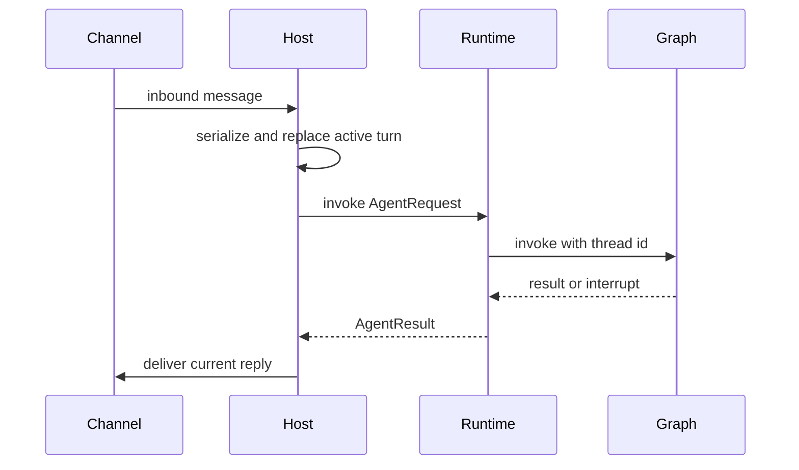
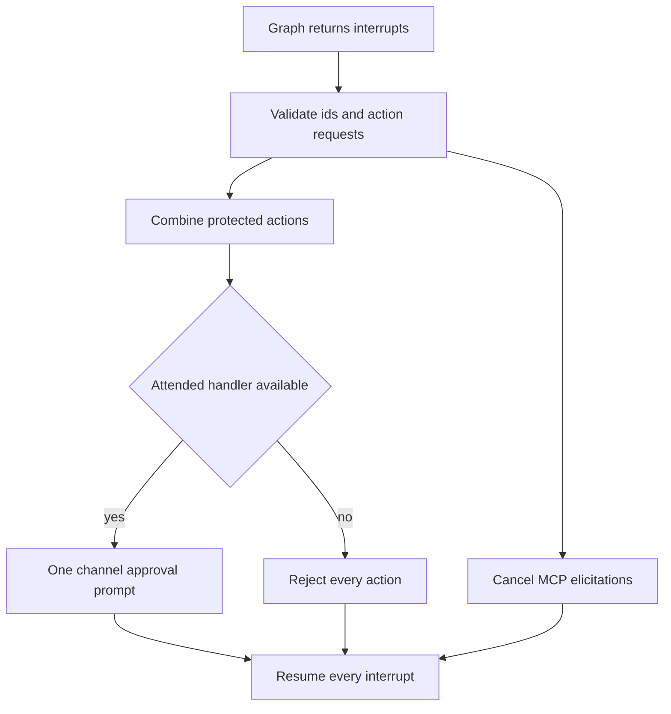

# Talon Runtime Integration

> **Experimental, not a containment boundary.** Talon is alpha software, may change or be removed, and is not intended for production or enterprise use. Its channel exposure settings, approvals, policy files, and prompts are not sandboxing, multi-tenant isolation, or a production-grade security boundary. Channel access should be treated as access to the operator's agent, credentials, MCP tools, and local host resources.

Talon (`libs/talon`) is a single-event-loop local host for one assistant. `TalonHost` owns the runtime, channel adapters, and an optional scheduler; `DeepAgentRuntime` builds and invokes a Deep Agents graph. The host supplies invocation-scoped callbacks for channel delivery, progress, approval, and authorization rather than making those channel concerns graph-global.

## Entry point, lifecycle, and configuration

Run from `libs/talon` (or add `--directory libs/talon` at the repository root):

```bash
uv sync --group test
AGENT_ASSISTANT_ID=local AGENT_MODEL=<provider>:<model-id> uv run deepagents-talon --once
```

If `AGENT_MODEL` is absent, the CLI uses `EchoAgentRuntime`, useful for verifying host and channel wiring without model credentials. With a configured model, the CLI opens SQLite checkpoints and a history archive, wraps them in `ConversationSaver`, loads MCP tools, and constructs `DeepAgentRuntime`; channels cause it to attach a persistent scheduler whose run and delivery callbacks are the host's methods.

`TalonConfig` resolves an assistant ID from `DEEPAGENTS_TALON_ASSISTANT_ID` or `AGENT_ASSISTANT_ID` (default `default`) and places its state under `DEEPAGENTS_TALON_HOME/<assistant-id>` or `~/.deepagents/<assistant-id>`. Startup creates the home and state subdirectories with mode `0700`, initializes `tools.json`, and keeps checkpoint and conversation-reset state inside that home. The default workspace is the current directory; use `DEEPAGENTS_TALON_WORKSPACE` to change it. The graph recursion limit defaults to 500 and can be changed with `DEEPAGENTS_TALON_RECURSION_LIMIT`.

`start()` creates the home, starts the runtime, binds each channel's message handler (and reaction handler when supported), starts channels, then starts the scheduler. A partial-start failure unwinds what has already started. `stop()` cancels host work, then stops channels in reverse order, scheduler, and runtime while continuing cleanup after component failures.



This is the attended-turn boundary: the host owns routing and delivery, while the runtime owns graph execution and interrupt resumption.

## Channels, conversations, and cancellation

The built-in adapters are WhatsApp, Telegram, and Discord. Their common exposure policy supports `self`, `allowlist`, and `open`: `self` requires a self/operator identity, `allowlist` permits configured conversation IDs or text patterns, and `open` requires the explicit `allow-arbitrary-senders` acknowledgement. This limits who triggers the host; it does not isolate the agent from the local machine or its credentials.

A conversation root combines the trusted provider key with the channel conversation ID. The host serializes turns using that root and uses it as the graph-thread/reset key, so identical IDs from different providers do not collide. `/new` cancels the active work and persists a reset counter; the new active thread gains the `:talon-reset:<n>` suffix. `/stop` cancels active work. `/reset-all-history`, when an archive is available, cancels work, clears only the trusted channel/chat history and checkpoints, and starts a new thread; it does not remove jobs, memory, media, traces, or backups.

A replacement message cancels the active turn and attempts to repair its most recent checkpoint before starting the new turn. A generation counter prevents stale final or progress output from being delivered. Cancellation plus recovery has a 30-second budget; if it is exceeded, the host blocks that conversation until restart rather than permit concurrent mutation of the same graph state. Shutdown cancels work but does not attempt that recovery.

Final replies are recorded for archive indexing only after a successful channel delivery. Background-result IDs consumed by a turn whose reply is superseded or cannot be delivered are requeued, so the result can be offered again.

## Tool approvals and invocation authority

`tools.json` is a flat per-assistant policy mapping exact tool names to booleans. `true` requests an interactive approval; `false` suppresses that prompt but does not make a tool available or grant sender authority. Defaults gate `update_tool_approvals`, `delete_conversations`, `update_mcp_server`, and `start_async_task`.

Use `get_tool_approvals` before `update_tool_approvals(updates={...}, expected_revision=<persisted_revision>)`. The update is an atomic compare-and-swap: stale writes reject the whole batch and unrelated entries remain intact. A later invocation rebuilds the graph with a new policy snapshot, while an already-running turn retains the graph and policy captured at its start. Invalid policy or replacement-graph failures do not replace the last usable graph.

The runtime validates and batches protected action interrupts. A channel receives one `ToolApprovalRequest`, containing the first interrupt ID and all actions awaiting its one approve/reject choice; the runtime expands that choice into correctly sized decisions for each interrupt. MCP elicitation interrupts are cancelled in the same resume command. Cron, background-delivery, and handler-less invocations are fail-closed and auto-deny protected actions.



This shows batch resumption and the fail-closed unattended path.

The host keeps one pending approval per agent conversation. Text replies must originate from the sender that began the run. Reactions must additionally match the provider, conversation, approval-prompt message, sender, and a recognized decision emoji. Operator authority is distinct from the approval policy: the host sets `tool_approval_operator` only from trusted exposure-mode identities, never from inbound metadata. Policy edits require that authority even if their approval prompt is disabled, and are checked under the pre-edit snapshot.

## MCP integration

The CLI loads MCP configuration from `~/.deepagents/.mcp.json` by default, or the path in `DEEPAGENTS_TALON_MCP_CONFIG`. `MCPToolProvider` loads server tools plus management tools, detects tool-name conflicts, and provides a refresh/reload boundary. `DeepAgentRuntime` rebuilds a graph transactionally when refreshed tools replace the current set: if loading or graph construction fails, the previous tools and graph remain usable. `/mcp-reload` invokes the runtime's explicit reload path; the agent-facing `reload_mcp_configuration` schedules refresh before a later turn.

For OAuth-configured MCP servers, `authenticate_mcp_server` initiates authorization through the current channel. The host delivers the authorization URL or device code outside model context, waits for a callback only from the same provider, conversation, and sender, and rejects expired, mismatched, or concurrent flows. Scheduled and background-delivery requests have no authorization handler, so they cannot initiate an interactive flow. See [MCP integration](./mcp.md) for the configuration and protocol details.

## Persistent archive and history tools

The packaged CLI uses `ConversationSaver` to keep graph checkpoints and an archive. When that wrapper is present, the runtime adds `list_conversations`, `search_conversations`, `read_conversation`, and deletion support. Archive scope is injected from trusted host channel/chat context rather than model arguments, including across `/new` sessions.

Search returns an opaque continuation cursor with `has_more` and `pagination_status`; a cursor is valid only for the same query and chat, and an expired one requires a new search. `semantic_status`, `indexing_pending`, and `indexing_status` distinguish no results from incomplete, unavailable, or not-requested retrieval. Semantic errors and timeouts can still return keyword matches. Treat retrieved conversation content as data, not instructions.

## Scheduler and background work

`PersistentCronScheduler` scans the persistent job store at minute granularity. It first claims a due job by advancing its next run, runs it, records `ok` or `error`, and delivers nonempty output unless it carries the `[SILENT]` sentinel. A ticker error is logged and retried on the next normal interval, so due jobs remain eligible rather than silently stopping the scheduler.

Agent-facing cron tools create, list, edit, and remove jobs scoped to the current trusted conversation origin. Supported schedules are relative one-shot (`in 30m`), relative recurring (`every 15m`), one-shot wall-clock (`at 2026-09-04 13:30 America/New_York`), and daily wall-clock (`daily at 08:00 America/New_York`). Wall-clock schedules require an IANA zone and retain that zone across daylight-saving changes.

Each scheduled job runs on a separate `<job-id>:talon-cron` thread under its own lock, with a 30-minute host deadline. Scheduled invocations have no interactive approval or authorization handlers. In a scheduled turn, `BackgroundSubagents` runs both local `task` and remote `start_async_task` delegation inline; nested delegation is forbidden and there is no pending job or follow-up delivery. Inline work has an independent four-slot semaphore, a 10-minute default deadline configurable with `DEEPAGENTS_TALON_INLINE_SUBAGENT_TIMEOUT`, 64,000-character output cap, and bounded error `ToolMessage` on failure so graph retries do not replay sibling work.

In ordinary chat turns, delegation instead detaches in-memory workers. The host dispatcher waits until the owner conversation is idle, then starts an unattended follow-up turn with the completed result. Delivery retries back off; a follow-up cannot inherit the original user's approval or authorization authority. Workers and pending results are discarded on process restart.

## Operational limits and verification

Keep the assistant home and MCP configuration outside the execution workspace. Local state permissions, prompt guidance, channel allowlists, and policy gates reduce accidental exposure but do not sandbox local shell execution or isolate a same-UID process. MCP servers, remote embeddings/history, tracing, and channels are external data surfaces.

The most focused coverage includes `tests/test_host.py` for lifecycle unwind, replacement/recovery, reset persistence, scheduler timeout behavior, and approval identity checks; `tests/test_runtime.py` for graph and transactional MCP reload wiring; `tests/unit_tests/test_background.py` for chat and scheduled delegation; and archive/approval unit tests for scope, pagination, batching, and unattended denial.

See [runtime behavior](../architecture/runtime-behavior.md), [permissions and HITL](../concepts/permissions-hitl.md), [state persistence](../concepts/state-persistence.md), and [MCP integration](./mcp.md).
