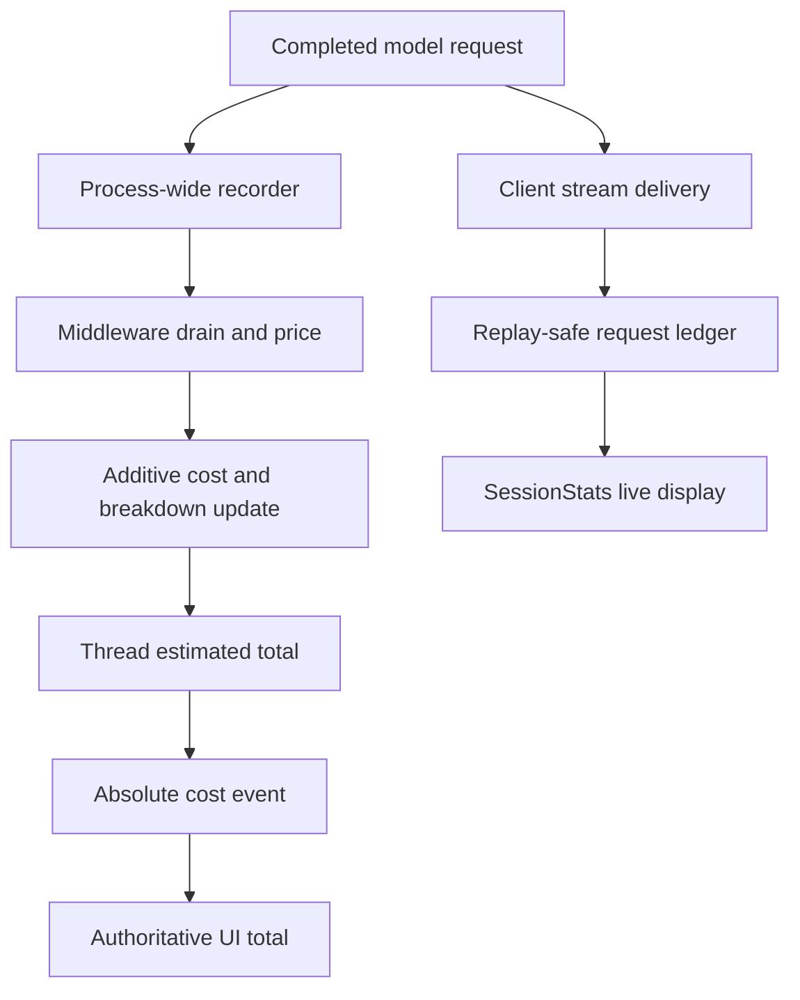
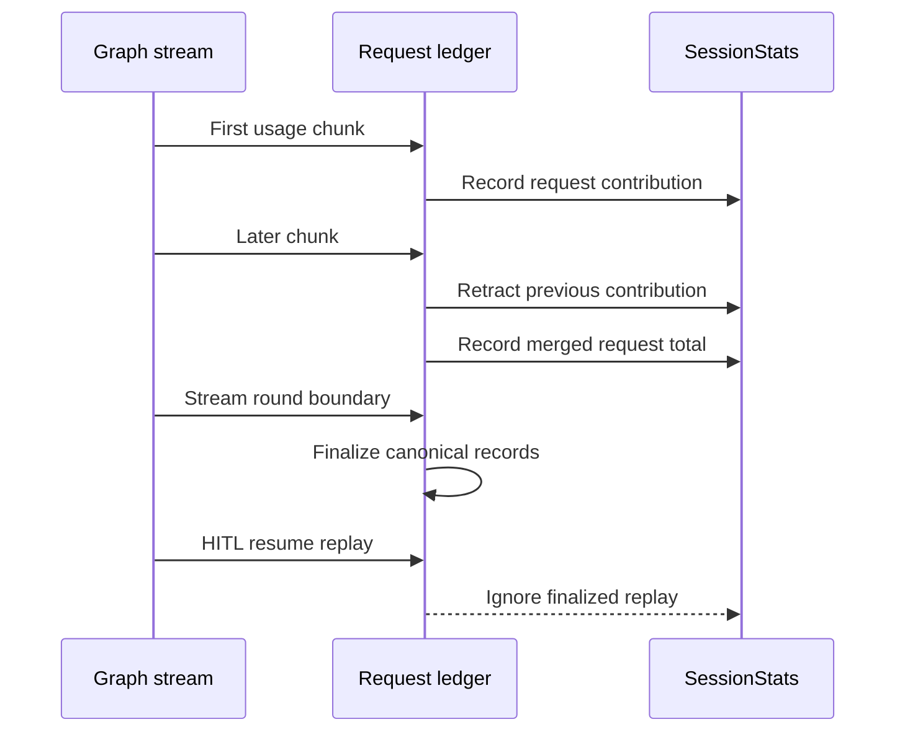
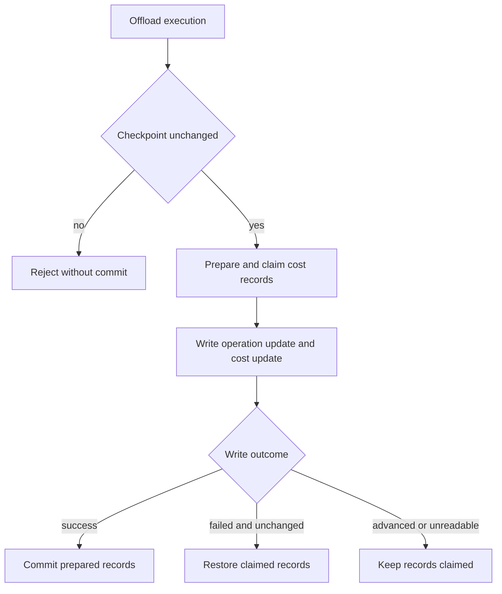

# Cost, Usage, and Session Operations

A dcode run has two distinct accounting views. The graph checkpoints a thread-wide **estimated** USD total and structured breakdown; the client uses `SessionStats` as a responsive, replay-safe live usage display. Neither is a provider invoice, authorizes a request, caps spend, or gates execution. Reconcile actual charges through the provider's usage and billing surfaces.

Related material: [Runtime behavior](../architecture/runtime-behavior.md), [State persistence](../concepts/state-persistence.md), [Development](development.md), [Testing guide](../testing/testing-guide.md), and [Run a dcode session](../workflows/run-dcode-session.md).

## Ownership and accounting flow

| Concern | Owner | Operational meaning |
| --- | --- | --- |
| Durable estimate | `CostTrackingMiddleware` and checkpoint state | `_session_cost_usd` is the cumulative estimate for priceable calls in a thread. `_session_cost_breakdown` retains token and price detail when available. |
| Live usage display | Client-side `SessionStats` | A local accumulator corrected as stream chunks arrive. It is not a durable or authoritative thread-lifetime total. |
| Price lookup | `genai-prices` and fallback catalogs | Best-effort estimation. Token/request accounting can remain visible when a model has no price. |
| Server-operation cost | `PreparedOperationCost` and `/offload` | Claimed records must be committed with state or restored. |
| UI diagnostics | Status display, Debug Console, and warning modal | The TUI combines the latest authoritative total with provisional live amounts and labels them as estimates. |

*Completed requests feed a durable checkpoint estimate and a separately owned live display.*

`CostState` makes `_session_cost_usd` schema-private and additive with `operator.add`, so each drain writes a delta instead of a shared read-modify-write total. `_session_cost_breakdown` is merged separately and may be absent on older checkpoints. The process-wide recorder captures completed model calls by thread, provider/model identity, and graph scope but does not price them in its callback. Pricing is deferred to the middleware drain, avoiding pricing-library work in the callback path and allowing main-agent, nested, and direct side-model calls to be attributed to their owner.

`CostTrackingMiddleware.after_model` drains completed calls after model steps. `after_agent` captures late work, such as grading, after the final model step. Hook failures are logged rather than failing a user turn; a failed pricing pass restores drained records when a recorder is available so a later drain can retry. A nested middleware instance starts with local zeroed cost channels, checkpoints its local deltas, then transfers its completed total and breakdown to the owning parent scope. The parent claims that transfer, preserving nested spend across interruption boundaries.

The middleware emits an **absolute** thread total, breakdown, and pricing-health flag on the custom stream because its private state channels do not appear on the state stream. The client discards an event for a non-active thread, replaces matching provisional request amounts when a total settles, and renders the authoritative total plus any remaining provisional amount. Absolute totals let the display converge after a missed delta.

## Pricing is estimation, not billing

`estimate_cost` needs usable split input/output usage and a model identity. Input tokens are inclusive: cache, modality, and reasoning detail buckets are passed with their enclosing totals so `genai-prices` can subtract priced details before applying rates. Cache counts and detail counts are clamped to their enclosing total when provider metadata is inconsistent, avoiding a malformed detail bucket causing the entire request to be dropped. Some unsupported detail intersections, such as cached audio input without an intersection count, deliberately fall back to ordinary input pricing and can understate cost.

No estimate is returned for absent or unsplittable usage, missing model identity, explicitly unpriceable providers, unavailable pricing data, or an unmatched price. This does not mean the provider request was free: `SessionStats` and the durable breakdown can still record request and token usage, while USD totals omit the unpriceable call. The code separately tracks an unavailable or incompatible pricing installation so the UI can distinguish that operational fault from ordinary catalog coverage gaps.

On an upstream catalog miss, dcode consults `~/.deepagents/prices.json` before packaged `bundled_prices.json`; a user entry therefore wins over the bundled stopgap. Both are fallback-only: a successful upstream match wins. Local override parsing and pricing use private `genai-prices` APIs; since the supported dependency range includes patch releases, validate override loading and precedence against the resolved dependency when changing that range. A malformed override does not interrupt a model turn.

A successful first pricing-library load may start one daemon updater, which refreshes the upstream catalog hourly. Disable it with `DEEPAGENTS_CODE_PRICES_AUTO_UPDATE=0`, `[update].prices_auto_update = false`, or truthy `DEEPAGENTS_CODE_OFFLINE`. A failed or refused refresh preserves the previously installed snapshot. dcode refuses a fetched snapshot with fewer providers than the bundled catalog, protecting against evidently truncated upstream data. Freshness improves estimates; it does not make the result a billing record.

## Replay-safe live usage and presentation

`SessionStats` tracks requests, submitted invocations, input/output tokens, cache reads/writes, wall time, estimated USD, and priceable-request count. It maintains per-model rows keyed by `(provider, model_name)` and `UsageKind` rows. Provider identity is part of the model key, so the same model name served by different providers does not collapse into one row.

*Each streamed provider request contributes once despite chunk corrections, retries, and a human-in-the-loop resume.*

`record_message_usage` prefers a LangChain invocation ID and otherwise uses message identity, optionally scoped to an attempt. For a later chunk of the same request it retracts the exact prior `RecordedRequest`, merges usage, re-prices the whole request, and records the replacement. This supports both cumulative and incremental provider chunk usage, prevents one API call becoming many requests, and permits a final chunk to move the contribution from a fallback model to the model it names. A completed message replaces a partial record and is then idempotent.

Call `finalize_recorded_requests` at every stream-round boundary. It finalizes canonical records and creates unscoped message aliases; replayed chunks after a HITL resume are then ignored rather than merged as new usage. Nested model-usage events are validated for event type/version, active thread, and identity before entering the same ledger as `subagent` usage.

The end-of-run Rich usage table is controlled by `display.show_usage_stats` or `DEEPAGENTS_CODE_SHOW_USAGE_STATS` and defaults to enabled. Ordinary configuration-resolution errors fail open because the table is cosmetic, while `BlockingError` is re-raised to expose blocking I/O during async teardown. A row with no priceable requests displays `—`, rather than `$0.00`.

## Durable breakdown and warning surfaces

The Debug Console exposes a copyable **entire-thread estimated** token-and-cost breakdown only when the active app's durable `_session_cost_usd` and `_session_cost_breakdown` can be formatted from version-1, historically complete structured detail. The formatter produces a plain-text table with inclusive parent rows, subset cache/reasoning rows, totals, and notes for unpriceable or directionless spend. If history is missing, incomplete, or incompatible, the cost total can still be shown but the breakdown control is unavailable.

The console passes a live formatter provider to `CostBreakdownScreen`, rather than a frozen copy. While the console and then the modal are open, each polls on the 0.5-second refresh cadence; the modal replaces its displayed value only after a successful, non-empty provider result. It sanitizes control characters both for the initial and refreshed text, renders it as non-markup content, and `c` copies the most recently successful complete value; Escape closes the modal.

Refresh is deliberately non-disruptive. A failed availability poll is debug-logged and hides the button; a failure while opening logs a warning and shows an unavailable toast; and a failure in the open modal is debug-logged while retaining the last displayed and copyable value. Thus a transient formatter/provider error cannot tear down the diagnostic UI or the user session.

`warnings.session_cost_threshold_usd` configures a once-per-thread warning; `0` disables it. When an incoming authoritative estimate is strictly above a positive threshold, the TUI opens `SessionCostWarningScreen`. The acknowledgement-only modal calls the amount an **estimated session cost**, suggests `/offload` or `/clear`, and closes only on Enter or Escape. Restoring a thread already above the threshold marks its warning as shown, so resuming it does not repeatedly interrupt the user. It is an advisory warning, not a budget guard.

## Offload reservation and settlement

`/offload` serializes work per thread, requires a registered idle/error-status thread with no pending graph work, hydrates the checkpoint it read, and rechecks that checkpoint before preparing operation cost. If the thread advanced during compaction, it commits no state; the completed operation's records remain unclaimed rather than being silently added to an unrelated later checkpoint.

`prepare_operation_cost` destructively drains completed model-call records, prices an additive cost/breakdown update, and returns `PreparedOperationCost`. Every prepared object must be settled exactly once: `commit()` marks that its accompanying checkpoint update persisted, while `rollback()` restores records for later pricing. An abandoned prepare permanently omits claimed spend, including records whose dollar delta is zero.

*Offload favors avoiding a later double charge when a failed write may already have persisted.*

If the state write fails and readback proves the checkpoint unchanged, `/offload` rolls records back. If it advanced or cannot be read, it commits the reservation conservatively: restoring could double charge on the next drain, although an unreadable outcome can leave an estimate absent from the thread total. The route reports an indeterminate failure and advises `/context` before retrying. It also restricts server writes to allowed state channels and rejects a `messages` write.

## SQLite-backed thread lifecycle

Thread checkpoints use a cached `DEFAULT_STATE_DIR/sessions.db` path after `harden_state_dir(DEFAULT_STATE_DIR)` runs. `get_checkpointer()` owns an `aiosqlite` connection and yields LangGraph's `AsyncSqliteSaver`; use it as an async context manager rather than treating the database as an application-owned synchronous store. New thread IDs are time-ordered UUID7 strings, while listing remains compatible with legacy short IDs already present in the database.

`delete_thread(thread_id)` deletes matching checkpoint rows and, when present, matching `writes` rows, commits the database transaction, and invalidates thread-list/message-count cache entries. It then attempts to delete the local offloaded conversation-history archive even if no checkpoint existed. Archive cleanup is best effort: the Boolean return says only whether checkpoint rows were deleted, not whether archive deletion succeeded.

## Focused verification and operations checklist

- Run `tests/unit_tests/test_cost_tracking.py` after changing usage normalization, recorder drains/restores, nested transfer, price catalogs, or operation preparation.
- Run `tests/unit_tests/test_session_stats.py` after changing stream identity, chunk aggregation, replay behavior, nested usage events, or the usage-table preference. Preserve the HITL round-finalization replay cases.
- Run `tests/unit_tests/test_sessions.py` after changing SQLite paths, thread identifiers, deletion, checkpoint access, or thread listing behavior.
- Run `tests/unit_tests/test_offload_api.py` for checkpoint conflict, state-write settlement, cancellation, and offload-boundary changes.
- Run `tests/unit_tests/test_debug_console.py` and `tests/unit_tests/tui/modals/test_session_cost.py` for the breakdown modal and persistent threshold warning surfaces.
- When investigating a discrepancy, identify the `thread_id` and checkpoint first. Compare durable and live values only after accounting for their different owners and lifetimes.
- For a missing dollar amount, distinguish unpriced from zero. Inspect reported provider/model identity, pricing health, catalog source, callback/recorder warnings, and offload settlement before assuming there was no provider charge.
- For an indeterminate offload, inspect `/context` and the latest checkpoint; do not blindly retry a compaction that may have landed.
