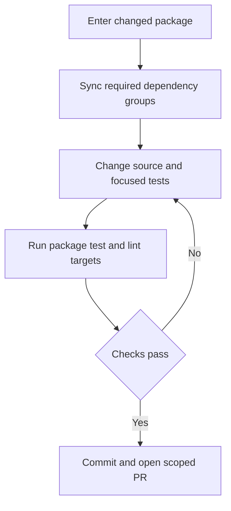
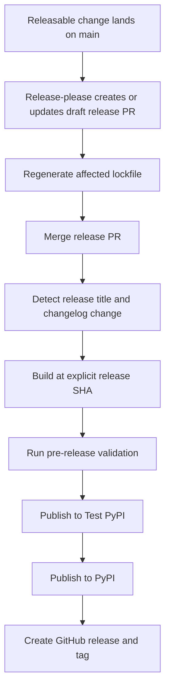

# Development and Release Operations

This repository is a monorepo of independently versioned Python packages under `libs/`, rather than one root Python project. Do ordinary work at the package boundary; use aggregate tooling only when validating shared lockfile or dependency changes. For code structure and test strategy, see [Source Map](../architecture/source-map.md), [Testing Guide](../testing/testing-guide.md), and [Quickstart](../quickstart.md).

## Contribution and package-local loop

Before an external contributor opens a PR, the contributor must be assigned to a maintainer-approved issue or discussion linked from that PR. Each package owns its own `pyproject.toml`, `Makefile`, and README; there is no root `pyproject.toml`. Local sibling dependencies can be editable, so changes in one package can be visible to a dependent sibling during in-tree development.

Use `uv` for interpreters, environments, and dependencies—do not substitute `pip`, Poetry, or Conda. `uv` selects an interpreter compatible with the package's `requires-python`; there is no single repository-wide Python version to install. The package Makefile is the command authority, and `make help` lists the targets that package actually supports.

Install Git hooks once, then enter the package being changed:

```bash
uv tool install pre-commit
pre-commit install --install-hooks

cd libs/deepagents
uv sync --all-groups
make test
make lint
```

`uv sync --all-groups` explicitly installs the package and its dependency groups. Use `uv sync --group <name>` when a narrower environment is appropriate, and use `uv run ...` for one-off commands. Do not create an environment outside its package or mix environments in the same session.



Caption: the normal development loop is explicitly synchronized and package-scoped before it reaches review.

Typical targets vary by package, but the core packages provide the following pattern:

| Command | Purpose |
| --- | --- |
| `make test` | Run unit tests; the core package runs socket-disabled pytest in parallel with coverage. |
| `make integration_test` | Run network-capable integration tests when the package supplies the target. |
| `make lint` | Check Ruff formatting/linting and type checking. |
| `make format` | Apply formatting and safe lint fixes. |
| `make type`, `make coverage`, `make test_watch` | Run a focused check when offered by the current package. |

Package targets run tools through `uv run`. In `deepagents`, `UV_FROZEN = true` makes an out-of-date lockfile fail rather than update itself during a Make target. This keeps validation deterministic: regenerate locks intentionally, then commit them.

### Pre-commit is an early guard, not a replacement for package checks

The hook installation above enables `pre-commit`, `commit-msg`, and `pre-push` stages. The configuration checks Conventional Commit message types, prevents direct commits to `main`, validates YAML and TOML, and normalizes whitespace. Its local hooks run package-specific `make ... format lint` commands for changed `deepagents`, Code, evals, and ACP paths; they also check affected lockfiles, dependency extras, and version equality for the SDK and Code packages.

The lock hook only checks package or example directories touched by the supplied paths, but checks every known lock-owning directory when it receives no paths. For each selected directory it runs `uv lock --check` with the repository's chosen lock interpreter. A hook can be bypassed, so retain the package loop and CI validation before merging.

The pre-push branch-name hook is installed through pre-commit. Except for protected or automation/release branch patterns, it requires `<github-username>/<scope>/<short-description>`; the username is resolved from `github.user`, then the GitHub CLI, then the local part of `user.email`. It is a local convenience and can be skipped, while server-side branch checking remains authoritative.

### Code package parity checks

`libs/code` provides `make check` as its local CI-parity entry point. After linting, import checks, and unit tests, it verifies extra synchronization, equality of `pyproject.toml` and `_version.py`, and lock freshness. Its SDK-pin checker treats exit status 1 (a stale pin) as advisory, while other checker failures stop the command.

The current `deepagents-code` source version is `0.1.77` in project metadata and `deepagents_code/_version.py`; its changelog begins with the same release. It declares an exact `deepagents==0.7.19` dependency. Change that pin only when Code needs a newer SDK, regenerate `libs/code/uv.lock`, and validate with `make check`.

## Aggregate locks and Python boundaries

Run repository fan-out operations from `libs/`. Its Makefile discovers library packages with Makefiles, partner packages with Makefiles, and example projects with `pyproject.toml` for lock operations. The loops use `set -e`, so the first failing package ends the command.

| Command | Purpose |
| --- | --- |
| `make lint` / `make format` | Run the corresponding target in every discovered library package. |
| `make lock [no-cache]` | Regenerate library and example locks; `no-cache` passes `--no-cache` to uv. |
| `make lock-check` | Verify all discovered locks are current. |
| `make lock-bump DEP=<pkg>` | Re-resolve each lock with `-P <pkg>`; `DEP` is required. |
| `make bench-all` | Run `bench` for `deepagents` and `code`. |

The aggregate lock command resolves ACP using Python 3.14 and every other package or example using Python 3.12. That is a reproducibility policy for lock creation, not the published support floor: ACP declares `>=3.11`, Talon declares `>=3.12`, core `deepagents` declares `>=3.11,<4.0`, and Code declares `>=3.12,<4.0`. Always consult the package's own `requires-python` for runtime support.

When changing package metadata or resolved dependencies, regenerate the owning lock rather than editing it manually. For a shared dependency upgrade, run `make -C libs lock-bump DEP=<pkg>` and commit all resulting locks. Package-local Makefiles deliberately fail on stale locks, while aggregate `lock-check` finds drift across the repository.

## Independent versions and release manifest

Release-please manages nine independent Python distributions: `deepagents`, `deepagents-acp`, `deepagents-code`, `deepagents-talon`, `langchain-daytona`, `langchain-modal`, `langchain-runloop`, `langchain-vercel-sandbox`, and `langchain-quickjs`. `separate-pull-requests` is enabled. For each managed path, the configuration specifies Python release type, distribution and component names, changelog path, version-bearing extra files, and excluded test paths.

The manifest is the last-released baseline, not necessarily a package's editable source version:

| Manifest path | Current baseline |
| --- | --- |
| `libs/deepagents` | `0.7.19` |
| `libs/acp` | `0.0.12` |
| `libs/code` | `0.1.77` |
| `libs/talon` | `0.0.8` |
| `libs/partners/daytona` | `0.0.8` |
| `libs/partners/modal` | `0.0.6` |
| `libs/partners/runloop` | `0.0.7` |
| `libs/partners/vercel` | `0.0.2` |
| `libs/partners/quickjs` | `0.3.7` |

Do not manually advance those values during normal development. When introducing a new managed package whose source starts at `0.0.1` and has not been released, register it in both the configuration and manifest with a `0.0.0` manifest baseline; otherwise release-please interprets `0.0.1` as already shipped and proposes `0.0.2`. Release-please updates metadata and version markers on its release PR, but does not regenerate `uv.lock`; the release workflow's lock updater does that work.

## Release flow and operating constraints



Caption: release-please prepares independent package releases, while the package release workflow publishes and tags the validated release tree.

Release-please is configured to draft separate release PRs and skip its own GitHub-release creation. After a release PR is merged, the release workflow detects a matching `release(<component>): <version>` commit that changes the package changelog, then dispatches the publisher. The publisher is a `workflow_dispatch` workflow because PyPI Trusted Publishing does not officially support reusable workflows. Its normal path requires an explicit release SHA whose package metadata declares the requested version, so the build, published artifacts, and tag refer to the same tree.

Keep a bump-worthy change limited to one managed component. Component attribution follows changed paths, not Conventional Commit scope alone; an empty commit has no path and could otherwise fan out to every package, so the release workflow rejects it before release-please proceeds. A release branch lock update occurs after version metadata changes because release-please itself does not maintain uv lockfiles.

The publication stages are build, pre-release validation, TestPyPI, PyPI, and GitHub release/tag. The build refuses an already published package version and fails closed when the PyPI version check cannot be trusted. Publishing and repository-write permissions are kept out of the minimally permitted build job.
