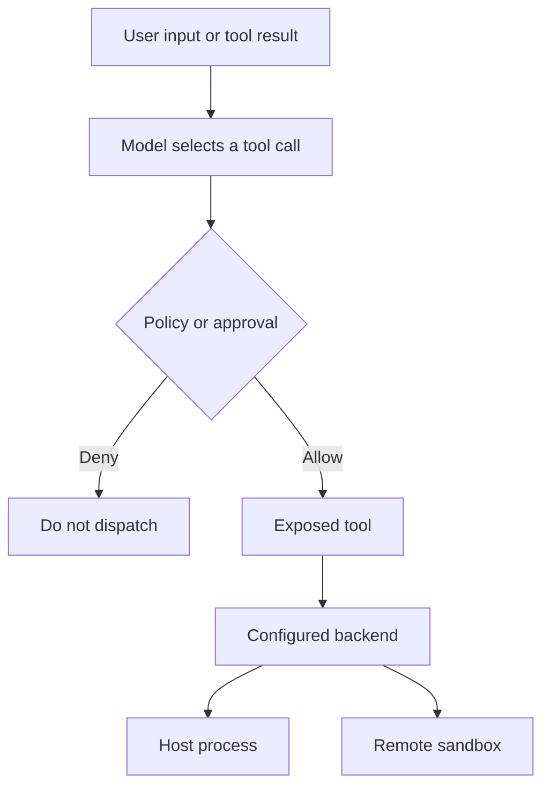

# Security Boundaries and Runbook

## Start with the execution boundary

Deep Agents follows a **trust the LLM** model: an agent can exercise the authority of the tools and backend exposed to it. Prompts, model choice, tool descriptions, redaction, and a request for approval are not host isolation. The deployer owns service authentication, network exposure, OS identity, persistence, credential storage, and the security of external integrations.

*Approval mediates dispatch; the selected backend and host policy determine where an allowed action can run.*

For untrusted repositories, prompts, MCP responses, or channel participants, use a remote sandbox, VM/container, or dedicated low-privilege OS identity. The dcode CLI trusts its current directory and reads project artifacts before approval; do not treat a checkout as inert input. See [Sandbox Partners](../integrations/sandbox-partners.md) and [Permissions and HITL](../concepts/permissions-hitl.md).

## Filesystem policy is not containment

`FilesystemPermission` is an ordered first-match policy for filesystem tools. Rules classify read and write operations as `allow`, `deny`, or `interrupt`; `interrupt` delegates the tool call to `HumanInTheLoopMiddleware`. Patterns must be absolute and cannot contain `..` or `~`.

This is **tool mediation**, not a shell or host confidentiality boundary. `FilesystemMiddleware` refuses to combine filesystem permissions with an execution-capable backend unless the paths are scoped to backend routes, because it has no execute-tool permission enforcement. An allowed `execute` capability can read arbitrary paths available to the process. Use filesystem permissions to reduce accidental or model-driven file-tool access; use OS permissions and a sandbox to keep secrets and the host out of reach.

## dcode: local server and workspace integrity

The dcode local server binds loopback and configures `LANGGRAPH_AUTH_TYPE=noop`. It is an ephemeral local IPC endpoint, not an authenticated service: any process able to reach its port is within the trust boundary. Keep it away from untrusted local peers and rely on host-process isolation in addition to the loopback bind.

A server thread has a durable, server-authoritative workspace binding. dcode canonicalizes an existing absolute working directory, resolves policy on the server, and records workspace identity with durable-policy and runtime fingerprints in one SQLite transaction. Later attempts to move the thread or change durable policy are refused. Compatible runtime-only changes can refresh the runtime fingerprint, but later execution must still supply matching binding context and fingerprint.

### Redacted workspace diagnostics

A refusal can carry structured diagnostics to the HTTP route and TUI, but diagnostics deliberately report only a small allowlisted snapshot of policy fields: booleans, integers, tool/command allowlists, and short identifiers. The snapshot excludes paths, prompts, model specifications and parameters, profile overrides, environment values, and credentials; it neither stores nor hashes excluded values for reporting. Logs summarize changed field names rather than values. Treat a 409 diagnostic as an explanation of an already-enforced binding decision, not as a source of configuration data.

### Offload is server-owned

`/dcode/threads/{thread_id}/offload` accepts a narrow operation request and does not let the caller choose the model that will make credentialed compaction calls. It strips client transport-routing parameters such as endpoints, proxies, injected HTTP clients, and custom headers, then removes client model, model parameters, and summarization model selection. The operation restores model identity and parameters from the server-read checkpoint, or falls back to server launch configuration for summarization.

This prevents a loopback caller from redirecting server credentials or selecting another provider during offload; it does not authenticate the loopback interface. Preserve both the server-side request filtering and the local-host boundary.

## MCP: trust configuration and protect OAuth state

MCP configuration is an authority boundary: a stdio entry can launch a process and a remote entry can receive headers and agent data. dcode resolves `${VAR}` and `${VAR:-default}` references in MCP commands, URLs, arguments, environment mappings, and headers. Malformed braced references, or a required variable that is unset, fail resolution. Interpolation is not secret mediation: it can intentionally place a credential in a process environment or HTTP header. Use trusted configuration sources, least-privilege credentials, and per-server approval/trust policy described in [MCP](../integrations/mcp.md).

### dcode OAuth token lifecycle

`FileTokenStorage` stores each MCP server's OAuth envelope under the selected profile state directory. Its server-name validation and URL hash keep the token filename inside the token-store directory. The envelope can contain bearer/refresh tokens, client registration, metadata, and an absolute expiry; tokens must never be rendered through `repr`, string interpolation, exception logging, prompts, or diagnostics.

Writes create a private token directory where supported, create a `0600` temporary file exclusively, atomically replace the destination, and reapply private file mode. A process-local mutation lock and a cross-process refresh lock avoid concurrent refresh-token rotation; readers see an entire old or new file because publication uses replace. A refresh-lock timeout reloads rather than attempting an unlocked refresh, avoiding reuse of a potentially rotated token. If the token file is corrupt or has an unsupported schema, the operator must remove it and log in again.

On startup the OAuth provider restores the persisted expiry and refreshes a token inside a 30-second safety margin before sending a stale bearer token. Missing/expired tokens in non-interactive server mode raise `MCPReauthRequiredError` instead of waiting for terminal input. Interactive login uses a single-use callback server bound to `127.0.0.1`; it validates a callback code and falls back to a pasted callback URL when browser or callback setup fails. These measures protect OAuth state handling, not secrets readable by the agent process.

## Talon: channel authority, approvals, and environment guards

Talon is experimental alpha software, without production-grade complete HITL, channel administrator controls, sandbox execution isolation, or multi-tenant boundaries. Treat anyone who can trigger the agent as potentially exercising the operator's model, MCP, channel, and local-host authority.

WhatsApp defaults to `self` exposure for the paired account. `allowlist` restricts eligible chats or mentions. `open` accepts arbitrary senders only after `DEEPAGENTS_TALON_WHATSAPP_OPEN_ACK`; use it only where granting that effective operator authority is intentional.

### Approval state is per invocation

Talon starts with a validated immutable `ApprovalSnapshot`. Only exact tool names with a `true` policy value produce approve/reject interrupts; `false` disables prompting and is not authorization. The approval store uses locked revision compare-and-swap updates, and a successful update applies to the next invocation because the running graph keeps its existing snapshot. The `update_tool_approvals` tool additionally requires both an active snapshot and a trusted operator marker; cron and background delivery cannot supply that operator marker.

The runtime serializes graph replacement under a tool lock, rebuilds the graph when it observes a changed approval snapshot, and binds the selected graph and snapshot into context for the invocation. It bounds approval-resume rounds and fails if the agent returns too many interrupt cycles. Thus policy changes can be activated safely between turns, but do not revoke capabilities from a running invocation or task.

### Default shell environment and secret limits

Talon's default backend is `LocalShellBackend` in a `CompositeBackend`, with `virtual_mode=False`; even a configured workspace does not itself contain absolute-path shell access. The runtime does set `inherit_env=False` and passes child processes a fixed safe `PATH`, an allowlist of ordinary locale/session variables, and no variables that look like credentials, OAuth tokens, provider tracing settings, or known dynamic-loader/interpreter/shell startup hooks. This reduces accidental inheritance of host secrets and environment injection into shell tools, but it does not sandbox the commands or prevent them reading files the Talon process can read.

Talon's MCP configuration redaction, locking, revision checks, and placement warnings similarly mediate its configuration tools rather than create secrecy. A default shell can bypass those tools and read an absolute config or token path. Talon OAuth storage uses cleartext bearer and refresh tokens with owner-only file hardening and atomic writes, but that filesystem hardening cannot protect them from the shell backend. Prefer `${ENV_VAR}` references to literals, keep secrets in a keyring or location inaccessible to the agent process, and use a sandboxed backend or separate OS identity when that is not possible.

## Operational runbook

1. **Classify the input and principal.** Treat repositories, fetched content, MCP output, and channel messages as untrusted influence. Restrict exposed tools before relying on approval.
2. **Choose real containment.** For untrusted work, use a remote sandbox or dedicated OS identity. Do not claim that `FilesystemPermission`, a workspace root, redaction, or HITL contains a shell.
3. **Protect dcode local IPC.** Run the loopback server only on a trusted host; do not expose its port or treat `noop` authentication as access control.
4. **Investigate workspace conflict safely.** Restore the bound workspace/policy context. Use the allowlisted diagnostic fields to identify drift; do not add paths, model configuration, prompts, or credentials to errors to improve debugging.
5. **Operate MCP as privileged integration.** Review commands, URLs, headers, and environment interpolation before trust. Keep token files private, do not log token-bearing objects, and repair corrupt OAuth state by removing the file and re-authenticating.
6. **Harden Talon exposure.** Prefer WhatsApp `self` or a restrictive allowlist. Treat `open` as a deliberate delegation of local-agent authority.
7. **Change Talon approvals deliberately.** Obtain the persisted revision, update exact tool-name booleans as a trusted operator, then begin a new invocation. Cancel/restart active work when prompt policy changes need immediate effect.
8. **Audit the process boundary.** Keep secrets out of paths readable by Talon's agent process; environment scrubbing is defense in depth, not a replacement for sandboxing or OS access control.
