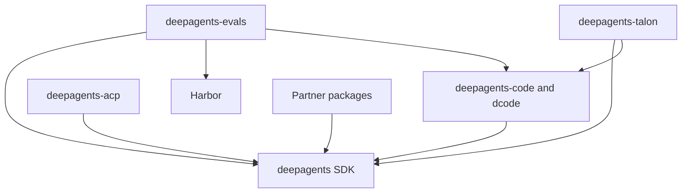

# Repository Quickstart

Start in the package that owns the behavior rather than at the repository root. Deep Agents is the opinionated harness over LangChain's `create_agent()` and the LangGraph runtime; Code, ACP, Talon, evaluations, and provider adapters are separate consumers or integration boundaries. This is a task-routing map; follow the linked pages for detailed contracts.

## Route the change

| Change type | Owner and read next | First focused validation |
| --- | --- | --- |
| Reusable graph assembly, middleware, backends, skills, memory, filesystem, permissions, or SDK subagents | `libs/deepagents/`; [architecture overview](./architecture/overview.md) and [source map](./architecture/source-map.md) | Run the closest test, then `make test TEST_FILE=tests/unit_tests/<file>.py` and `make lint`. |
| dcode CLI or TUI, headless operation, sessions, workspace policy, approvals, costs, context offload, MCP loading, or product sandbox selection | `libs/code/`; [Code architecture](./architecture/code-agent.md), [run a dcode session](./workflows/run-dcode-session.md), and [testing guide](./testing/testing-guide.md) | `make test TEST_FILE=tests/unit_tests/test_<area>.py`; use `make integration_test TEST_FILE=...` only when the changed contract crosses an external boundary. |
| Editor protocol, stdio, ACP sessions, options, stream conversion, or replay | `libs/acp/`; inspect Code too if `dcode --acp` assembly changes; [ACP integration](./integrations/acp.md) | `make test TEST_FILE=tests/test_<area>.py` in ACP; test the dcode ACP path separately if its launcher or graph factory changed. |
| Long-running channels, scheduler, host lifecycle, local approvals, Talon MCP, or background delegation | `libs/talon/`; [Talon runtime integration](./integrations/talon.md) and [long-running runtime behavior](./architecture/runtime-behavior.md) | `make test TEST_FILE=tests/<focused-path>.py`, then `make lint`. |
| Evaluation scenario, report, model group, or Harbor execution | `libs/evals/`; [testing guide](./testing/testing-guide.md) | Run the owning eval test and the product regression test; reserve real-model evaluation for a changed trajectory or external evaluation contract. |
| Provider sandbox adapter or QuickJS behavior | `libs/partners/<provider>/`; [sandbox and partner backends](./integrations/sandbox-partners.md) | Run the adapter's package-local tests and the SDK or Code contract test that consumes it. |
| Dependency metadata, lockfile, version, release PR, or publishing automation | The changed release unit; [development, CI, and releases](./operations/development.md) | Run package checks and `make -C libs lock-check` when a lock can change. |

## Package boundaries and compatibility

`libs/` is a monorepo of independently versioned packages. Each package owns its `pyproject.toml`, `Makefile`, and README; there is no root `pyproject.toml`. Local first-party dependencies are editable, so a sibling consumer sees an in-tree SDK change during development. Use `uv` for interpreters, environments, and dependencies, and treat the current package's Makefile as the command authority. Select Python from that package's `requires-python`; there is no repository-wide interpreter pin.

| Package or group | Current release baseline or source version | Responsibility | Python requirement |
| --- | ---: | --- | --- |
| `deepagents` | `0.7.19` | SDK: `create_deep_agent`, middleware, and backends | `>=3.11,<4.0` |
| `deepagents-code` | release baseline and source: `0.1.77` | Prebuilt terminal coding agent invoked as `dcode` | `>=3.12,<4.0` |
| `deepagents-acp` | `0.0.12` | Agent Client Protocol editor integration | `>=3.11` |
| `deepagents-evals` | source version `0.0.1` | Evaluation suite and Harbor integration | `>=3.12,<3.14` |
| `deepagents-talon` | `0.0.8` | Experimental local long-running host | `>=3.12` |
| Partners | Daytona `0.0.8`; Modal `0.0.6`; Runloop `0.0.7`; Vercel `0.0.2`; QuickJS `0.3.7` | Provider and sandbox integrations | `>=3.11,<4.0` |

`deepagents-code` declares `0.1.77` in both its project metadata and its release-managed `deepagents_code/_version.py`; the Release Please manifest has the same `libs/code` baseline. Keep these source and release values aligned through the package release process rather than editing a consumer's version in isolation.


*Published dependencies flow from consumers and adapters to the SDK, dcode, or Harbor capability they use.*

The important release-facing dependency is exact: `deepagents-code` pins `deepagents==0.7.19`. ACP has an unpinned SDK dependency; evals depends on the SDK, Code, and Harbor; Talon depends on the SDK and Code. An SDK change that Code consumes therefore requires reviewing the Code pin, its lockfile, and its release unit—not merely testing editable local sources. The five partner packages each depend on the SDK but are package-local integration boundaries, not prerequisites for ordinary SDK or Code development.

## Focused edit–test loop

Install dependencies explicitly, work in the changed package, and use its documented targets. Before preparing a pull request, install the repository's pre-commit hooks once; they run formatting, linting, lockfile, and Conventional Commit checks for changed packages.

```bash
uv tool install pre-commit
pre-commit install --install-hooks
cd libs/code
uv sync --all-groups
make test TEST_FILE=tests/unit_tests/test_server_graph.py
make lint
```

The SDK and Code `test` targets accept `TEST_FILE`; their unit runs disable network sockets except Unix sockets, run pytest in parallel, and report missing-line coverage. Code lint also validates the generated command catalog and process current-working-directory rule. ACP defaults `TEST_FILE` to `tests/` and applies a 10-second pytest timeout. Talon's `test` target also runs its WhatsApp bridge Node tests.

For metadata or dependency work, update the affected package lock deliberately, then apply the appropriate wider check:

```bash
cd libs/code
uv lock
make check
make -C ../ lock-check
```

Code's `make check` runs lint, import checks, unit tests, extras/version consistency checks, a lockfile check, and an advisory SDK-pin check. The SDK-pin workflow warns about a stale Code pin, but the publication path enforces the pin unless an intentional bypass is acknowledged. Release dependency validation strips editable local sources and resolves changed release manifests against PyPI, so a local sibling installation does not prove that the published dependency graph resolves. The partner-bounds workflow is advisory and identifies partner SDK upper bounds that would exclude an SDK release version.

## Release-unit checklist

Release Please manages nine independent units: `deepagents`, `deepagents-acp`, `deepagents-code`, `deepagents-talon`, and the Daytona, Modal, Runloop, Vercel, and QuickJS partner distributions. `libs/evals` is a monorepo package but not a manifest release unit. The manifest baselines are `deepagents` `0.7.19`, `deepagents-acp` `0.0.12`, `deepagents-code` `0.1.77`, `deepagents-talon` `0.0.8`, Daytona `0.0.8`, Modal `0.0.6`, Runloop `0.0.7`, Vercel `0.0.2`, and QuickJS `0.3.7`.

Before changing release-facing metadata:

1. Confirm the changed package and its distribution/component in the [source map](./architecture/source-map.md).
2. Keep the Code exact SDK pin at the SDK version it requires; if it changes, regenerate `libs/code/uv.lock` and run `make check`.
3. Regenerate and check locks at the package or aggregate scope required by the dependency change.
4. For a release PR, treat public-index resolution and any advisory partner-bound or SDK-pin warning as release work to resolve, not as proof supplied by editable development.

## Continue in the relevant domain

- [Repository architecture overview](./architecture/overview.md) — ownership boundaries, SDK construction, and consumer roles.
- [Repository source map](./architecture/source-map.md) — public surfaces, entrypoints, focused tests, and release units.
- [Build and customize a deep agent](./workflows/build-a-deep-agent.md) — model, backend, tools, profiles, middleware, state, and subagent decisions.
- [MCP servers, trust, and OAuth](./integrations/mcp.md) and [sandbox and partner backends](./integrations/sandbox-partners.md) — external tool and execution boundaries.
- [Development and release operations](./operations/development.md) and [security boundaries and runbook](./operations/security.md) — setup, locks, CI gates, publishing, and safe operation.
- [Testing guide](./testing/testing-guide.md) — deterministic seams and confidence runs.
- [Run a dcode session](./workflows/run-dcode-session.md) — interactive, headless, ACP, and diagnostic operations.
