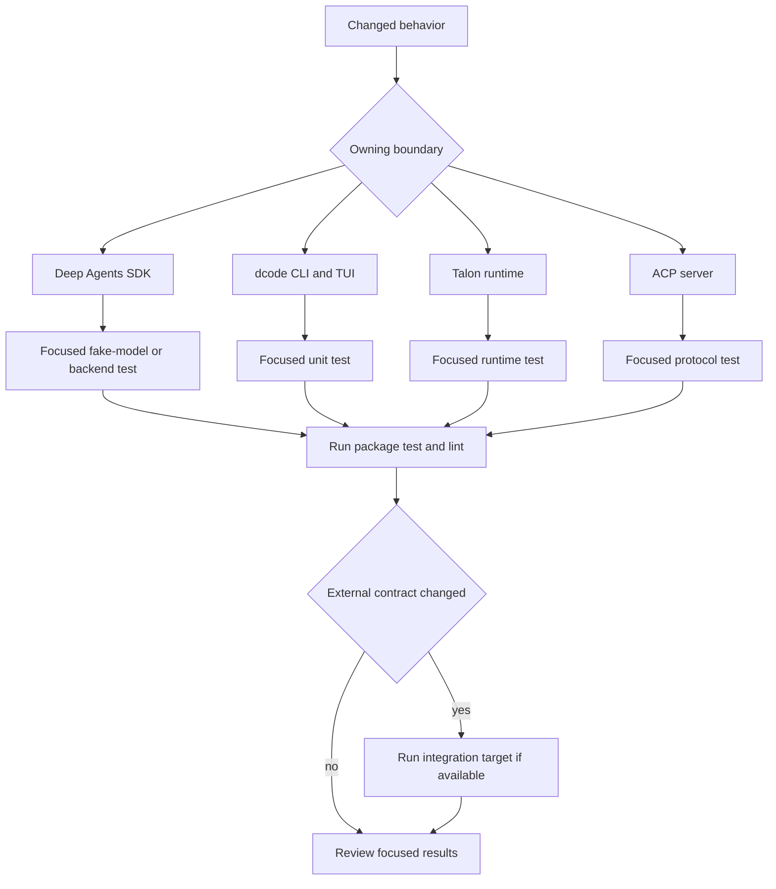
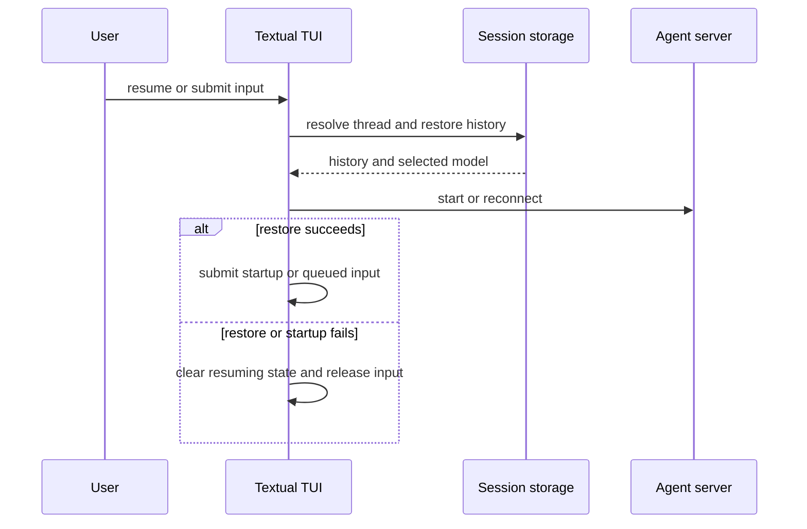

# Testing Guide

Work from the package that owns the behavior. This monorepo has independently versioned packages with their own `pyproject.toml`, `Makefile`, and test environment; sibling packages are editable local dependencies. Install dependencies explicitly with `uv sync --all-groups`, use the package `Makefile` as the standard command interface, and use `make help` when a target is uncertain. Test paths mirror source layout. Warnings are errors unless they are on the reviewed per-package allowlist.



*Start at the boundary that owns the contract; broaden only after its deterministic test passes.*

## Package commands and test discipline

From `libs/deepagents` and `libs/code`, a focused file uses `TEST_FILE`; `make test` runs unit tests with xdist, disables benchmarks, and blocks network sockets while allowing Unix sockets. `make integration_test` selects integration tests and uses a 30-second timeout. In dcode, `make check` adds Ruff formatting/checking, `ty`, import and command checks, unit tests, and repository consistency checks; an SDK-pin failure is advisory.

```bash
cd libs/deepagents
uv sync --all-groups
make test TEST_FILE=tests/unit_tests/test_end_to_end.py
make lint
make test
make integration_test

cd ../code
make test TEST_FILE=tests/unit_tests/test_mcp_auth.py
make check
```

For an isolated direct invocation, use the package test group, for example `uv run --group test pytest tests/unit_tests/test_specific.py`. Keep the default socket block intact for unit tests: a change requiring a provider, service, or executable belongs in an integration route rather than weakening a deterministic test.

Talon and ACP use package-local `TEST_FILE` too, but their targets do not use xdist. Both apply a 10-second pytest timeout and block non-Unix sockets. Talon's `make test` first runs its WhatsApp bridge Node unit tests; ACP's test target writes both terminal and XML coverage reports. Their lint targets run Ruff format-in-check mode, Ruff checks, and `ty` against the package.

```bash
cd libs/talon
make test TEST_FILE=tests/test_runtime.py
make lint

cd ../acp
make test TEST_FILE=tests/test_agent.py
make lint
```

## Deep Agents SDK: prove end-to-end behavior without a provider

Use `libs/deepagents/tests/unit_tests/test_end_to_end.py` when a change crosses graph construction, middleware, model invocation, tool calling, streaming, or filesystem backends. It scripts `AIMessage` responses through `GenericFakeChatModel`, invokes real agents, and parameterizes filesystem behavior over virtual filesystem, state, and store backends. The test seam is deliberately end-to-end: assertions observe messages, tool results, state continuity, and stream metadata rather than implementation-private calls.

This is the preferred pattern for a new agent capability:

1. Feed a finite fake-model response sequence containing the intended tool calls and final answer.
2. Build the real agent with an in-memory checkpointer/store or temporary virtual filesystem.
3. Invoke or stream it exactly as a caller would.
4. Assert the externally visible messages, tool output, stream metadata, and persisted state, including a second turn when state shape or continuity matters.

The end-to-end suite protects, among other contracts, filesystem tool use, multiple sequential calls, propagation of tags and metadata into main-agent streams, and prevention of a `StateBackend` files value degrading from a dictionary between turns. Fake models also let tests distinguish provider-class-specific behavior without credentials.

### Middleware and sandbox boundaries

Use `test_middleware.py` for composition and installation changes. It creates agents with `StateBackend`, `StoreBackend`, `CompositeBackend`, and small in-memory sandbox seams to verify that filesystem middleware provides its tools and stream channel, subagent middleware provides `task`, and combining middleware retains both capabilities. It is the narrow route for tool registration, message/result shaping, filesystem actions, or subagent composition.

Use `backends/test_sandbox_backend.py` for `BaseSandbox` protocol and command-template changes. Its concrete in-process mock exercises server-side reads and small edits, upload-backed writes and large edits, parsing and failure propagation, cleanup, safe command construction, and sync/async parity. Do not substitute a live sandbox for these protocol tests; reserve integration coverage for a provider-specific boundary.

## dcode: test the state and security boundary

| Changed contract | Focused command | What the test should establish |
| --- | --- | --- |
| MCP OAuth storage, discovery, callback, refresh, or re-auth | `make test TEST_FILE=tests/unit_tests/test_mcp_auth.py` | Private, isolated token persistence and safe authentication lifecycle behavior. |
| MCP config discovery, loading, trust, filtering, or reconnect | `make test TEST_FILE=tests/unit_tests/test_mcp_tools.py` | Configuration and tool-selection behavior without an MCP service. |
| Bound workspace configuration or user-facing drift explanation | `make test TEST_FILE=tests/unit_tests/test_workspace_diagnostics.py` | Persisted diagnostics remain useful without storing private paths or values. |
| Approval classifier routing or failure fallback | `make test TEST_FILE=tests/unit_tests/test_auto_mode.py` | Structured fake-model policy decisions fail closed at the right boundary. |
| Model retry classification or streaming retry cleanup | `make test TEST_FILE=tests/unit_tests/test_model_retry.py` | Retryable failures retry deterministically; control-flow interrupts do not. |
| Checkpoint metadata, thread lookup, or deletion | `make test TEST_FILE=tests/unit_tests/test_sessions.py` | SQLite persistence and cleanup invariants. |
| Startup, resume, queue, restart, or teardown in the terminal UI | `make test TEST_FILE=tests/unit_tests/test_app.py` | User-visible lifecycle ordering under Textual scheduling. |

### MCP authentication and configuration

`test_mcp_auth.py` uses an isolated home/state directory, canned `httpx`/`httpx2` errors and responses, callback handlers, and controlled threads rather than a remote server. For `FileTokenStorage`, retain tests for server and URL isolation, invalid server-name rejection, POSIX `0600` permissions, corrupt-file remediation, expiry sidecars, and concurrent update serialization. Its async API must move blocking disk reads and writes off the event-loop thread; cancellation must remain joined to an in-flight persistence operation so a rotated token is not abandoned. A failed write must be surfaced rather than silently lost.

OAuth/provider tests should drive the generator flow by returning canned HTTP responses to it. Important boundaries include cold-start expiry restoration, legacy-token refresh behavior, Bearer `resource_metadata` challenges through wrapped exceptions, loopback and paste-back callback parsing, and metadata discovery/caching for later refresh. Error summaries must give a re-login or configuration remedy without copying an unknown exception payload that may contain credentials. When modifying configuration resolution, pair this file with `test_mcp_tools.py`, `test_mcp_login_service.py`, or the MCP UI test that owns the visible continuation.

### Workspace diagnostics

`test_workspace_diagnostics.py` isolates the session database through `DEEPAGENTS_CODE_SERVER_DB_PATH` and inspects the real SQLite rows. It verifies that a thread binding persists a versioned, allowlisted snapshot; path-valued fields are excluded, oversized values are omitted, and a refusal never overwrites the prior comparison snapshot. On a later bind or require operation, diagnostics distinguish configuration drift, unbound threads, and context mismatch.

This is also a privacy boundary. Tests assert that diagnostic changes and logs name safe fields but not their sensitive values, snapshots tolerate legacy/malformed input as specified, and rendered restoration advice treats unavailable historical values as unavailable—not as an instruction to unset them. Change the allowlist, serialization, refusal behavior, or UI-facing diagnostics only with these cases covered.

### Autonomous mode, retry, sessions, and the TUI

Auto-mode tests inject fake structured models, stores, events, and temporary paths. They protect bounded classifier history, context-overflow fallback, deterministic trusted-tool routes, write and symlink-escape safeguards, and the fail-closed path when the classifier is unavailable. Keep classifier tests provider-free and assert the decision plan and emitted event, not just a helper return value.

Model-retry tests use controlled exceptions, streaming model doubles, and no-sleep seams. They separate retryable transport/provider errors from authentication, permission, invalid-request, and context-overflow cases; LangGraph interrupts remain control flow. The suite also protects attempt/status events and prevents failed streaming attempts from leaving orphaned output.

Session tests use temporary SQLite checkpoints and filesystem archives. They cover coexistence of legacy and current thread identifiers, metadata from the newest checkpoint, deletion, and best-effort offloaded-history cleanup. Test a persistence change there rather than relying on the UI to discover ordering bugs.



*`test_app.py` tests the ordering and recovery observable to an interactive user.*

`test_app.py` drives the async Textual app, so it is the boundary for resume/startup ordering, queued input, cancellation, restart, and shutdown. Preserve the invariant that restored history and adopted model settle before startup submission. A failed resume must clear the resuming state, and an interrupted or restarted turn must make input/queue progress possible again. Add a focused widget test for isolated rendering or key handling, but retain an app-level lifecycle test whenever scheduler ordering can change the outcome.

## Talon runtime: replacement, approval, and recovery

Run `libs/talon/tests/test_runtime.py` for `DeepAgentRuntime` lifecycle changes. It replaces `create_deep_agent` with recording graphs and uses in-memory stores, fake tools, callbacks, and temporary directories to make runtime wiring inspectable. The focused tests cover construction of the composite backend, checkpointer, tools, skills, memory, subagents, model settings, and environment-derived limits without a model provider.

Tool refresh and MCP reload are particularly sensitive: refreshed tools rebuild the graph between turns, while an MCP configuration reload must replace tools and graph transactionally. If construction of the replacement graph fails, the previous tools and graph remain active. Similarly, an invocation already waiting on a human approval must resume against the graph that raised its interrupt even if the runtime graph is later replaced.

Runtime approval tests send a graph interrupt through an `AgentRequest` approval handler and assert the resumed decision. They also assert that rejected calls do not run, scheduled/cron invocations auto-reject gated tools because no interactive approval exists, and logs expose action names/counts but not argument values or raw conversation identifiers. Recovery tests repair a dangling tool call before writing the interruption marker at the latest checkpoint. Treat these as lifecycle and privacy invariants, not merely mock expectations.

## ACP: protocol behavior with a fake client and model

`libs/acp/tests/test_agent.py` is the protocol-level end-to-end suite for `AgentServerACP`. It constructs real deep-agent or LangChain graphs with `MemorySaver`, connects a `FakeACPClient`, creates ACP sessions, then calls `prompt`, cancellation, mode/config updates, and session loading. This tests the ACP boundary without a live client or LLM.

Use it for streamed content ordering, reasoning and multimodal blocks, tool-call start/result updates, per-session cancellation, and human-in-the-loop permissions. In particular, preserve whitespace-only reasoning deltas, emit content before its tool call, prompt once per interrupt, and apply `approve_always` only to the appropriate session's allowed command/tool type.

When `load_sessions=True`, test a persisted session through a restarted server. The suite verifies replay of user/agent messages, visible reasoning, tool calls, compacted history, and saved mode/model options. It also rejects session IDs the server did not create and reload requests from a different `cwd`; these tests protect ownership and workspace isolation. Mode or model changes rebuild the agent using the session context, including its original working directory.

## Completion checklist

1. Sync the changed package and run its focused test file first.
2. Use fake models, fake clients, in-memory stores/checkpointers, temporary files, and canned transport responses to exercise the real graph or protocol boundary.
3. Preserve socket blocking and warnings-as-errors in unit tests; do not add live provider dependencies to recover determinism.
4. Run `make test` and `make lint` in the changed package; run `make check` for a dcode review-ready change.
5. Run dcode MCP, workspace, persistence, retry, and Textual tests at their distinct boundaries rather than folding them into a generic agent test.
6. For Talon graph replacement or ACP session work, include the relevant concurrency, ownership, approval, and recovery failure path.
7. Escalate to `make integration_test` only when the externally hosted contract changed.
