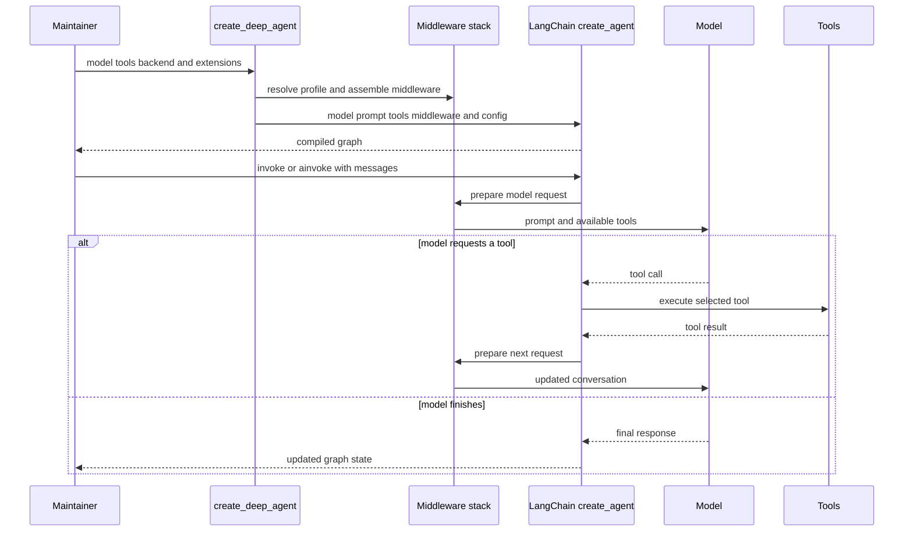

# Build and Customize a Deep Agent

Use `create_deep_agent` when an application needs LangChain's tool-calling loop with the Deep Agents harness: filesystem tools, planning and context management, delegation, skills, and memory. It returns a compiled LangGraph graph constructed around LangChain's `create_agent`, rather than a distinct runtime. For component ownership, see [SDK construction & execution](/openwiki/architecture/sdk-construction-execution.md).

## 1. Start with an explicit model and a small tool loop

Install with `uv add deepagents`. Pass a tool-calling model explicitly. `model` accepts a `provider:model` string, resolved through `init_chat_model`, or an initialized `BaseChatModel`. Use an initialized model when provider-specific choices matter, such as disabling the OpenAI Responses API or configuring its retention behavior.

```python
from deepagents import create_deep_agent

agent = create_deep_agent(
    model="openai:gpt-6-astra",
    tools=[my_custom_tool],
    system_prompt="You are a research assistant.",
)
result = agent.invoke({"messages": "Research LangGraph and write a summary"})
```

Do not rely on `model=None`: it selects `ChatAnthropic(model_name="claude-sonnet-4-6")`, requires `ANTHROPIC_API_KEY`, and is deprecated for removal in `deepagents==1.0.0`. The compiled graph has `recursion_limit=9_999` for long tool loops. That setting is not a security or termination boundary: expose only appropriately bounded tools and test the paths that can repeat.



Caption: Build-time resolves policy and compiles the LangChain graph; at invocation, middleware shapes model requests and the graph loops through requested tools until the model finishes.

## 2. Select storage and execution boundaries before tools

`backend=` owns file storage and command-execution capability. It defaults to `StateBackend`, which keeps files in graph state. Files are checkpointed within one conversation thread rather than shared across threads, and this backend may only be used during LangGraph execution. Seed state-backed files in graph input, for example `agent.invoke({"messages": [...], "files": {...}})`, not by calling the backend outside a run. See [tools & filesystem](/openwiki/concepts/tools-filesystem.md).

`FilesystemMiddleware` provides `ls`, `read_file`, `write_file`, `edit_file`, `delete`, `glob`, `grep`, and `execute`. `execute` runs a command only if the backend implements `SandboxBackendProtocol`; otherwise it returns an error. `LocalShellBackend` implements that protocol but runs commands directly on the host without sandboxing, process isolation, or security restrictions. Shell access can bypass filesystem policy, so it is unsuitable for web/API, multi-tenant, or untrusted workloads.

`tools=` is additive: application tools are merged with the built-in suite and never remove a built-in. Use a harness profile's `excluded_tools` to stop offering a built-in to the model, or supply a replacement `FilesystemMiddleware` with the desired `tools` to remove filesystem capability from the harness.

## 3. Set the prompt and profile policy deliberately

`system_prompt` is caller-owned `USER` content. The active harness profile appends `BASE` and then `SUFFIX`: `USER -> BASE -> SUFFIX`, with blank lines between nonempty parts. If the caller passes a `SystemMessage`, its content blocks, including `cache_control`, are retained; profile content becomes an appended text block.

Profiles provide model/provider-specific policy, including prompt slots, tool-description overrides and exclusions, extra middleware, and the default general-purpose subagent. Profile resolution follows model construction. Treat a profile change as behavior-changing: test profile selection, prompt output, and final stack/tool shape.

## 4. Extend at the middleware boundary

Use an ordinary entry in `tools=[]` for a stateless action. Use middleware when a feature must intercept each model request, change available tools or the system prompt, transform history, or maintain typed state. The main assembly is:

1. **Core:** optional `SkillsMiddleware`, `FilesystemMiddleware`, optional `SubAgentMiddleware`, summarization middleware, `PatchToolCallsMiddleware`, and optional `AsyncSubAgentMiddleware`.
2. **Custom:** caller `middleware` entries are inserted after the core.
3. **Tail:** profile extra middleware, provider prompt-caching middleware, optional `MemoryMiddleware`, optional `HumanInTheLoopMiddleware`, and `UnsupportedContentMiddleware`. Profile tool exclusion is applied last, after custom middleware, so an excluded tool cannot be restored by a custom model hook.

A custom middleware whose `.name` matches a current entry replaces it in place; a new name is inserted between core and tail. Profiles may filter middleware, but `FilesystemMiddleware` and `SubAgentMiddleware` are protected scaffolding: they back the built-in filesystem tools and synchronous `task` handler. Invalid, private, ambiguous, unmatched, or protected exclusions raise `ValueError` instead of silently producing a degraded agent.

Prefer state supplied by the middleware that owns it. If graph-wide `state_schema` is necessary, make it a `TypedDict` subclass of `DeepAgentState` to preserve the `DeltaChannel` reducer for `messages`; it avoids quadratic checkpoint growth. Declarative subagents receive that base schema, whereas precompiled and remote subagents retain their own schemas.

## 5. Add delegation for the intended execution model

`subagents=` supports three execution boundaries:

- A declarative `SubAgent` is compiled for synchronous `task` delegation. It may override model, prompt, tools, middleware, skills, permissions, interrupts, and response format.
- A `CompiledSubAgent` exposes an already-built runnable through `task`. Its runnable needs a `messages` state key; configure its schema and approval behavior when compiling it.
- An `AsyncSubAgent`, identified by `graph_id`, is routed to `AsyncSubAgentMiddleware`. It launches tracked background work through the LangGraph SDK, returning task identity immediately; the agent can launch, check, update, cancel, and list tasks.

Unless the profile disables it or an inline subagent is named `general-purpose`, the builder supplies a default synchronous `general-purpose` subagent. Therefore `task` is normally present. Disable that default with `general_purpose_subagent=GeneralPurposeSubagentProfile(enabled=False)` and pass no synchronous subagents to omit `task`; asynchronous subagents are independent.

A normal declarative subagent inherits parent application tools when its own `tools` field is absent, but not arbitrary parent middleware. It inherits parent filesystem permissions and `interrupt_on` unless it declares replacements. A `mode="fork"` declarative subagent is experimental: it continues the parent conversation, appends its own prompt to the inherited prompt, cannot declare skills, and refuses recursive delegation. Any LangGraph `CompiledStateGraph` can be used as a compiled subagent.

For remote work, provide `name`, `description`, and `graph_id`, plus an endpoint and optional headers. It must be an Agent Protocol server. If `url` is omitted for local ASGI transport, call the parent using `ainvoke`; synchronous `invoke` requires a reachable server URL.

## 6. Configure skills, memory, and approval at their owners

`skills=` supplies POSIX backend paths to skill directories. `SkillsMiddleware` uses backend APIs to discover `SKILL.md` metadata and expose the index for progressive loading; later sources override earlier sources with the same skill name. With the default `StateBackend`, provide the skill files in invocation state. See [subagents & skills](/openwiki/concepts/subagents-skills.md).

`memory=` supplies `AGENTS.md` paths. `MemoryMiddleware` loads sources at agent startup, concatenates them in source order, strips HTML comments, and adds them to system-prompt context. Its injected guidance directs the model to treat memory as reference material, not instructions that override the user or verified tool evidence.

Use `permissions=` for policy over built-in filesystem tools, not for sandboxing. `FilesystemPermission` rules are ordered first-match decisions with `allow`, `deny`, and `interrupt` modes; unmatched calls are allowed. `FilesystemMiddleware` enforces them at the tool boundary, not during direct backend use. Declarative subagents inherit parent rules unless they specify replacement rules.

Pass `interrupt_on` for explicit tool approval, or use interrupt-mode filesystem rules. The builder converts interrupt-mode rules to path-aware `HumanInTheLoopMiddleware` predicates and merges them with explicit entries; explicit entries win for the same tool. Bulk calls such as `ls`, `glob`, `grep`, and `delete` interrupt conservatively when their scope could intersect a protected path. A checkpointer is required to persist and resume approval interruptions.

## 7. Forward LangGraph operational configuration without confusing ownership

`checkpointer`, `store`, `context_schema`, `response_format`, `cache`, `name`, and `debug` are forwarded to LangChain's `create_agent`. Use a checkpointer for persistent graph state and resumable approval, a store for a backend that needs one, and `response_format` for structured output. These options do not replace the main boundaries: the backend selects storage/execution, profiles select harness policy, and middleware controls request-time behavior.

## 8. Test the closest boundary, then the complete loop

Start with fake-model assembly tests. Assert profile prompt output, selected tools, middleware order, metadata, and expected validation failures. `test_graph.py` covers profile lookup and prompt assembly, general-purpose subagent wiring, prompt caching, tool exclusion, and profile/middleware invariants.

Then use a scripted fake model to exercise the modified loop. The end-to-end suite constructs and invokes an agent, verifies built-in filesystem and custom tool calls, and verifies sequential tool calls by inspecting the resulting message state and tool messages. For policy work, add targeted permission and HITL cases in `test_permissions.py`; for delegation, backend, skills, or memory changes, add a component-boundary test and a graph-level wiring assertion.

From `libs/deepagents`, run focused tests before the broader suite:

```bash
uv run --group test pytest -vvv --disable-socket --allow-unix-socket tests/unit_tests/test_graph.py
uv run --group test pytest -vvv --disable-socket --allow-unix-socket tests/unit_tests/test_permissions.py
uv run --group test pytest -vvv --disable-socket --allow-unix-socket tests/unit_tests/test_end_to_end.py
```

`make test` uses `uv` and disables socket access except Unix sockets. See the [testing guide](/openwiki/testing/testing-guide.md).

## Safe-change checklist

1. Choose an explicit model and backend before exposing tools that act outside graph state.
2. Treat `tools=` as additive; use a profile or replacement filesystem middleware to reduce capability.
3. Assign controls to their owner: backend for isolation, filesystem middleware for path policy, HITL for approval, and profiles for model-specific behavior.
4. Test each subagent's isolation, inheritance, and approval behavior independently of its parent.
5. Preserve `DeepAgentState` message reduction when extending state.
6. Assert the compiled middleware/tool shape and execute the security-sensitive or multi-step path that motivated the change.
