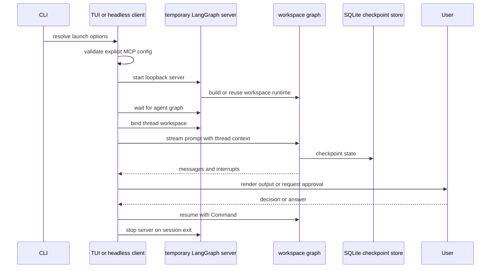

# Run a Deep Agents Code Session

`dcode` has three execution boundaries. The default starts the interactive Textual UI; `-n` performs one headless task; `--acp` provides Agent Client Protocol (ACP) over standard input and output. Interactive and headless modes are clients of a temporary loopback LangGraph server, while ACP constructs its agent in-process. Related background: [code agent architecture](../architecture/code-agent.md), [configuration layering](../concepts/config-layering.md), [MCP integration](../integrations/mcp.md), and [costs and sessions](../operations/cost-and-sessions.md).

## Select a mode

```bash
# Interactive TUI
dcode

# One bounded, script-friendly task
dcode -n "run the focused tests" --max-turns 8 --timeout 600

# Editor-host protocol service over stdin/stdout
dcode --acp
```

Use the TUI when a person must review tool calls, answer `ask_user`, select a model, resume a conversation, or inspect `/mcp`. Use headless mode for a bounded automation task: it starts a fresh UUID7 thread and does not resume a TUI thread. Its turn or wall-clock budget ending is an error exit (`124`); `-q` keeps response text on stdout and operational output on stderr, and `--no-stream` buffers the reply.

Treat the launch checkout as trusted input. Configuration, workspace discovery, skills, and MCP discovery can read project files before a tool-approval panel exists. Approval governs model-requested operations, not every startup read. Use an explicitly selected remote sandbox rather than a host checkout when isolation is required.

## Startup and execution flow



*Interactive and headless dcode clients bind a workspace before graph execution and use a temporary server for the duration of the client session.*

### Resolve configuration, model, and workspace

The launch path resolves a cheap model identity first so the TUI can paint its status bar without importing a provider. If no credentials are configured it defers server startup for onboarding; a malformed or disallowed model configuration ends launch before the UI is run. The resolved model specification, supplied model parameters, profile overrides, and CLI retry limit are handed to the server configuration. A prefixed environment variable such as `DEEPAGENTS_CODE_ANTHROPIC_API_KEY` takes precedence even when it is empty, which deliberately suppresses the corresponding canonical variable.

The TUI starts with an initial approval mode, then hands interactive execution to `run_textual_app`. Approval is live per-thread state, so changing it does not itself require reconstructing the graph. A blank `--auto-classifier-model` is distinct from an absent argument: it explicitly requests inheritance from the main model rather than falling back to a configured classifier.

For the server-backed paths, `server_session` preflights an explicit `--mcp-config`, serializes `ServerConfig` into a temporary server directory, starts `langgraph dev` on `127.0.0.1` and an ephemeral port, waits for the `agent` graph, and configures a `RemoteAgent` with the launch workspace and a session policy claim. Failed startup, cancellation, and normal context-manager exit stop the subprocess. Auto-discovered project and user MCP configurations are intentionally not fatal at this parent-side preflight; their individual failures can instead appear in MCP status metadata.

### Workspace binding is the execution gate

A `RemoteAgent` needs a `configurable.thread_id`. Before a stream, the client binds or validates the workspace for that thread and supplies workspace context. At graph selection, the server refuses execution without both a thread ID and valid workspace context. The durable binding establishes the workspace identity and policy; it is not merely a client-side hint.

On each execution, the server resolves the current workspace configuration and rejects project-policy or access-policy drift rather than silently applying it to an existing thread. Model, prompt, and other runtime-only changes are deliberately different: they preserve the binding and checkpoint history but produce a new runtime-cache key, rebuilding the runtime. The bounded workspace runtime cache prevents repeated MCP discovery and sandbox creation; the configured sandbox is process-wide, so a second workspace cannot claim it after the first sandboxed runtime does.

Diagnostics for a refusal are structured but secret-safe. The persisted comparison snapshot has an allowlist of small policy values; paths, credentials, environment values, model specifications and parameters, prompts, and profile overrides are neither persisted nor reported as diagnostic substitutes. Clients must tolerate missing diagnostics from older servers or intermediaries.

## Tools, approvals, and headless constraints

Interactive mode can use Manual, Auto, or YOLO approval. The UI obtains interrupts from the remote graph, renders them, and resumes graph work after a decision or `ask_user` answer. Invalid persisted modes fall back to Manual; YOLO requires its acknowledgement. Project hooks and project Python extensions are separate trust boundaries, not consequences of ordinary tool approval.

Headless mode has no approval UI. Without `--shell-allow-list`, shell execution is disabled; a restrictive allow-list gates shell commands, and `all` enables unrestricted shell execution. Non-shell tools are otherwise auto-approved, but a project permission hook can still override these shortcuts. MCP tools whose metadata is not coherently read-only are rejected in headless mode instead of waiting forever for a human decision.

## MCP loading, login, and reconnect

`--no-mcp` disables MCP loading. Otherwise an explicit `--mcp-config` is loaded at highest precedence; without it, the resolver merges discovered user configuration, trusted project entries, and enabled-plugin MCP declarations. Project MCP entries are filtered through whole-session trust plus persisted per-server approvals and denials. If the user trust policy cannot be read, project trust fails closed; malformed discovered configuration is reported rather than making an unrelated usable source disappear silently.

The same resolution rules support `dcode mcp login`. Login resolves and validates the named server before OAuth is attempted, and gives actionable outcomes for no config, an invalid explicit file, unknown servers, trust-policy failure, and untrusted project entries. An explicit config path is a deliberate direct request; discovery-based project sources remain subject to trust filtering.

In the TUI, MCP metadata is preloaded concurrently with server startup for display, but the server owns the live tool instances. A successful OAuth login writes a token for a later server restart; it does not mutate tools in the already-running graph. The UI offers or defers reconnect, and `/mcp reconnect` applies the new token or server enablement by restarting the app-owned server. Remote-server sessions and `--no-mcp` cannot apply this local reconnect operation.

## Streaming, retries, interruption, and persistence

Model retry middleware wraps the model node rather than an entire agent turn. A transient model failure may therefore retry without replaying completed tool calls. Retry settings are taken from the request's effective model; terminal provider failure is re-raised instead of being converted into an AI response. Correlated `model_attempt` and retry events let both clients distinguish partially displayed failed output from the replayed attempt and discard tentative transcript or tool state.

SQLite checkpointing owns persisted conversation state. TUI resume chooses the most recent eligible thread for bare `-r` or resolves a named thread, enforcing configured age policy. Missing threads, unsafe timestamps, and database errors fall back to a new session; when its stored working directory differs, the UI can offer a workspace switch. Interrupt cleanup is also server-facing: active runs are cancelled and pending graph work is reconciled rather than merely removing a local spinner.

ACP does not enter `server_session` or use `RemoteAgent`. It creates its model and MCP tool set, opens the SQLite checkpointer, builds per-ACP-session agent graphs, and cleans up MCP sessions in `finally`. Diagnose ACP model or MCP failures separately from loopback-server startup.

## Diagnose and verify

For development from `libs/code`:

```bash
make bootstrap
export DEEPAGENTS_CODE_DEBUG=1
uv run deepagents-code
```

Debug mode preserves the temporary server log and attaches a per-thread client log. The file logger hardens its directory and rejects symlinked log targets where possible; if secure file logging cannot be established, use the in-app `Ctrl+\\` Debug Console. Check the preserved server log for graph-construction failures, the thread log for client/stream behavior, and `/mcp` for server-level MCP status before changing policy or credentials.

Choose tests by the boundary changed:

```bash
make test TEST_FILE=tests/unit_tests/test_non_interactive.py
make test TEST_FILE=tests/unit_tests/test_model_retry.py
make test TEST_FILE=tests/unit_tests/test_app.py
make test TEST_FILE=tests/unit_tests/test_input_parsing.py
make check
```

These focused suites cover headless approval behavior, retry and stream failures, TUI startup and resume, and defensive parsing of thread references and pasted paths. Pair remote streaming, binding, offload, or pending-work changes with remote-client tests; pair runtime resolution and policy changes with workspace and server-graph tests.
